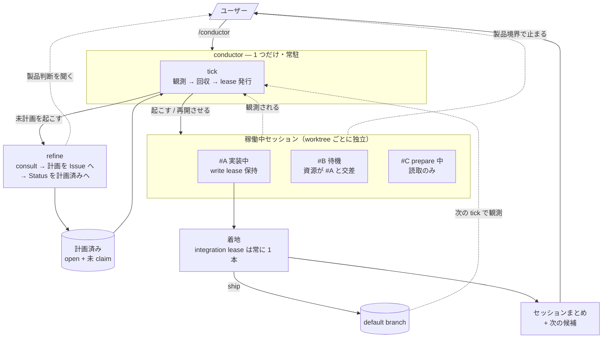
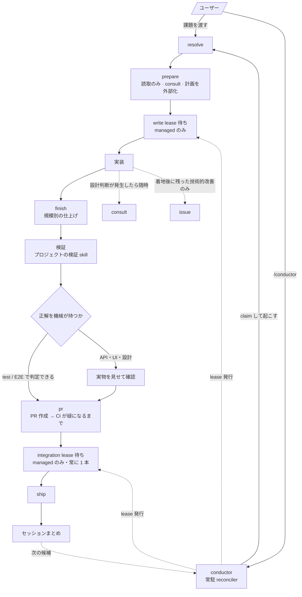

# agents

harness を問わず共通で使う agent 設定の SSOT。`~/.agents/` へ投影され、各 harness から参照される。
配線は `lib/inventory.sh`、置き場所（共通 / harness 個別）の判断は [`../AGENTS.md`](../AGENTS.md)。

| 実体 | 役割 | 投影先 |
| --- | --- | --- |
| `AGENTS.md` | 全 harness 共通の instructions | `~/.agents/AGENTS.md` / `~/.claude/CLAUDE.md` / `~/.codex/AGENTS.md` ほか |
| `skills/` | 発動条件を持つ手順の集合 | `~/.agents/skills`（Claude は harness 固有 overlay と union） |
| `.skill-lock.json` | 外部由来 skill の取得元と hash | `~/.agents/.skill-lock.json` |

`.skill-lock.json` は `up.sh` の `bunx skills update -y` が読む。**手で編集しない。**

この README は**人が全体を把握するための見取り図で、harness が自動で読み込むものではない。**
だから**規約の本体をここに書かない** — ここにしか無い規則は、エージェントには届かない。

## AGENTS.md と skills の関係

[`AGENTS.md`](AGENTS.md) は全 harness に常時読み込まれる薄い層で、**製品に依存しない原則**だけを置く。
skills は**発動条件を持つ手順**で、必要になったときだけ読まれる。

skills は AGENTS.md を 2 通りに使う。**中身をここへ写さない**（写した瞬間に drift する）。

- **判断の SSOT として引く** — 規模の定義（軽微 / 中規模 / 大規模）を `finish` が引いて工程を選ぶ、など
- **反映先の判定に使う** — 学んだことを AGENTS.md / 共通 skill / project のどこへ書くか（層契約）

project 固有の差分は各 repo が持つ。同名 `<skill>-project` があれば本体 skill が先に読み、
**追加・具体化のみ**を適用する。基準・手順・完了条件を緩める記述は適用せず報告する。

## 全体像

複数の課題が同時に動いているときの俯瞰。1 件の中の進行は「1 件の進行」の図を見る。



読み方は 3 つ。

- **人が返すのは製品判断だけ** — 計画中（`refine`）と実装中（`resolve`）の 2 か所で聞かれる。それ以外はエージェントが決めきる。`refine` / `resolve` は単体でも起動できるが、常時運転では conductor が起こす
- **並列できるかは lease が決める** — `#B` が待っているのは人の判断待ちではなく資源待ち。専用の台帳は無く、稼働中セッションの計画（`resourceKeys`）が貸出状態そのもの
- **着地は必ず 1 本ずつ** — 実装が何本並んでも default に入るのは直列。ここが本当のボトルネック

## 層構造

| 層 | skills | 契約 |
| --- | --- | --- |
| orchestrator | `conductor` | キューを回す。1 件の解決は work-item flow に委譲する |
| work-item flow | `refine` `resolve` | 課題 1 件を扱う。`refine` は計画まで、`resolve` は着地まで |
| subflow | `finish` | 工程の一部を束ねる |
| leaf | `consult` `zero-base-loop` `tidy` `docs` `commit` `pr` `ship` `issue` `merge` `rabi-design` | それ自体で完結し、単体で invoke できる |

参照は上の層から下の層への一方通行:

```text
conductor → refine / resolve → finish → consult / tidy / docs / commit / pr / ship / …
conductor → herdr（harness の CLI 構文。差し替え点は conductor/references/harness.md）
refine    → consult
```

- **禁止するのは下位から上位への逆参照と循環**。`resolve` は `conductor` を知らないし、leaf は flow を知らない
- 同じ層どうしの依存・言及も作らない（leaf 同士は特に）。**規約の本体と検出手順は `docs` の品質パス**
- skill 間の棲み分け・順序の知識は、上位層の skill とこの README が持つ（規模の定義と層ごとの反映先は `~/.agents/AGENTS.md`）
- 例外はデータ資産の共有のみ。実体と張り方は「物理構造」の節

このほかに外部由来のツール系 skills があるが、それぞれの description に従い単発で発動するためこの README では扱わない。

## 上位層の役割分担

**中身は各 `SKILL.md` が SSOT。**ここは「何を持つか」と、**skill をまたぐ不変条件**だけ。

| skill | 持つもの | 持たないもの |
| --- | --- | --- |
| `conductor` | 選出・claim・lease 発行・stale 回収・計画の失効判定 | 技術方針・製品判断・着手後にどこで人を待つか |
| `refine` | 「何を作るか」を Issue に固定する | 実装・「どう作るか」 |
| `resolve` | 課題 1 件の進行・計画の外部化・停止条件・作業単位の運用 | lease を誰が出すか |
| `finish` | 規模別の仕上げフロー | — |

skill をまたぐので、どれか 1 つの `SKILL.md` には書けない不変条件:

- **未計画 → 計画済みへ進めるのは `refine` だけ。**`conductor` は自分でキューに積めない（自己増殖の禁止）。
  計画済みへ**戻す**のは別で、`conductor`（stale 回収）も `resolve`（停止条件）も行う
- multiplexer への操作は `conductor/references/harness.md` に隔離してある（前半＝契約 / 後半＝現在の実装）。
  **別のターミナルへ乗り換えるときは後半だけを書き換える**

## 1 件の進行

課題 1 件が受領から着地まで通る順。複数件が同時に動いている俯瞰は「全体像」の図を見る。



`finish` の中身（規模別にどの leaf を通るか）は `finish` が SSOT。
**PR 作成と CI が integration lease の前**にある理由は `resolve` の工程表。

## leaf: ゲート系（直接実行禁止）

git / gh の一部操作は、理由・きっかけを問わず**必ず skill を経由する**。

| skill | 置き換える生コマンド | 発動条件 |
| --- | --- | --- |
| `commit` | `git commit` | コミットするとき常に。gitmoji 付与（`commit/references/gitmoji.md` が SSOT） |
| `merge` | `git merge` | **PR を出さずに**ローカルで統合するときだけ（例外経路）。`--no-ff` + gitmoji |
| `pr` | `gh pr create` | PR を作るとき常に。merge 可能な状態まで持っていく（merge はしない） |
| `ship` | `gh pr merge` | PR を merge するとき常に。着地と後始末（Issue の CLOSED 確認まで） |
| `issue` | `gh issue create` | Issue を作るとき常に。切り出しの判断は呼び出し元（作業単位は `~/.agents/AGENTS.md`） |

`issue` / `merge` / `pr` / `ship` の gitmoji は `commit/references/gitmoji.md` を共有する。
`pr` と `ship` は default 同期の手順（`pr/references/sync-default.md`）も共有する。

## leaf: レビュー・品質系の対比

各 skill は自分のスコープだけを定義しているため、棲み分けはこの表で見る。

| skill | 使う | 使わない |
| --- | --- | --- |
| `consult` | 複数案が存在し得る設計判断・中規模以上の見込みで着手するとき（ユーザー明示不要） | 選択肢が実質 1 つの自明な変更 |
| `zero-base-loop` | 大規模 diff を書き終えた後、コミット前。設計レベルの指摘（ゼロベース一致・根本解決）も拾う。**指摘が尽きるまで回す** | 軽微・中規模 |
| `tidy` | 中規模以上の実装完了後、コミット前。**レビューは 1 巡** | 軽微。設計妥当性の判定（→ `consult` / `zero-base-loop`） |
| `docs` | 仕様変更・機能実装を文書へ反映するとき（中規模以上の仕上げ）。agent-facing 文書を触った変更は規模不問で品質パス | 製品コード実装そのもの |

補足:

- project 差分（同名 `<skill>-project`）はどの skill にも効く汎用機構。SSOT は `~/.agents/AGENTS.md`
- `rabi-design` は上記のフローに乗らない。Rabi 名義の UI・文書・スライド・Artifact を作るときに単発で発動する

## レビューの委譲先（2 系統）

| skill | 委譲先 | 契約の SSOT |
| --- | --- | --- |
| `consult` / `zero-base-loop` | 別 harness の CLI を read-only で並列起動（次節） | `consult/references/advisors.md` |
| `docs` / `tidy` | 同 harness の subagent。書き手のバイアスを切るのが目的で、対象と判断基準だけを渡す | `tidy/references/review-contract.md` |

## アドバイザー構成（consult / zero-base-loop）

**メインが手を動かし、別系統モデルが判断だけを検証する分業。**候補 harness から実行中の自分を
除いたものをアドバイザーにするので、メインが Claude でも Codex でも同じ表から組み替わる。
候補・起動手順・再入防止の条件は `consult/references/advisors.md` が SSOT。

## 物理構造（symlink の実例）

**`SKILL.md` 以外は、モデルがそのファイルに何をするかで置き場所が決まる。**大きさでは分けない。

| ディレクトリ | モデルの扱い | 例 |
| --- | --- | --- |
| `references/` | **読む**（必要になったときだけ読み込む） | `gitmoji.md` `harness.md` `advisors.md` |
| `scripts/` | **実行する** | — |
| `assets/` | **成果物に使う**（テンプレート・画像・フォント） | `rabi-design/assets` |

`SKILL.md` は発動時に常に読まれるので、**オンデマンドで足りるものは `references/` へ出す**。

skill 間で共有するときは、本文への複製ではなく**片方を SSOT にして相対 symlink** を張る:

```text
agents/skills/
├── pr/references/sync-default.md                # SSOT（ローカル default の同期。ship からパス参照）
├── consult/references/advisors.md               # SSOT（アドバイザー起動表）
├── zero-base-loop/references/advisors.md        -> ../../consult/references/advisors.md
├── tidy/references/review-contract.md           # SSOT（レビュー委譲の契約）
├── docs/references/review-contract.md           -> ../../tidy/references/review-contract.md
├── refine/references/same-branch.md             # SSOT（`Same branch as #N`。conductor からパス参照）
└── resolve/references/same-branch.md            -> ../../refine/references/same-branch.md
```

- 相対 symlink にするのは、repo の checkout 場所と `~/.agents/skills` への投影のどちらでも解決できるようにするため
- gitmoji 一覧（`commit/references/gitmoji.md`）と default 同期（`pr/references/sync-default.md`）はパス参照で共有しており、symlink は張らない（読む側が SKILL.md からパスで辿れれば足りる）
- 新たに共有したくなったら、まず SSOT の置き場（最も主たる利用者の skill 配下）を決め、他方から相対 symlink かパス参照で辿る。両方に本文を持たせない
- **同じ層どうしは symlink、上位から下位はパス参照。**symlink だと読む側の `SKILL.md` に自分の相対パスしか出ないので、禁止している同層への言及が本文に現れない。上位 → 下位はもともと正参照なので隠す必要がない

## 追加・変更するとき

1. **書く先は [`AGENTS.md`](AGENTS.md) の層契約で決める。**この README には規約の本体を置かず、
   見取り図だけを更新する
2. 下位層の skill を束ねたくなったら、上位層の skill に書く
3. この README を含む agent-facing 文書を触ったら `docs`（品質パス）→ `commit`
4. 置き場所（共通 / harness 個別）の判断と配線手順は [`../AGENTS.md`](../AGENTS.md) に従う
