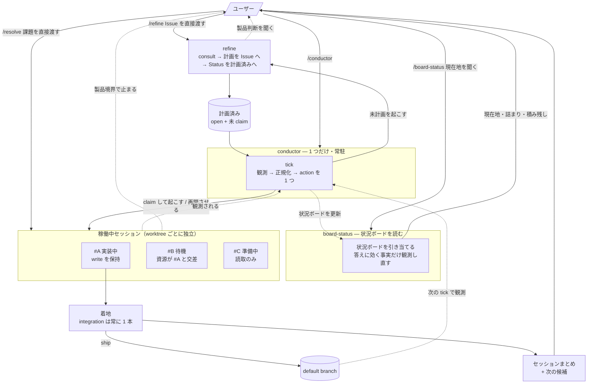

# agents ドキュメント

**人が全体を把握し、整合性を監査するための資料。**agent は読まない（`~/.agents/` へ投影しない）ので、
図も表も必要なだけ細かく書いてよい。

**規約の本体はここに無い。**ここにあるのは skills から導出した図と索引だけで、
**矛盾を見つけたら skills が正**。直すのは skills 側で、ここはその後に引き直す。

| 資料                           | 何が分かるか                                              |
| ------------------------------ | --------------------------------------------------------- |
| [`glossary.md`](glossary.md)   | 語の**種別**（skill / 工程 / ループ / 状態 / 資源）と意味 |
| [`lifecycle.md`](lifecycle.md) | 課題 1 件の状態遷移と、着地までの登場人物のやりとり       |
| [`structure.md`](structure.md) | skills とファイルの依存関係、`agents/shared/` の共有実体  |

規約の SSOT は次のとおり。

| 知りたいこと                           | SSOT                                                      |
| -------------------------------------- | --------------------------------------------------------- |
| 製品非依存の原則・作業単位・規模の定義 | [`../AGENTS.md`](../AGENTS.md)                            |
| 各工程の手順・判断・完了条件           | 各 `../skills/<name>/SKILL.md`                            |
| 置き場所（共通 / harness 個別）と配線  | [`../../AGENTS.md`](../../AGENTS.md) / `lib/inventory.sh` |

## 全体像

複数の課題が同時に動いているときの俯瞰。1 件の中の進行は [`lifecycle.md`](lifecycle.md)。



読み方は 4 つ。

- **人が返すのは製品判断だけ** — 計画中（`refine`）と実装中（`resolve`）で聞かれ、`board-status` が盤面から拾って人へ返す。それ以外はエージェントが決めきる
- **`refine` / `resolve` は単体でも起動できる** — 常時運転では conductor が起こすが、人が直接渡す経路も等価に存在する。**違いは「枠が空くのを待つかどうか」だけ**（claim 済みとして渡されたときだけ待つ。`resolve` の variant → [`glossary.md`](glossary.md)）
- **並列できるかは資源が決める** — `#B` が待っているのは人の判断待ちではなく**枠の空き待ち**。貸出を記録した台帳は持たず、**今ある実体を数えれば貸出状況が分かる**（→ [`glossary.md`](glossary.md) の「資源」）
- **着地は必ず 1 本ずつ** — 実装が何本並んでも default に入るのは直列。ここが本当のボトルネック

## 層構造

| 層             | skills                                                                                                                              | 契約                                                                                         |
| -------------- | ----------------------------------------------------------------------------------------------------------------------------------- | -------------------------------------------------------------------------------------------- |
| observer       | `board-status`                                                                                                                      | orchestrator の出力を読んで人へ返す                                                          |
| orchestrator   | `conductor`                                                                                                                         | キューを回す。1 件の解決は work-item flow に委譲する                                         |
| work-item flow | `refine` `resolve`                                                                                                                  | 課題 1 件を扱う。`refine` は計画まで、`resolve` は着地まで                                   |
| subflow        | `finish`                                                                                                                            | 工程の一部を束ねる                                                                           |
| leaf           | `consult` `zero-base-loop` `tidy` `docs` `commit` `pr` `ship` `issue` `merge` `rabi-design` `herdr` `skill-creator` `agent-browser` | それ自体で完結し、単体で invoke できる                                                       |

参照は上の層から下の層への一方通行。

```text
board-status → conductor（ボードの出どころと、載る項目の SSOT）
conductor → refine / resolve → finish → consult / tidy / docs / commit / pr / ship / …
conductor → herdr（multiplexer の CLI 構文。差し替え点は conductor/references/harness.md）
conductor → ship（着地後に branch が残ることに依存）
refine    → consult
```

- **禁止するのは下位から上位への逆参照と循環**。`resolve` は `conductor` を知らないし、leaf は flow を知らない
- 同じ層どうしの依存・言及も作らない（leaf 同士は特に）。例外はデータ資産の共有だけで、張り方は [`structure.md`](structure.md)
- 検出手順は `docs` skill の品質パス。**層の割り当ての正は `docs/scripts/layers.tsv`**（leaf は既定なので書かれない）。この節はその導出で、ずれると品質パスの `derived` 検査が落ちる

## 上位層の役割分担

**中身は各 `SKILL.md` が SSOT。**ここは「何を持つか」の索引だけ。

| skill          | 持つもの                                                     | 持たないもの                                                                  |
| -------------- | ------------------------------------------------------------ | ----------------------------------------------------------------------------- |
| `board-status` | ボードの引き当て方・読み方・放置されたものの回収             | **ボードに載る項目**（`conductor` が SSOT）                                   |
| `conductor`    | 正規化・action の優先順・資源の貸し出し・差し戻し            | 技術方針・製品判断・着手後にどこで人を待つか                                  |
| `refine`       | 「何を作るか」を Issue に固定する                            | 実装・「どう作るか」                                                          |
| `resolve`      | 課題 1 件の進行・計画の外部化・停止条件・作業単位の運用      | 資源を誰が出すか                                                              |
| `finish`       | 規模別の仕上げフロー                                         | —                                                                             |

**skill をまたぐ不変条件**（未計画 → 計画済みを進める主体、Status の単調性、multiplexer 操作の
隔離）は [`../AGENTS.md`](../AGENTS.md) と各 `SKILL.md` が持つ。ここには写さない。

## leaf の対比

各 skill は自分のスコープだけを定義しているため、棲み分けはこの索引で見る。

| skill            | 使う                                                                             | 使わない                      |
| ---------------- | -------------------------------------------------------------------------------- | ----------------------------- |
| `consult`        | 複数案が存在し得る設計判断・中規模以上の見込みで着手するとき（ユーザー明示不要） | 選択肢が実質 1 つの自明な変更 |
| `zero-base-loop` | 大規模 diff を書き終えた後、コミット前。**指摘が尽きるまで回す**                 | 軽微・中規模                  |
| `tidy`           | 中規模以上の実装完了後、コミット前。**レビューは 1 巡**                          | 軽微。設計妥当性の判定        |
| `docs`           | 仕様変更・機能実装を文書へ反映するとき。agent-facing 文書を触った変更は規模不問  | 製品コード実装そのもの        |

### ゲート系（直接実行禁止）

git / gh の一部操作は、理由・きっかけを問わず**必ず skill を経由する**。発動条件と手順は各
`SKILL.md`。

| 生コマンド        | skill    |
| ----------------- | -------- |
| `git commit`      | `commit` |
| `git merge`       | `merge`  |
| `gh pr create`    | `pr`     |
| `gh pr merge`     | `ship`   |
| `gh issue create` | `issue`  |

### レビューの委譲先

| skill                        | 委譲先                                    | 契約の SSOT                        |
| ---------------------------- | ----------------------------------------- | ---------------------------------- |
| `consult` / `zero-base-loop` | 別 harness の CLI を read-only で並列起動 | `agents/shared/advisors.md`        |
| `docs` / `tidy`              | 同 harness の subagent                    | `agents/shared/review-contract.md` |

候補 harness から**実行中の自分を除いた 2 つ**をアドバイザーにするので、メインが Claude でも
Codex でも同じ表から組み替わる。

## この資料を更新するとき

**skills の構造を変えたら引き直す**（状態・工程・層・共有ファイルの増減）。文言修正では引き直さない。
判定と手順は `docs` skill の品質パス。

図が古いまま監査に使われる方が、引き直しのコストより高くつく。
