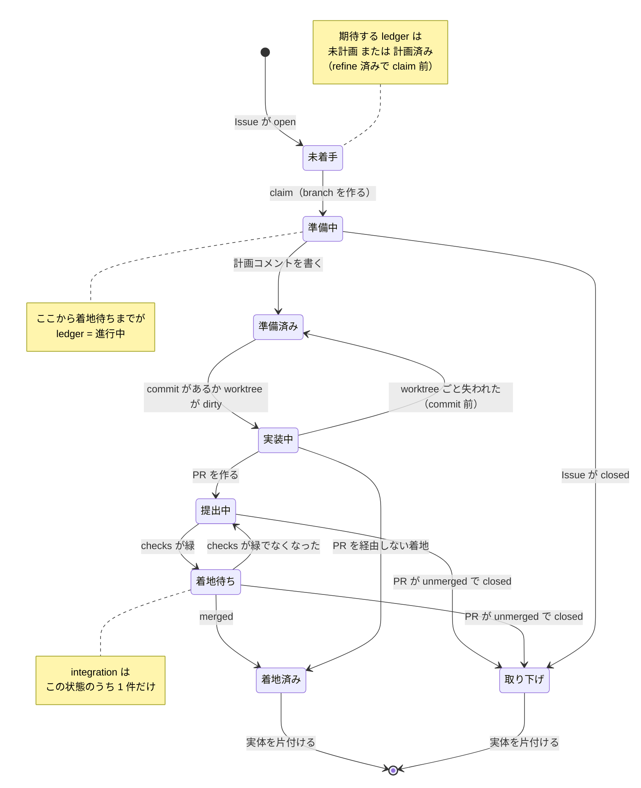
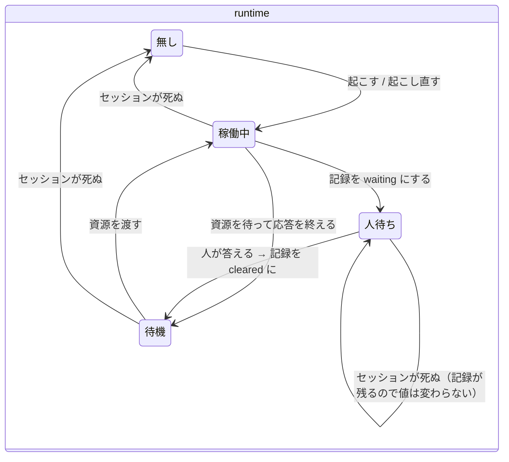
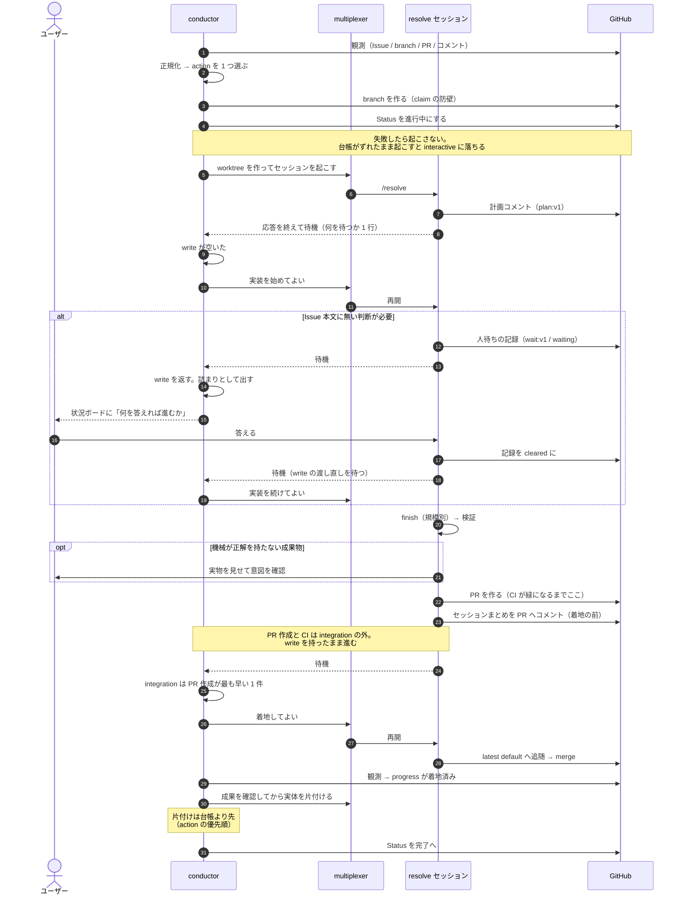
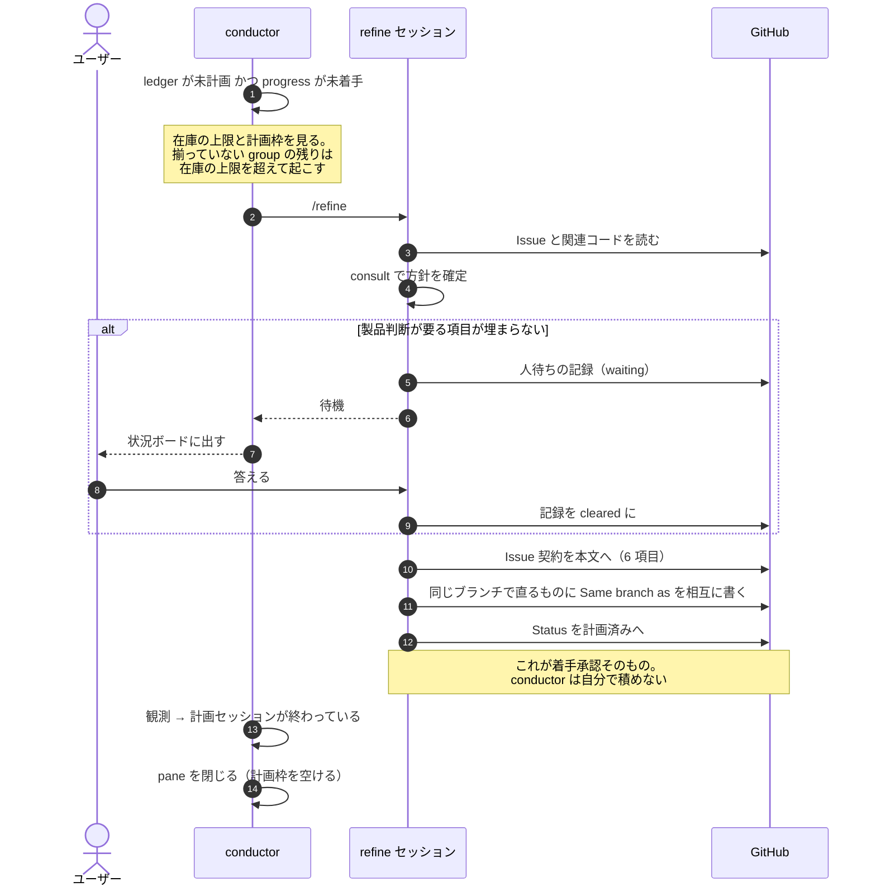

# 課題 1 件のライフサイクル

規約の本体は `conductor` / `refine` / `resolve` の各 `SKILL.md`。ここは導出した図。
**知らない語が出てきたら** [`glossary.md`](glossary.md)。

課題 1 件は **4 つの軸**で表される。図はこの軸ごとに分かれている。

| 軸 | 何を表すか |
| --- | --- |
| `progress` | **成果物がどこまで進んだか**（branch・PR・commit から決まる） |
| `runtime` | **実行しているセッションの様子**（動いている / 止まっている / 人を待っている） |
| `capacity` | **作業場所（worktree）を持っているか** |
| `ledger` | **ボード上の表示**（Project Status） |

## 状態遷移（conductor から見た `progress`）

観測から一意に決まる。**worktree とセッションの「有無」は `progress` に入らない**（それぞれ
`capacity` と `runtime`）ので、着地待ちの実体が消えても状態は退行しない。
見るのは worktree の**中身**（dirty かどうか）だけ。

**判定は上から読んで最初に当たった行**（終端が最上段）。`ship` は remote branch を消さないので、
merge 直後は「branch あり + commit あり」も同時に真になる。**終端を先に確定しないと、正常な着地の
たびに `Conflict` で止まって片付けに到達しない。**

**計画セッション（`refine`）は `progress` に現れない。**成果物は進んでいないので `未着手` のまま
で、セッションの有無は `runtime` 側の話。

**複数の行に当たるのは正常**（上から読んで先に当たった方が勝つ、という決め方なので）。
`Conflict`（**判断がつかない状態**。該当条件は `conductor/SKILL.md`）はどの状態からも起こりうる。
遷移せず、状況ボードへ出して止まる。

**`ledger` が期待より「手前」なら `Conflict` にしない** — 前進で直せる（claim 直後に Status 更新が
失敗した `準備中 × 計画済み` がこれ）。

## 実行器と資源（同じ課題の別の軸）

`progress` が同じでも、実行器と実体は独立に消えたり戻ったりする。

**`人待ち` はセッションの有無を問わない。**記録が `waiting` である限り `人待ち`。だから人待ち中に
セッションが死んでも値は割れず、`Conflict` にならない。**起こし直された側は起動時に記録を読み**、
まだ答えが無ければ質問を出し直し、答えが返っていれば解釈して `cleared` にする。

**`待機` は「記録が無い」と「`cleared`」の両方を含む。**片方だけにすると、答えを解釈した直後の
「動いていない」がどの値にも当たらず、人待ちからの復帰が止まる。

**`人待ち` から直接 `稼働中` へ戻らない。**答えが返っても write は別の課題へ回っている可能性が
あるので、`待機` を経由して渡し直しを待つ。

**セッションが死んでも `progress` は動かない。**だから `runtime` を `無し` から起こし直すだけで
続きから再開できる（実装は worktree に、計画と人待ちは Issue に残っている）。
唯一の例外は commit 前に worktree ごと失われたときで、そのときは実装自体が無いので
`準備済み` へ戻るのが正しい。

## 着地までのやりとり

**片付けの前に必ず成果を確認する。**worktree とセッションを消すとセッションまとめが一緒に消え、
**git にも Issue にも残らない**。PR に載っていなければ pane から回収し、どこにも無ければ
片付けずに報告する。

## 計画済みになるまで

