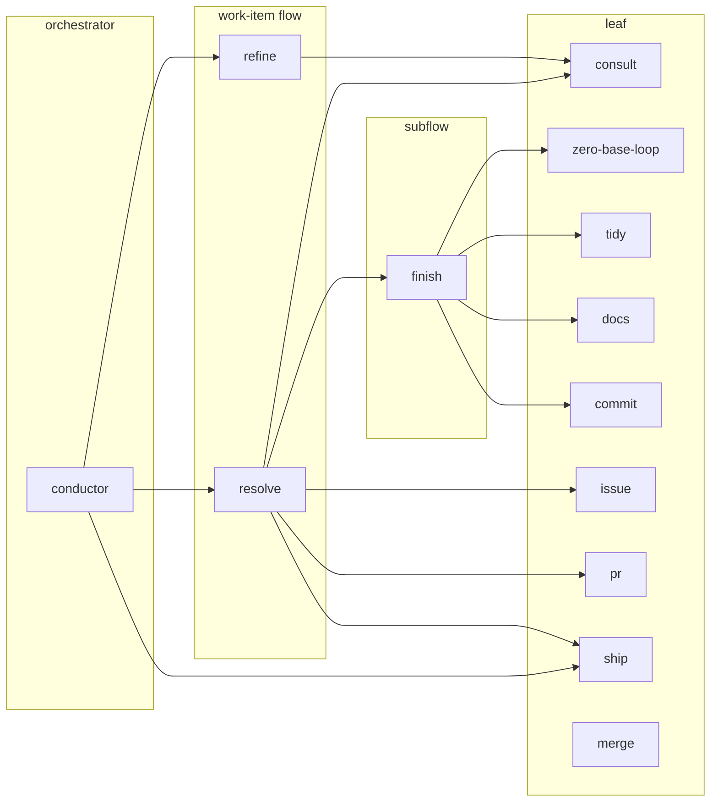
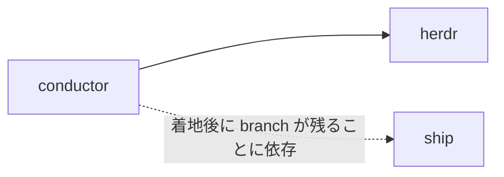
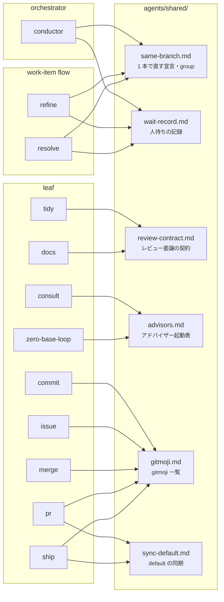

# ファイル構造と依存

規約の本体は各 `SKILL.md` と [`../../AGENTS.md`](../../AGENTS.md)（置き場所の判断と配線）。
ここは実体の対応表。

## ディレクトリの役割

**`SKILL.md` 以外は、モデルがそのファイルに何をするかで置き場所が決まる。**大きさでは分けない。

| ディレクトリ | モデルの扱い | 投影先 |
| --- | --- | --- |
| `skills/<name>/SKILL.md` | 発動時に**常に読む** | `~/.agents/skills/` |
| `skills/<name>/references/` | **読む**（必要になったときだけ） | 同上 |
| `skills/<name>/scripts/` | **実行する** | 同上 |
| `skills/<name>/assets/` | **成果物に使う** | 同上 |
| `AGENTS.md` | **常時読み込まれる** | `~/.agents/AGENTS.md` ほか |
| `shared/` | **読む**（skill から symlink 経由で） | skills の一部として投影される |
| `docs/` | **読まない**（人が読む） | 投影しない |

`SKILL.md` は発動時に常に読まれるので、**オンデマンドで足りるものは `references/` へ出す**。

## skill 間の参照

上位層 → 下位層の一方通行。同じ層への言及は作らない。

`conductor` が multiplexer の CLI を参照する箇所は **`references/harness.md` に隔離**してあり、
本体はそれ以外の場所で multiplexer を知らない。

## 共有している実体

実体は `agents/shared/` にあり、使う skill が `references/` へ相対 symlink を張る
（`agents/skills/<name>/references/<file>` → `../../../shared/<file>`）。

**層をまたいでも、同じ層どうしでも、参照先は `shared/` だけ。**skill が別の skill の
`references/` を覗く形が無くなるので、層契約（同じ層への言及を作らない）を隠さずに満たせる。

**skill 固有の reference は `references/` に実体で置く**（`conductor/references/harness.md`、
`docs/references/review-prompt.md`、`skill-creator/references/schemas.md`）。

置く条件と張り方の規則は [`../../AGENTS.md`](../../AGENTS.md) が SSOT。ここには写さない。

## 追加・変更するとき

手順は [`../AGENTS.md`](../AGENTS.md) の層契約と [`../../AGENTS.md`](../../AGENTS.md) の配置方針。
**この資料の側でやることは 1 つだけ** — 構造を変えたら [`README.md`](README.md) と
[`lifecycle.md`](lifecycle.md) の図を引き直す。
