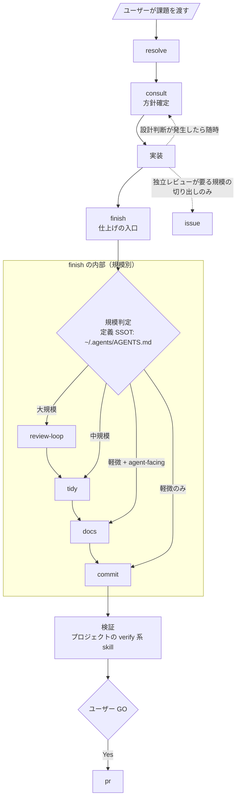
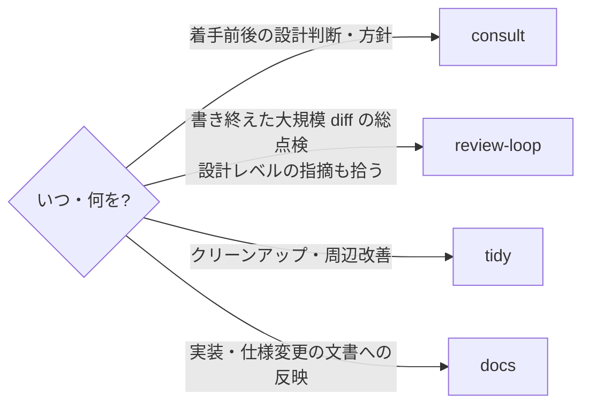

# agents/skills

agent 共通 skills の SSOT。`~/.agents/skills` へ投影され、各 harness（Claude / Codex / pi 等）から `lib/inventory.sh` の配線で参照される（配置方針は repo の `AGENTS.md` を参照）。

この README は**関係性と発動条件の見取り図**。各 skill の手順詳細はそれぞれの `SKILL.md` が SSOT。

## 2 層構造: フロー skill と単体 skill

| 層 | skills | 契約 |
| --- | --- | --- |
| フロー skill | `resolve` `finish` | 単体 skill を束ねて進行順を定義する。他 skill への参照はこの層だけが持つ |
| 単体 skill | `consult` `review-loop` `tidy` `docs` `commit` `pr` `issue` `merge` `rabi-design` | それ自体で完結し、単体で invoke できる。本文で他 skill に言及しない |

- 参照方向は **フロー → 単体の一方通行**。単体 skill 同士の依存・言及は作らない
- skill 間の棲み分け・順序の知識は、フロー skill・`~/.agents/AGENTS.md`・この README が持つ
- 例外はデータ資産の共有のみ: gitmoji 一覧（`commit/references/gitmoji.md`）とアドバイザー起動表（`consult/advisors.md`。`review-loop/advisors.md` は相対 symlink）

このほかに外部由来のツール系 skills があるが、それぞれの description に従い単発で発動するためこの README では扱わない。

## フロー skill の中身

### resolve — 課題 1 件の一気通貫

ユーザーが `/resolve` で課題（Issue 番号・タスク説明）を渡したときに実行する。Issue 切り出しの基準（独立レビューが要る規模だけ切り出す / 今回変更由来の回帰はそのブランチで直しきる）もここが SSOT。

### finish — 実装一段落の仕上げ

実装が一段落したら必ず実行する。規模判定に従い [`review-loop`] → `tidy` → `docs` → `commit` を順に実行する。単発タスクでも共通。

- 実装を伴う `consult` / `review-loop` の使用は中規模以上として扱う（SSOT: `finish`）
- 途中で非自明に膨らんだら規模を再判定し、上の段から入り直す

## 規模判定（要約）

| 規模 | 目安 | フロー |
| --- | --- | --- |
| 軽微 | 挙動を変えない局所変更 | `commit` のみ（agent-facing を含むなら `docs` → `commit`） |
| 中規模 | 挙動変更あり（骨格は変えない） | `tidy` → `docs` → `commit` |
| 大規模 | 責務・API・データフロー・永続形式・security/correctness 境界を変える | `review-loop` → `tidy` → `docs` → `commit` |

規模の定義の SSOT は `~/.agents/AGENTS.md`、フローの SSOT は `finish`。この表は参照用の要約。

## 単体 skill: ゲート系（直接実行禁止）

git / gh の一部操作は、理由・きっかけを問わず**必ず skill を経由する**。

| skill | 置き換える生コマンド | 発動条件 |
| --- | --- | --- |
| `commit` | `git commit` | コミットするとき常に。gitmoji 付与（`references/gitmoji.md` が SSOT） |
| `merge` | `git merge` | ローカルマージするとき常に。`--no-ff` + gitmoji |
| `pr` | `gh pr create` | PR を作るとき常に。auto-merge まで面倒を見る（ユーザー GO は `resolve` フロー側） |
| `issue` | `gh issue create` | Issue を作るとき常に。切り出すかどうかの判断基準は `resolve` が SSOT |

`issue` / `merge` / `pr` の gitmoji は `commit/references/gitmoji.md` を共有する。

## 単体 skill: レビュー・品質系の対比

各 skill は自分のスコープだけを定義しているため、棲み分けはこの表で見る。

| skill | 使う | 使わない |
| --- | --- | --- |
| `consult` | 複数案が存在し得る設計判断・中規模以上の見込みで着手するとき（ユーザー明示不要） | 選択肢が実質 1 つの自明な変更 |
| `review-loop` | 大規模 diff を書き終えた後、コミット前。設計レベルの指摘（ゼロベース一致・根本解決）も拾う | 軽微・中規模 |
| `tidy` | 中規模以上の実装完了後、コミット前 | 軽微。設計妥当性の判定（→ `consult` / `review-loop`） |
| `docs` | 仕様変更・機能実装を文書へ反映するとき（中規模以上の仕上げ）。agent-facing 文書を触った変更は規模不問で品質パス | 製品コード実装そのもの |

補足:

- `consult` / `review-loop` のアドバイザーは候補 3 harness から実行中の自分を除いた 2 つを選ぶ（起動表: `consult/advisors.md`）
- `docs` / `issue` / `resolve` は project 差分機構を持つ: available skills に `docs-project` / `issue-project` / `resolve-project` があれば先に invoke し差分適用（追加・具体化のみ、基準は緩めない）

## skill を追加・変更するとき

1. 手順・意味が 2 harness 以上で共通ならここ（`agents/skills/`）、1 harness 専用なら `harnesses/<agent>/skills/` に置く（同名は harness 側が後勝ち）
2. 単体 skill の本文に他 skill への参照を書かない。束ねたくなったらフロー skill か本 README に書く
3. SKILL.md を触ったら `docs`（品質パス）→ `commit`（規模不問）
4. 配線の追加・変更は `lib/inventory.sh` → `./init.sh` → `./doctor.sh`
