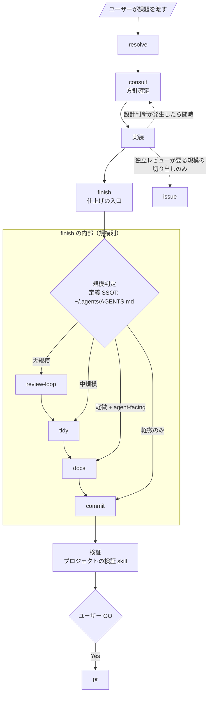
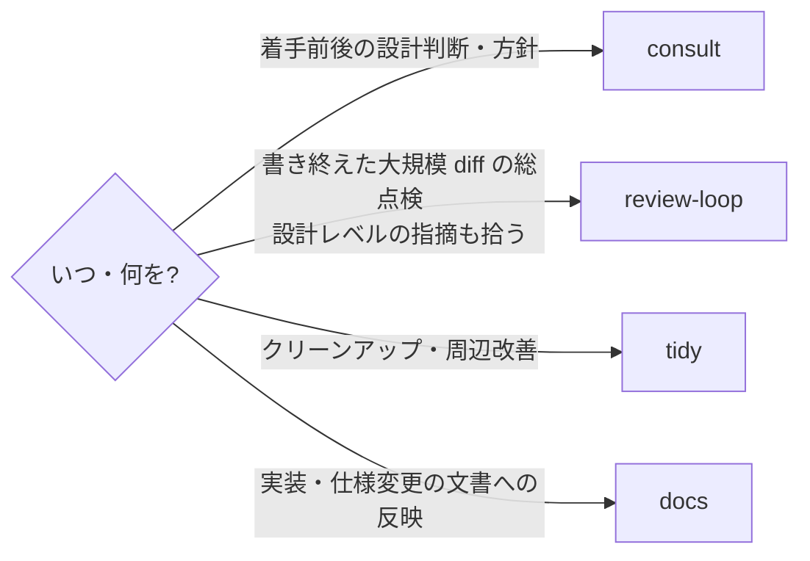
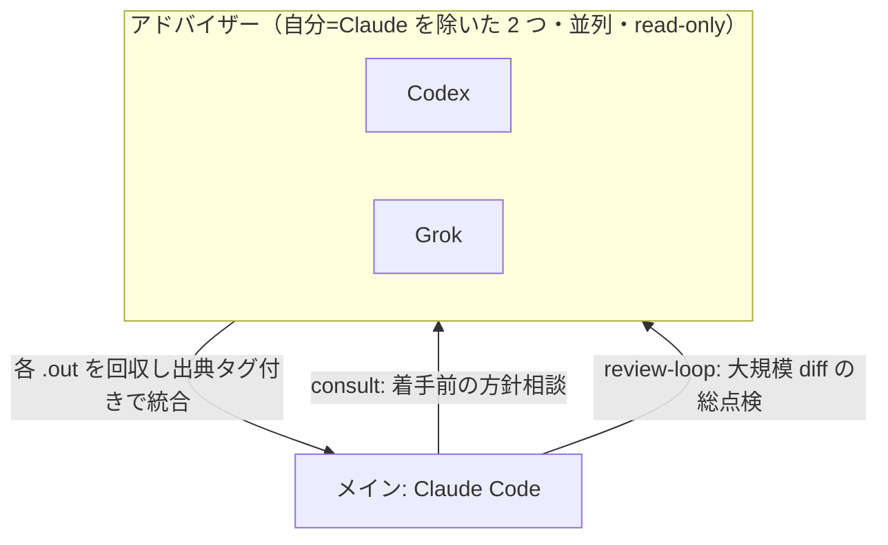

# agents/skills

agent 共通 skills の SSOT。`~/.agents/skills` へ投影され、各 harness から参照される。harness ごとの配線方法は harness で異なり、`lib/inventory.sh` が SSOT（配置方針は dotfiles repo の `AGENTS.md`）。

この README は**関係性と発動条件の見取り図**。各 skill の手順詳細はそれぞれの `SKILL.md` が SSOT。

## 2 層構造: フロー skill と単体 skill

| 層 | skills | 契約 |
| --- | --- | --- |
| フロー skill | `resolve` `finish` | 単体 skill を束ねて進行順を定義する |
| 単体 skill | `consult` `review-loop` `tidy` `docs` `commit` `pr` `issue` `merge` `rabi-design` | それ自体で完結し、単体で invoke できる。本文で他 skill に言及しない |

- 参照方向は **フロー → 単体の一方通行**。単体 skill 同士の依存・言及は作らない
- skill 間の棲み分け・順序の知識は、フロー skill とこの README が持つ（規模の定義と層ごとの反映先は `~/.agents/AGENTS.md`）
- 例外はデータ資産の共有のみ: gitmoji 一覧（`commit/references/gitmoji.md`）、アドバイザー起動表（`consult/advisors.md`）、レビュー委譲の契約（`tidy/review-contract.md`）。共有の張り方は「物理構造」の節を参照

このほかに外部由来のツール系 skills があるが、それぞれの description に従い単発で発動するためこの README では扱わない。

## フロー skill の中身

### resolve — 課題 1 件の一気通貫

ユーザーが `/resolve` で課題（Issue 番号・タスク説明）を渡したときに実行する。Issue 切り出しの基準もここが SSOT。

### finish — 実装一段落の仕上げ

実装が一段落したら必ず実行する。単発タスクでも共通。


```mermaid
flowchart TD
    U[/ユーザーが課題を渡す/] --> W[resolve]
    W --> C[consult<br/>方針確定]
    C --> I[実装]
    I --> F[finish<br/>仕上げの入口]

    F --> S{"規模判定<br/>定義 SSOT: ~/.agents/AGENTS.md"}

    subgraph FIN["finish の内部（規模別）"]
        S -->|大規模| RL[review-loop] --> T[tidy]
        S -->|中規模| T
        T --> D[docs]
        S -->|軽微 + agent-facing| D
        D --> CM[commit]
        S -->|軽微のみ| CM
    end

    CM --> V[検証<br/>プロジェクトの検証 skill]
    V --> GO{ユーザー GO}
    GO -->|Yes| PR[pr]

    I -.設計判断が発生したら随時.-> C
    I -.独立レビューが要る規模の切り出しのみ.-> IS[issue]
```

規模の定義は `~/.agents/AGENTS.md`、規模ごとのフローと再判定の条件は `finish` が SSOT。上図はその進行順の骨格。

## 単体 skill: ゲート系（直接実行禁止）

git / gh の一部操作は、理由・きっかけを問わず**必ず skill を経由する**。

| skill | 置き換える生コマンド | 発動条件 |
| --- | --- | --- |
| `commit` | `git commit` | コミットするとき常に。gitmoji 付与（`commit/references/gitmoji.md` が SSOT） |
| `merge` | `git merge` | ローカルマージするとき常に。`--no-ff` + gitmoji |
| `pr` | `gh pr create` | PR を作るとき常に。auto-merge まで面倒を見る（ユーザー GO は `resolve` フロー側） |
| `issue` | `gh issue create` | Issue を作るとき常に。切り出すかどうかの判断基準は `resolve` が SSOT |

`issue` / `merge` / `pr` の gitmoji は `commit/references/gitmoji.md` を共有する。

## 単体 skill: レビュー・品質系の対比

各 skill は自分のスコープだけを定義しているため、棲み分けはこの表で見る。


```mermaid
flowchart LR
    Q1{"いつ・何を?"}
    Q1 -->|着手前後の設計判断・方針| consult
    Q1 -->|書き終えた大規模 diff の総点検<br/>設計レベルの指摘も拾う| review-loop
    Q1 -->|クリーンアップ・周辺改善| tidy
    Q1 -->|実装・仕様変更の文書への反映| docs
```

| skill | 使う | 使わない |
| --- | --- | --- |
| `consult` | 複数案が存在し得る設計判断・中規模以上の見込みで着手するとき（ユーザー明示不要） | 選択肢が実質 1 つの自明な変更 |
| `review-loop` | 大規模 diff を書き終えた後、コミット前。設計レベルの指摘（ゼロベース一致・根本解決）も拾う | 軽微・中規模 |
| `tidy` | 中規模以上の実装完了後、コミット前 | 軽微。設計妥当性の判定（→ `consult` / `review-loop`） |
| `docs` | 仕様変更・機能実装を文書へ反映するとき（中規模以上の仕上げ）。agent-facing 文書を触った変更は規模不問で品質パス | 製品コード実装そのもの |

補足:

- project 差分（同名 `<skill>-project`）はどの skill にも効く汎用機構。SSOT は `~/.agents/AGENTS.md`
- `rabi-design` は上記のフローに乗らない。Rabi 名義の UI・文書・スライド・Artifact を作るときに単発で発動する

## レビューの委譲先（2 系統）

| skill | 委譲先 | 契約の SSOT |
| --- | --- | --- |
| `consult` / `review-loop` | 別 harness の CLI を read-only で並列起動（次節） | `consult/advisors.md` |
| `docs` / `tidy` | 同 harness の subagent。書き手のバイアスを切るのが目的で、対象と判断基準だけを渡す | `tidy/review-contract.md` |

## アドバイザー構成（consult / review-loop）

`consult` / `review-loop` は、候補 3 harness（Claude / Codex / Grok）から**実行中の自分を除いた 2 つ**を read-only で並列起動し、セカンドオピニオンを取る（再入防止）。起動は呼び出し元 shell から切り離し、起動と回収を別コマンドに分ける。起動の手順と条件は `consult/advisors.md` が SSOT。

現在の主運用は Claude Code がメインのため、実際の構成はこうなる:


```mermaid
flowchart TD
    M["メイン: Claude Code"]

    M -->|"consult: 着手前の方針相談"| A
    M -->|"review-loop: 大規模 diff の総点検"| A

    subgraph A["アドバイザー（自分=Claude を除いた 2 つ・並列・read-only）"]
        X["Codex"]
        G["Grok"]
    end

    A -->|"各 .out を回収し出典タグ付きで統合"| M
```

- メインが手を動かし、別系統モデル 2 つが判断だけを検証する分業。メインが Codex や Grok なら同じ表から組み替わる

## 物理構造（symlink の実例）

skill 間でデータ資産を共有するときは、本文への複製ではなく**片方を SSOT にして相対 symlink** を張る。現在の実例:

```text
agents/skills/
├── consult/
│   └── advisors.md                    # SSOT（アドバイザー起動表）
├── review-loop/
│   └── advisors.md -> ../consult/advisors.md
├── tidy/
│   └── review-contract.md             # SSOT（レビュー委譲の契約）
└── docs/
    └── review-contract.md -> ../tidy/review-contract.md
```

- 相対 symlink にするのは、repo の checkout 場所と `~/.agents/skills` への投影のどちらでも解決できるようにするため
- gitmoji 一覧（`commit/references/gitmoji.md`）は `issue` / `merge` / `pr` からパス参照で共有しており、symlink は張らない（読む側が SKILL.md からパスで辿れれば足りる）
- 新たに共有したくなったら、まず SSOT の置き場（最も主たる利用者の skill 配下）を決め、他方から相対 symlink かパス参照で辿る。両方に本文を持たせない

## skill を追加・変更するとき

1. 単体 skill を束ねたくなったら、フロー skill か本 README に書く
2. この README を含む agent-facing 文書を触ったら `docs`（品質パス）→ `commit`
3. 置き場所（共通 / harness 個別）の判断と配線手順は dotfiles repo の `AGENTS.md` に従う
