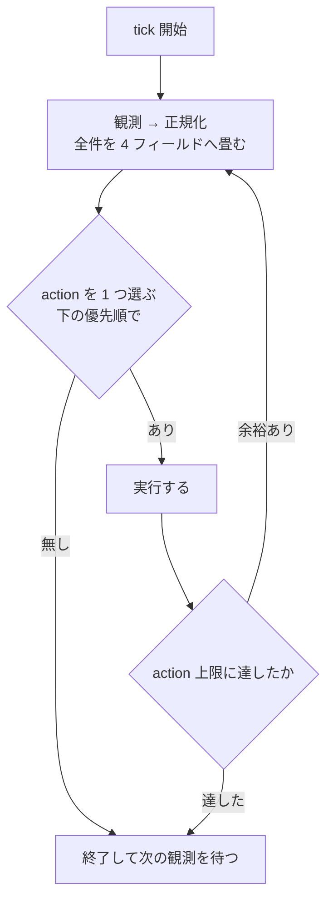

# 自動消化ループ

**目的は課題を滞りなく流すこと。**速く実装することではなく、**詰まりを作らないこと**が指標。
判断に迷ったら「どちらが待ち行列を短くするか」で決める。

**有限状態機械の reconciler。**外部化された状態を観測し、そこから一意に決まる遷移だけを実行する。
技術方針・製品優先順位・課題の中身には立ち入らない（`resolve` の領分）。

常駐して tick を繰り返す。**tick は冪等で、前回の続きを仮定しない。**
自分の記憶を状態にしない — 落ちても次の tick が観測から組み立て直せることが唯一の要件。

**project 差分が無くても動く。**ここの既定値から外れたときだけ project 側に書く。
唯一の例外は **Status の対応**で、これだけは project 必須（無ければ fail-closed で止まる）。
推測が外れても待ちが伸びるだけの項目には既定値を置き、**間違ったものを掴む項目には置かない。**

## 観測

**観測の最初に default を fetch する。**古い default を基準にすると、着地済みのものを稼働中と
数えて枠が埋まったままになる。tick が「前回の続きを仮定しない」のは、ここを毎回やり直すため。

読む先はここからのみ。

| 観測材料 | SSOT |
| --- | --- |
| 自動実行の承認・課題仕様 | Issue 本文 + Status |
| 二重着手防止 | remote branch |
| 計画 | 固定 marker 付きの Issue コメント（`resolve` が書く） |
| claim | 固定 marker 付きの Issue コメント（`references/same-branch.md`） |
| 人待ち | 固定 marker 付きの Issue コメント（`references/wait-record.md`） |
| 失敗 | 固定 marker 付きの Issue コメント（下記） |
| 着地 | PR の `merged` と default branch の SHA |
| 実行器 | セッション（状態値の意味は `references/harness.md`） |
| 容量 | worktree |
| 台帳 | Project Status（**排他には使わない**。承認・選出・台帳・退避の制御には使う） |

### 正規化

**正規化は Issue 単位で行う。**group を 1 レコードに畳まない — 一部だけ計画済みの group は
`ledger` が 1 つに決まらず、未計画側の refine が起きないか計画済み側を早期 claim するかになる。
**group が単位になるのは選出と資源の集約だけ**（claim・在庫・write の数え方）。

**共有の成果物をどう帰属させるかは `references/same-branch.md`。**そのまま引くと非代表が
永久に `未着手` になる。

**1 件につき 4 つのフィールドへ畳む。**`progress` と `runtime` は
**排他ラダー（上から読んで先に当たった行が勝つ）**で、生の条件は重なってよい — 重なりは順序が
解決する。`capacity` と `ledger` は値そのものが互いに素。

**`Conflict` はラダーで解決できないものだけ。**次の 5 つ。「2 つの行に当たった」は含まない。

- **観測できない**（API が落ちて PR の状態が読めない等）
- **証跡が矛盾している**（印はあるのに記録が無い等）
- **`ledger` が上の順で 5 に落ちた**（`準備中` なのに `完了` 等）
- **group の中で終端と非終端が混在している**（共有実体をどちらに倒しても壊れる）
- **Issue 契約が欠けているのに、捨てられない成果物がある**（commit または dirty）。
  差し戻すと実装が消え、放置すると着手できない

**`ledger` はこの順で判定する。**上から見て最初に当たったところで決まる。

1. **`退避先`** — 人が置いた安定状態。ずれを見ない（`Conflict` にも差し戻しにもしない）
2. **差し戻しの 3 事象のどれか** — 戻す
3. **期待どおり** — 何もしない
4. **期待より手前** — 前進で直す
5. **それ以外（先・解釈不能）** — `Conflict`

**差し戻しを `Conflict` より先に見るのが要点。**`進行中 × 未着手`（claim だけ残った）は
字面では「期待より先」に見えるので、順序を決めないと `Conflict` に吸い込まれて差し戻しに
到達しない。claim 直後に Status 更新が失敗した `準備中 × 計画済み` も同様で、4 で直る。

**`progress` — 成果物がどこまで進んだか。**セッションを見ない。**上から読み、最初に当たった
行が値**（各行は上の行に当たらないことを前提にする）。順序は恣意ではなく**包含関係** — 終端の
証跡があるなら中間状態は過ぎている。

| 値 | 条件（上の行に当たらないこと） |
| --- | --- |
| `着地済み` | PR が `merged`、または branch の**空でない** commit がすべて default に含まれる |
| `取り下げ` | Issue が closed、または **open PR が無く** head に紐づく最新 PR が unmerged で closed |
| `着地待ち` | open PR あり・checks 緑 |
| `提出中` | open PR あり |
| `実装中` | branch あり・**commit があるか worktree が dirty** |
| `準備済み` | branch あり・計画コメントあり |
| `準備中` | branch あり |
| `未着手` | 上のどれでもない |

**終端（`着地済み` / `取り下げ`）を最上段に置く。**`ship` は remote branch を消さないので、
merge 直後は「branch あり + commit あり」も同時に真になる。**終端を先に確定しないと、正常な
着地のたびに `Conflict` で止まり、片付けに到達しない。**

**worktree の「有無」は見ない。中身（dirty）だけ見る。**有無を入れると、着地待ちの worktree が
消えた瞬間に `未着手` へ退行し、**integration が二重発行される**（唯一の直列化点が破れる）。
一方 dirty は「まだ commit していない実装がある」ことの証跡で、worktree ごと消えたならその実装は
失われているので、`準備済み` へ戻るのが正しい。

**着地は PR の `merged` で見る。**`default..HEAD == 0` を主条件にすると、squash merge で着地済みが
未着地に見え、逆に **default から切っただけの空 branch が着地済みに見える**。PR を経由しない
着地だけ、**空でない** commit の包含で補う。

**`計画中` を `progress` に置かない。**計画セッションの有無は実行器の話で、成果物は進んでいない。
セッションが消えただけで成果物の進捗が退行する形にしない。

**`runtime` — 実行器がどうなっているか。**同じく上から読む。

| 値 | 条件（上の行に当たらないこと） |
| --- | --- |
| `人待ち` | 人待ちの記録が `waiting`（**セッションの有無を問わない**） |
| `稼働中` | セッションが動いている |
| `待機` | セッションはあるが動いていない（記録が無い / `cleared` のどちらも） |
| `無し` | セッションが無い |

**`人待ち` を最上段に置き、セッションの有無を条件に入れない。**入れると「答えを解釈して
`cleared` にした直後の idle」がどの値にも当たらず、**人待ちからの復帰が `Conflict` で止まる**。

**人待ちの SSOT は Issue の記録**であって、multiplexer の印ではない。印は即時観測用のキャッシュで、
セッションが死ぬと印も最後の応答も失われる。**印と記録が食い違ったら記録が正**（印だけがあるときは、
書き手が記録を残す前に落ちた可能性があるので `Conflict`）。

**`capacity` — 実体を持っているか。**

| 値 | 条件 |
| --- | --- |
| `あり` | worktree の checkout がある |
| `prunable` | checkout は無いが、**所有している workspace が残っている** |
| `無し` | どちらも無い |

容量を数えるのは `あり` だけ。`prunable` は片付けの対象ではあるが枠は食っていない
（`無し` に畳むと掃除が漏れ、`あり` に畳むと存在しないものを消しにいく）。

**branch を `capacity` に入れない。**未マージ branch は意図的に残すので、入れると `取り下げ` の
片付けが毎 tick 再発火して固定点に収束しない。

**`ledger` — Project Status。**`未計画` / `計画済み` / `進行中` / `完了` / `退避先`。
対応表は **project 必須**。

**Status を排他制御に使わない。使うのは着手承認・選出・台帳・退避の制御**まで
（理由は「claim」の節）。

| `progress` | 期待する `ledger` |
| --- | --- |
| `未着手` | `未計画` **または** `計画済み`（計画が済んで claim 前なら後者。どちらもずれではない） |
| `準備中`〜`着地待ち` | `進行中` |
| `着地済み` | `完了` |
| `取り下げ` | 触らない（人が置いた状態を尊重する） |

## 1 tick



**1 つ実行したら観測からやり直す。**git・GitHub・multiplexer は同時に撮れるスナップショットでは
ないので、**同じ観測に複数の変更を続けて適用すると別の競合を作る**。

空キューは**終了条件ではなく idle**。次の観測まで待つ。

### action の優先順

**同じ課題に 1 tick で 2 つの action を出さない。**上から最初に当たったものを 1 つだけ実行する
（片付けるなら起こさない、が自動的に守られる）。

**適用の単位は group**（正規化は Issue 単位、実体を触る action は代表の番号で 1 回）。
帰属・代表の固定・片付けの条件は `references/same-branch.md`。
**終端が混在する group は `Conflict`** にして人へ返す。

| 順 | action | 条件 | すること |
| --- | --- | --- | --- |
| 1 | **報告して止める** | `Conflict` | 触らずに状況ボードへ出す（fail-closed） |
| 2 | **片付ける** | `progress` が `着地済み` / `取り下げ`、**かつ**（`capacity` が `あり` / `prunable` **または** セッションが残っている **または** 人待ちの記録が `waiting`） | 成果を確認してから実体を消し、記録を閉じる（下記） |
| 3 | **計画セッションを閉じる** | `refine-<番号>` のセッションがあり、`runtime` が `人待ち` でなく、`ledger` が `未計画` でないか**そのセッションが動いていない** | pane を閉じる（計画枠を空ける） |
| 4 | **差し戻す** | 下の「差し戻し」の 3 事象のどれかに当たる | **先にセッションを止め**、表の戻し先へ移し、経緯を Issue にコメントする |
| 5 | **本文の変更を伝える** | 対象集合のどれかの本文が計画の記録と違う。**かつ届け先のセッションが生きていて、`runtime` が `人待ち` でない** | 再承認と再 plan が要ることを伝える。**計画側が更新されるまで枠渡しと着地を止める** |
| 6 | **計画の失効を伝える** | `baseSha..default` が計画の `invalidationScope` か `resourceKeys` に交差し、**届け先のセッションが生きていて、`runtime` が `人待ち` でない** | 再 plan が要ることを伝える（下記） |
| 7 | **台帳を進める** | `ledger` が期待より**手前**、または**対象集合の誰かの Status か assignee が欠けている** | Status と assignee を期待値へ寄せる（**前進のみ**。後退は「差し戻す」だけが行う）。claim の部分失敗はここで埋まる |
| 8 | **計画を起こし直す** | `ledger` が `未計画` かつ `runtime` が `人待ち`（記録が `waiting`）で、計画セッションが無い。かつ **計画枠に空きがある** | pane だけ作って起こす（worktree は使わない） |
| 9 | **解決を起こし直す** | `progress` が `準備中`〜`着地待ち` かつ、`runtime` が `無し` / `人待ち` でセッションが無い。**かつ対象集合の台帳が揃っている**（揃っていなければ「台帳を進める」が先）。かつ **checkout が無いなら容量に空きがある** | checkout があるなら pane だけ。無いなら worktree を作ってから起こす |
| 10 | **枠を渡す** | `runtime` が `待機` かつ、待っているのが write なら**資源キーが write 保持者（対象集合自身は除く）のどれとも交差しない**、integration なら**その課題が保持者として選ばれている** | 渡して再開させる |
| 11 | **計画を起こす** | `ledger` が `未計画` かつ `progress` が `未着手` かつ計画セッションが無く、人待ちの記録が `waiting` **でない** | `refine` を起こす（在庫の上限と計画枠を見る） |
| 12 | **claim する** | 選出の条件をすべて満たす | branch を作って起こす（下記） |

**`ledger` が `退避先` の課題に当てるのは、上 3 つ**（報告して止める・片付ける・計画セッションを閉じる）**だけ。**人が見るまで
拾わせないための状態なので、差し戻し・起こし直し・台帳の前進のどれで動かしても退避が復活する
（一度 `未計画` へ落ちれば、次の tick ではもう `退避先` ではない）。**判定は Status の値だけで
行う** — 経緯コメントは監査用で、分岐の条件にしない。

**計画の人待ちが落ちたときは「計画を起こし直す」が拾う。**`refine` は成果物を進めないので `progress` は `未着手`
のままで、「計画を起こす」の上限に阻まれると**記録を `cleared` にする主体が二度と立ち上がらない**。
再起動は新規の計画ではないので、在庫の上限を見ない。

**起こす・渡す action は、稼働中になったことを観測してから tick を終える。**確認しないと、
まだ `待機` に見える課題へ同じ枠をもう一度渡せる。**観測できなければ失敗として扱う**
（失敗の記録を進め、次の tick でやり直す。無言で次へ行かない）。

**`stale` は独立した概念ではない。**「`progress` から期待される `runtime` / `capacity` / `ledger`
とのずれ」がそれで、片付ける・計画セッションを閉じる・差し戻す・台帳を進める がその修復にあたる
（計画の通知 2 つは修復ではない）。別の表を持たない。

**前進と後退を混ぜない。**「台帳を進める」は期待表に向かって進めるだけ、「差し戻す」だけが戻す。
両方を「期待値へ寄せる」で書くと、同じ観測が「計画済みへ戻す」とも「未計画へ直す」とも読めて
一意にならない。


### いつ打つか

**ポーリングしない。待ちっぱなしにもしない。**状態のスナップショットを取り、前回と違ったときだけ打つ。
何も変わっていない tick は観測の空振りにしかならず、API の枠だけを焼く。

**入れるのは正規化と action が読むものすべての digest。**項目を列挙して足し忘れると、その観測
だけで進む遷移が永久に起きない（checks が緑になっても PR 番号は変わらないので、`提出中` から
`着地待ち` へ進まず **integration が一生発行されない**）。**個別に数え上げず、読むもの全部から
1 つの指紋を作る。**

読むものは「観測」の表がそのまま該当する — Issue（本文・Status・assignee・open / closed）、
remote branch、PR（state・checks）、固定 marker の 4 記録（claim・計画・人待ち・失敗）、セッション、
worktree と workspace、default の SHA。

丸めてよいのは 1 つだけ: **worktree が prepare を抜けたかは 0 か 1 に丸める**
（実装中にファイルが増えるたび起こさないため）。

**自分自身は入れない。**conductor の状態は応答のたびに変わるので、入れると全部ノイズになる。
スナップショットの取り方は harness 依存（`references/harness.md`）。

## 資源

並列は「事前に予測した path」ではなく**実行資源の貸し出し**で制御する。

**守るものが違うものを 1 つの語にまとめない。**まとめると「人待ちは返す」と「実体が枠を握る」が
矛盾する。**論理 lease（write / integration）の保持者は課題**、**物理枠（容量 / 計画枠）の保持者は
実体**、と分けると両立する。

| 資源 | 何を守るか | 保持者 | 保持している条件 | 同時数 |
| --- | --- | --- | --- | --- |
| **容量** | ディスクと build 資源 | worktree | `capacity` が `あり` | 5 |
| **計画枠** | 計画セッションの同時数 | セッション | **生存している `refine-*` のセッション**（人待ちでも返さない） | 3 |
| **write** | 同時書き込み。資源キーが交差しない | **課題** | `progress` が `実装中` / `提出中`、**または** `準備済み` かつ `runtime` が `稼働中` / `無し`。いずれも `runtime` が `人待ち` でなく `ledger` が `退避先` でなく、**本文が計画の記録と一致している** | **数の上限を置かない**（資源キーの交差が決める） |
| **integration** | **merge**。本当の直列化点 | **課題** | `着地待ち` かつ `runtime` が `人待ち` でなく `ledger` が `退避先` でなく、**本文が計画の記録と一致している**もののうち、PR 作成が最も早い 1 件 | **常に 1**（変更不可） |

**「保持している条件」が唯一の復元式。**取得と解放を別に書かない — 条件が満たされた瞬間に持ち、
外れた瞬間に空く、が観測から一意に決まる形。**`提出中` → `着地待ち` で write は空く**
（merge だけが直列化点なので、そこから先は integration が守る）。

**`退避先` が返すのは論理 lease だけ。**write と integration は返すが、**容量は占有したまま**
（worktree に未コミットの変更が残っているかもしれないので消さない）。人が見て判断するまで
枠が 1 つ埋まるのは意図した挙動 — 退避が積み上がったら容量で止まる、が正しい止まり方。

起こし直しの対象外なので、握らせたままにすると人が Status を動かすまで論理 lease が死ぬ。
**差し戻しがセッションを止めてから移す**ので、書き続ける実行器と枠の受け渡しが競合しない
（止められないなら `Conflict`）。

**`待機` が非保持なのは `準備済み` のときだけ。**「渡されるのを待っている = まだ書き始めていない」が
成り立つのはそこまでで、**`実装中` 以上の `待機` は書きかけで止まっている**（未コミットの変更や
commit を抱えている）。ここを区別しないと、**17 ファイル dirty のまま休止している課題と資源キーが
交差する別の課題へ write を渡す**。

**`人待ち` だけは `progress` を問わず非保持。**dirty を抱えたまま返すことになるが、それは
「予定範囲を超えたとき」の後発規則が引き受ける（worktree と変更は保持し、先行が着地したら
rebase して再開する）。返さない側に倒すと、**人が答えるまで交差する全課題が止まる**。

**`runtime` を条件に使うのは `人待ち` だけ。**記録という明示的な証跡があるので判定が一意に決まる。
`待機` は「渡されるのを待っている」と「gate を待って中断している」の両方に付き、`runtime` だけでは
切り分けられない。**`無し` を保持したままにしているのと同じ理由**で、そちらは成果物（`progress`）
で決める。

**人待ちは write も integration も返す。**着地の直前で製品判断を待つことはあるので、integration を
握ったままにすると**他の課題が永久に merge できない**。次点の PR へ譲る。

**論理 lease の保持者を課題にするのは、実体が交換可能だから。**セッションは交換可能な実行器、
worktree は交換可能な checkout で、**課題だけが復旧後も同一性を持つ**。だからセッションが死んでも
write を保持したまま起こし直せるし、worktree が消えても integration は二重発行されない。

**物理枠は実体そのものを数える。**`capacity` が `あり` の数が容量、**生存している `refine-*` の
セッション数**が計画枠。計画枠は人待ちでも返らない（実行器は残っているので）。**空くのは
セッションが消えたときだけ** — 計画セッションを閉じる行が要るのはこのため。

**`resolve` セッションを数える枠を別に持たない。**`resolve` は必ず worktree を作るので容量が
そのまま上限になる。二重に縛ると、**資源を何も使っていない `待機` のセッションが次の claim と
計画を止める**（停止中のセッションは background の完了で自分から再開するので、そもそも同時実行数
の入場制御にはならない）。`refine` だけ専用の枠が要るのは、worktree を持たず容量で縛れないため。

**容量が上限なら claim しない**（claim 手順 5 で worktree を作るため）。

**write に数の上限を置かない。**保持は条件から導出されるので、数では「誰が持つか」を制御できない
（条件が真になった瞬間に持つ）。数が実際に読まれるのは「枠を渡す」の前提だけで、そこで判断すべき
なのは**資源キーが交差しないか**であって何本目かではない — 交差しないなら何本走っていても安全、
交差するなら 1 本でも待たせる。数を足すと、安全なものを理由なく待たせる側にしか働かない。

**暴走は容量が止める。**write を持てるのは branch のある課題、つまり worktree を持つ課題だけで、
worktree は容量が縛る。外部の数値で止める役目はそちらが果たしている。

integration だけが固定なのは、**merge が本当の直列化点**だから。他は増減させてよい。
**PR 作成と CI は integration の外**で、write を持ったまま進む（理由は `resolve` の工程表）。
**integration の順序は PR 作成時刻で決める** — 同じ観測から常に同じ 1 件が選ばれる形にする。

**lock ではなく lease と呼ぶのは、明示的な解放を要さないから。**台帳は持たず、正規化した
レコードの集合が貸出状態そのもの。**論理 lease は `progress` が進めば自動で移り、終端で消える。**
物理枠は実体が消えた時点で空く。

**答えが返っても、そのまま書かせない。**返した枠は別の課題が使っている可能性があるので、
**記録が `cleared` になった課題には write を渡し直す。**交差していれば「予定範囲を超えたとき」の
後発として休止させる。渡し直さないと、資源キーが交差する 2 つが同時に書く。

判定は 3 値。**`unknown` は直列化する**（交差しないと言い切れないものを並列にしない）。

| 判定 | 意味 |
| --- | --- |
| `compatible` | 資源キーが交差しない。並列でよい |
| `incompatible` | 交差する。後発は待つ |
| `unknown` | 判定できない。**`incompatible` として扱う** |

資源キーは「同時に触ると壊れるもの」の名前であって path ではない。path は advisory に留める
（別ファイルでも caller と callee・generator と生成物・schema と consumer は意味的に衝突する）。

**キーの一覧を project が持っていなくてよい。**無ければ全部 `unknown` = 全直列になり、
遅いだけで壊れない。**並列が欲しくなった時点で、実際に衝突した組み合わせから書き足す。**
先に網羅しようとすると、使われないキーが並ぶ。

### 予定範囲を超えたとき

実装中に資源キーが増えるのは**異常ではない**（周辺改善を同じブランチで直しきる方針の帰結）。
規則を固定しておき、その場で判断しない。

1. **先に write を取った側が継続する**
2. 後発は安全なチェックポイントで休止する
3. **worktree と変更は保持する**（破棄しない）
4. 先行が着地したら rebase・再計画して再開する

これは実行資源待ちであって製品判断待ちではない。**人への差し戻しと混ぜない。**

## 硬い上限

暴走は「賢さ」で防がない。外部の数値で止める。容量は「資源」の表と「計画済みの在庫」、
それ以外はここ。

- 1 tick あたりの最大 action 数（既定 5）
- Issue 単位の retry budget（既定 3）。連続失敗は**選出対象外**へ退避する（下記）
- systemic failure の circuit breaker。rate limit・ネットワーク断は backoff
- **解釈不能な状態では fail-closed**（進めずに報告する）
- 所有していない worktree / セッションは削除しない
- **conductor 自身は Issue を作らない・Status を計画済みへ進めない**（自己増殖の禁止。キューを
  回すのが責務で、中身を判断しない）。台帳を期待値へ寄せることと、下の差し戻しは行う
- Issue 本文が変わったら、次の不可逆操作より前に休止する

**人待ちの数に上限を置かない。**質問を積んでも待ち行列は伸びない — 人待ちは write と
integration を返し、`refine` は容量も使わないので、待っている課題は資源を消費しない。
数を縛るのは物理枠（容量と計画枠）と在庫で足りており、人待ち専用の上限は同じものを
二重に縛るだけで、**人が答えている最中に新しい計画が止まる**副作用の方が大きい。

### 差し戻し

**Status は claim から着地まで単調に進む。**戻すのは次の 3 つだけで、**人待ちは含まない**
（人待ちは記録で表し、Status は進行中のまま）。**判定キーは観測できる条件で固定する** —
そうしないと「台帳を進める」の前進と区別がつかない。

| 何が起きた | 判定（観測できる述語だけ） | 戻し先 | あわせてすること |
| --- | --- | --- | --- |
| claim だけ残っていた | `ledger` が `進行中` かつ `progress` が `未着手` かつ **Issue 契約は揃っている** | **計画済み** | **claim の記録を消す**（残すと claim 済みに見えて二度と選出されない） |
| retry budget 切れ | 失敗の記録の `count` が上限に達した | **退避先** | — （以後は上 3 つしか当てないので押し戻されない） |
| 計画が無効 | **Issue 契約が欠けている**（かつ commit が無い） | **未計画** | **claim の記録を消し、branch と実体を片付ける** |

**「前提が崩れた」を差し戻しの理由にしない。**述語になっておらず、default の進行による計画の
失効と切り分けられない。**default が進んだことによる失効は「計画の失効を伝える」だけが扱う** — 差し戻しは
Issue 契約の欠落に限る。

**commit や dirty があるなら差し戻さず `Conflict`**（上の列挙の 5 つ目）。branch を消すと実装が
消えるので、判断を人へ返す。

**差し戻した先が、そのまま期待値と整合する形にする。**`未計画` へ戻すのに branch を残すと
`progress` が `準備中` のままなので、次の tick で台帳が `進行中` へ押し戻されて堂々巡りになる。
**永続コメントで期待値を上書きしない** — 失効条件を持てないので、再 claim 後も古い戻し先が残る。

### 失敗の記録

**retry budget をセッションの記憶に置かない**（tick は前回の続きを仮定しない）。Issue コメントへ
固定 marker で外部化し、正規化と起床スナップショットの入力に含める。

````markdown
<!-- retry:v1 -->
```yaml
count: <連続失敗回数>
lastAction: <失敗した action の名前>
```
<!-- /retry:v1 -->
````

**action が成功したら `count` を 0 にする。**`退避先` から人が戻したときも同じ（記録が残っていると
次の失敗で即座に退避する）。

**人待ちと実体待ちを未計画へ戻さない** — refine がすぐ拾い直すので、**止まらない。**

1 件を止めるのはこの表。**全体を止めるのは conductor セッション自体の停止**で、
認証不明・conductor の多重起動・計画 schema 不明・整合失敗の連続は全体 pause に倒す。

**conductor は 1 つだけ動かす。**起動したら自分のセッションに固定名を付け（`references/harness.md`）、
tick の観測で**同名のセッションが自分以外にいたら自分を止めて報告する**。名前が付いていないと
検知できないので、名乗るのを飛ばさない。

## 選出

**起こす候補は 2 種類。**どちらを起こすかは action の優先順が決める（**1 tick に 1 つだけ**。
ここは候補の条件を定義する節で、並行して起こす節ではない）。

| 起こすもの | 対象 |
| --- | --- |
| `refine` | Status が**未計画**の open Issue で、`refine-<番号>` のセッションが稼働していないもの |
| `resolve` | Status が**計画済み**の open Issue（下記の条件をすべて満たすもの） |

**Status が唯一の選出軸。**`refine` が Status を未計画から計画済みへ進めることが、着手承認そのもの。

対応表に要るのは 5 つ — **未計画 / 計画済み / 進行中 / 完了 / 退避先**（最後は retry budget 切れを
人が見るまで置く先）。claim と着地の判定が進行中と完了に依存するので、3 つでは足りない。
**書き手側からも読める場所に置く**（`refine` が計画済みへ進めるので、対応表が conductor 側に
しか無いと名前が食い違い、その Issue は誰にも選出されずに沈黙する）。

**明示された Status 以外は触らない**（fail-closed）。対応が無ければ何も選出せずに報告して止まる。
**「不明なので全部見る」に倒さない** — 置き場や参照用に使われている Status を掴む。
Status が増えたときも、対応表に載るまでは対象外。

### 計画済みの在庫

計画済みを積みすぎると、default が進むたびに計画が古くなり、着手時の再 plan が常態化する。
**上限に達していたら refine を起こさない**（消化を優先する）。既定は write 容量 + 先読み 1。

**数えるのは計画の数で、Issue の数ではない**（group は 1。「同一ブランチ group」を参照）。

**揃っていない group の残りを計画する refine は、在庫の上限を超えて起こす。**上限の目的は
「積みすぎて計画が古くなる」ことの防止で、これは新しい仕事を積むのではなく**既に計画済みのものを
着手可能にする**操作。例外にしないと、計画済みなのに永久に claim できない Issue が残る。

**上限は起こすかどうかの判定であって、`refine` / `resolve` 自身の停止条件ではない。
判定はここでだけ行う。**

### resolve に渡す条件

次を**すべて**満たすものだけ。

1. Issue が open
2. Status が計画済み
3. まだ claim されていない（下記）
4. Issue 契約が揃っている
5. `Depends on #N` の依存がすべて解消している

**claim 済みの判定は 4 通りある。**branch 名には番号が 1 つしか入らないので、1 つだけでは漏れる。

- **claim の記録の `members` に含まれている**（最も確実。加入は記録が実体なので、台帳や計画の
  更新が途中で落ちてもここには残る）
- その Issue 番号の remote branch がある（実体の有無は問わない。**実体が無いものは
  「起こし直す」が扱う**ので、選出で拾うと二重になる）
- **計画コメントの `alsoResolves` に番号が含まれている**（1 ブランチで複数の Issue を片付ける
  のは通常運用なので、これを見ないと二重着手になる）。**セッションの生死で判定しない** —
  外部化された計画は残るので、セッションが消えた隙に別 branch を claim できてしまう
- **同じ group の代表が claim されている**（下記）

### 同一ブランチ group

Issue 本文の **`Same branch as #N`** で結ばれた集合が group（宣言の定義は
`references/same-branch.md`）。**group は 1 単位として claim する** — branch は 1 本、`resolve` には**対象集合の全番号**を渡す。代表の決め方と固定（claim 後に引き直さない）は `references/same-branch.md`。

`alsoResolves` だけでは **claim から計画コメント書き込みまでの窓が空く。**その間、同じ group の
別 Issue が未 claim に見えて別セッションが起き、1 本で直すはずのものが複数ブランチに割れる。
本文の宣言はセッションより先に存在するので、この窓が消える。

**group の一部だけが計画済みなら claim しない。**残りが後から同じブランチへ入れられなくなる。

**group はどこでも 1 と数える。**1 group = 1 計画 = 1 branch = 1 write lease。
在庫も容量も同じ（古くなるときもまとめて古くなる）。

### 順序

`Depends on #N` から依存グラフを組み、**他をブロックしている数が多いものを先に取る**。
詰まりの原因を先に流すため。同数ならボード上の並び順。

依存は選出のフィルタでもある（解けていないものは選ばない）が、**それだけに使うと詰まりが残る**。
待たせている課題があるなら、それを解く課題が最優先。

**枠を渡す先が複数競合したときも、同じ順序で選ぶ。**選出だけの規則にすると、claim 済みの
課題どうしの順番を決める根拠がどこにも無くなり、その場の判断に落ちる。

**人が優先順を変えたいときは、ボードを並べ替えてもらう。**指示を conductor の記憶にも
永続コメントにも置かない — tick は前回の続きを仮定しないので記憶は次の tick で消え、
コメントは失効条件を持てないので古い優先順が残り続ける。**ボードは観測材料そのもの**なので、
並べ替えれば次の tick から自動で効き、気が変わればまた並べ替えるだけで戻る。

**未計画のままなら拾われない**のが正しい。進め忘れが自動着手にならない側へ倒す。

## Issue 契約

**Status が計画済み = 「計画が済んでいる」という宣言。**項目は `refine` の Issue 契約が SSOT。
**揃っているかを確認するだけ**で、欠けていたら着手せず不足項目を挙げて差し戻す（戻し先は
「差し戻し」の表）。

## claim

**claim = その課題を自分が引き受けたという宣言。**未 claim なら拾ってよい、claim 済みなら拾わない。
判定材料と理由は「選出」の節。

**remote branch の一意作成が二重着手の最後の防壁**（作成成功と conflict を区別できる）。
Status や assignee では排他できない — 同時に 2 つが「自分が取った」と書き込めてしまう。順序を守る。

1. Issue 契約を検証する（group なら全員分）
2. remote branch を代表の番号で一意に作成する。失敗したら候補を捨てて次へ
3. **claim の記録を代表の Issue へ書く**（代表と全員の番号。形式は `references/same-branch.md`）
4. **記録した全員**の Status を進行中にし、assignee を自分にする（group でも代表だけにしない）
5. worktree を作る
6. セッションを起こす（`references/harness.md`）

**4 が誰か 1 人でも失敗したらセッションを起こさない。**`resolve` は Status が進行中であることで
`managed` と判定するので、台帳がずれたまま起こすと **lease を一度も待たない `interactive` として
着地まで走る**
（`integration` が常に 1 という唯一の直列化点が破れる）。branch は残し、次の tick へ返す。

Project の更新失敗で claim をロールバックしない。**branch が真実**で、Status は台帳。
ずれは次の tick が直す。base は常に default から切る。

branch 名は `{prefix}/{Issue 番号}-{slug}`（prefix の既定は `feat` / `fix` / `chore`）。
**番号を含めるのは claim を機械的に引くため**で、この形は変えない。prefix の集合は project が変えてよい。

## 片付ける

**所有していないものは消さない。**手順は `references/harness.md`。`refine` は pane を閉じるだけ、
`resolve` は worktree ごと片付ける。

### 片付ける前に成果を確認する

**worktree とセッションを消すと、セッションまとめが一緒に消える。**積み残し・懸念・気づきは
そこにしか無く、**git にも Issue にも残らない。**着地の確認と片付けを続けて実行しない。

1. **PR にセッションまとめが載っているか確認する**（`resolve` は着地前に書く規約）
2. 載っていなければ pane から回収する。pane も消えていれば harness の transcript を探す
3. **どこにも無ければ片付けず報告する。**消えたものは復元できない

コメントは**同内容が既にあれば追記しない**（tick ごとに同じ失敗を投稿しない）。

## 計画の失効

**action の 1 つ**（優先順の「計画の失効を伝える」）。他の action と同じく、1 tick に 1 つだけ実行して観測へ戻る。

**届け先が居ないなら伝えない。**セッションが死んでいるときは「起こし直す」が先に実体を戻し、
起こされた側が計画コメントの `baseSha` を読み直す。伝えたことにして飛ばすと、前提が崩れたまま
実装が続く。

**人待ち中も伝えない。**人の回答を待っている最中に別の指示を送ると、質問が流れる。
`cleared` になって `待機` に落ちた時点で、**枠を渡すより先に**伝える（優先順が既にその形）。

**「本文の変更」も同じ扱い。**届け先が居ない・人待ち中は伝えず、起こし直しを先に通す。
収束条件は**計画に記録した本文が現在の本文と一致すること**（再 plan で更新される）。

**収束条件は計画の `baseSha`。**伝えた後も交差は真のままなので、再 plan で `baseSha` が更新
されるまで再発火しうる。**再送を止める状態を記憶に持たない** — 代わりに、伝えた側が計画コメントを
更新するまでの間は `runtime` が `稼働中` なので、次の tick では優先順の上位（片付け・差し戻し）に
当たらない限り同じ通知になる。**同じ内容の再送は害が無い**（受け手は冪等に再 plan する）。

**default が進んだら、稼働中セッションの計画と突き合わせる。**実装セッションは default を監視できない
（待つ間は待機で、ポーリングしない）ので、conductor が伝えないと誰も気づかない。

`baseSha..default` の変更 path が計画の `invalidationScope` か `resourceKeys` に交差したら、
そのセッションに伝えて再 plan させる。**交差しなければ何もしない** — 無関係な進行で実装を止めると、
default が動くたびに全セッションが中断する。

伝えないと、着地直前の rebase まで前提の崩れに気づけない。検証も意図の確認も済ませた後なので、
そこで判明すると手戻りが最大になる。

## 状況ボード

**1 つの Artifact を更新し続ける。**ユーザーがそれを見れば、今どの worktree で何が起きているかが
分かる状態にする。Artifact を作れない harness では、同じ内容を最終応答に出す。

更新するのは**稼働中・詰まり・キューのいずれかが変わったとき**。変化の無い tick で書き直さない。

載せるもの:

| 項目 | 中身 | 観測元 |
| --- | --- | --- |
| 稼働中 | Issue 番号・`progress`・保持している資源・`runtime` | 正規化レコード |
| 待機中 | 何を待っているか、何が空けば動くか | 正規化レコードと容量 |
| 詰まり | 人待ちのもの。**何を答えれば進むか**を 1 行で | 人待ちの記録の `reason` |
| 直近の着地 | 前の tick 以降に default へ入ったもの | default の SHA 差分 |
| キュー | 計画済みの残数と次に取る予定の上位数件 | Issue 一覧 |

**URL は記憶しない。題名を固定し、一覧から引き当てて更新する**（無ければ新規に作る）。
記憶を持たない原則と両立させるため。tick ごとに新しい Artifact を作らない。

1 件終わるごとの詳細な報告は `resolve` のセッションまとめが担う。ここは全体の現在地だけを持つ。
