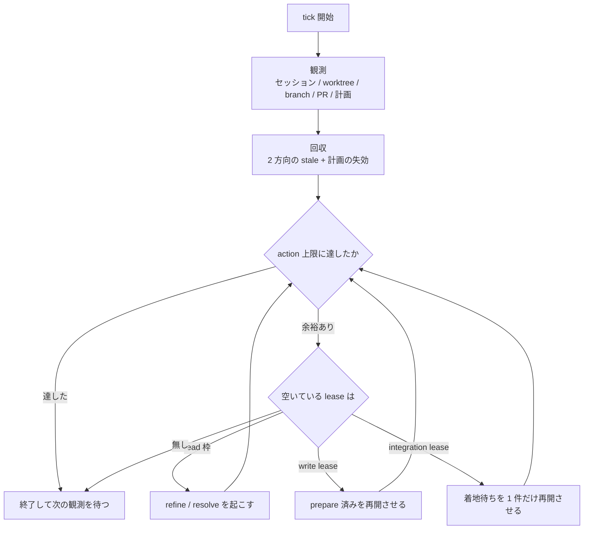

# 自動消化ループ

**目的は課題を滞りなく流すこと。**速く実装することではなく、**詰まりを作らないこと**が指標。
判断に迷ったら「どちらが待ち行列を短くするか」で決める。

**有限状態機械の reconciler。**外部化された状態を観測し、そこから一意に決まる遷移だけを実行する。
技術方針・製品優先順位・課題の中身には立ち入らない（`resolve` の領分）。

常駐して tick を繰り返す。**tick は冪等で、前回の続きを仮定しない。**
自分の記憶を状態にしない — 落ちても次の tick が観測から組み立て直せることが唯一の要件。

**project 差分が無くても動く。**ここの既定値から外れたときだけ project 側に書く。
唯一の例外は **Status の対応**で、これだけは project 必須（無ければ fail-closed で止まる）。
推測が外れても待ちが伸びるだけの項目には既定値を置き、**間違ったものを掴む項目には置かない。**

## 状態の SSOT

観測はここからのみ行う。

| 状態 | SSOT |
| --- | --- |
| 自動実行の承認・課題仕様 | Issue 本文 + Status |
| 二重着手防止 | remote branch |
| 計画 | 固定 marker 付きの Issue コメント（`resolve` が書く） |
| 実装実体 | worktree・git diff / commit・セッション |
| integration | PR・checks・default branch の SHA |
| 人向け進捗 | Project Status（**表示用。ロックにしない**） |

### 工程の判定

**観測の最初に default を fetch する。**古い default を基準にすると、着地済みのものを稼働中と
数えて枠が埋まったままになる。tick が「前回の続きを仮定しない」のは、ここを毎回やり直すため。

**セッションの生死しか外からは見えない**（multiplexer が返すのは idle / working / 中断の別だけ）。
どの工程にいるかは git と PR から引く。

| 観測 | 工程 | 保持している lease |
| --- | --- | --- |
| worktree もセッションも無い | 未着手 | — |
| **`refine-<番号>` のセッションがある**（worktree は無い） | refine 中 | read |
| worktree の `HEAD` が default と**同一 SHA** かつ **clean** | prepare 中 | read |
| worktree が **dirty**、または commit があって PR が無い | 実装中 | write |
| PR あり + CI pending | 提出 | write |
| PR あり + CI 緑 + 未 merge | integration 待ち | integration |
| **`default..HEAD` が 0** かつ `HEAD` が default と**別 SHA** | 完了 | — |

`refine` は worktree を作らないので、**セッション名で引く**（`resolve` は worktree で引ける）。
完了を `default..HEAD == 0` で見るのは、PR を経由しない着地も拾えるため。

**表の工程は「どこまで進んだか」で、保持 lease はその既定値。**人待ちのセッションは工程に
関わらず lease を返す（「lease」を参照）。

**commit 数だけで判定しない。**`default..HEAD == 0` は prepare 中と完了の両方で成り立ち（SHA で
分ける）、dirty な worktree は commit 0 でも実装中（clean かで分ける）。どちらを落としても枠の
数え方が狂う。

**lease はこの表から復元する。**工程名は `resolve` と同じ語を使う（状況ボードに出るため）。
**integration 待ちが複数あるときは PR 作成が早い方が lease を持つ** — 表の列だけ見て全員が
持っていると数えない。idle の意味も表と組み合わせて決まり、write 枠が空いているのに idle なら
中断（再開させる）、埋まっていて idle なら正常な待機。**状態表示だけで完了と判定しない。**

## 1 tick

空キューは**終了条件ではなく idle**。次の観測まで待つ。

### いつ打つか

**ポーリングしない。待ちっぱなしにもしない。**状態のスナップショットを取り、前回と違ったときだけ打つ。
何も変わっていない tick は観測の空振りにしかならず、API の枠だけを焼く。

スナップショットに入れるもの:

- default の SHA
- worktree ごとに prepare を抜けたか（commit があるか dirty か。**0 か 1 に丸める**。
  実装中にファイルが増えるたび起こさない）
- open PR の番号と branch
- 子セッションの名前と状態

**自分自身は入れない。**conductor の状態は応答のたびに変わるので、入れると全部ノイズになる。
スナップショットの取り方は harness 依存（`references/harness.md`）。

## lease

並列は「事前に予測した path」ではなく**実行資源の貸し出し**で制御する。

| lease | 何に使うか | 発行条件 | 同時数（既定） |
| --- | --- | --- | --- |
| read | `refine` と `resolve` の prepare | 読み取りのみなので衝突しない | 3 |
| write | 実装 | 資源キーが稼働中のどれとも交差しない | 4 |
| integration | **merge** | — | **常に 1**（変更不可） |
| （worktree 総数） | ディスクと build 資源の頭打ち | lease とは独立 | 9 |

**worktree 総数が上限なら、lease が空いていても claim しない**（claim 手順 4 で作るため）。

integration だけが固定なのは、**merge が本当の直列化点**だから。他は増減させてよい。
**PR 作成と CI は integration の外**で、write を持ったまま進む（CI はブランチごとに独立して回る）。

**`refine` は worktree を作らない**ので、worktree を持つのは `resolve` だけ。
総数は lease の合計から導かず、独立の頭打ちとして置く（人待ちのセッションも worktree を残す）。

**lock ではなく lease と呼ぶのは、明示的な解放を要さないから。**台帳は持たず、稼働中セッションの
集合とその計画（`resourceKeys`）が貸出状態そのもの。セッションが消えれば貸出も消えるので、
**持ち主が死んで枠が残り続ける状態が原理的に起きない。**

**人待ちは lease を返す。**製品判断を待って止まっているセッションは実行資源を使っていないので
稼働中に数えない。数えると、答えを待っている間だけ並列度が落ちる。代わりに**人待ちの総数に
上限を置く**（既定 3）— 答えられる量を超えて質問を積んでも、待ち行列が伸びるだけで速くならない。

判定は 3 値。**`unknown` は直列化する**（交差しないと言い切れないものを並列にしない）。

| 判定 | 意味 |
| --- | --- |
| `compatible` | 資源キーが交差しない。並列でよい |
| `incompatible` | 交差する。後発は待つ |
| `unknown` | 判定できない。**`incompatible` として扱う** |

資源キーは「同時に触ると壊れるもの」の名前であって path ではない。path は advisory に留める
（別ファイルでも caller と callee・generator と生成物・schema と consumer は意味的に衝突する）。

**キーの一覧を project が持っていなくてよい。**無ければ全部 `unknown` = 全直列になり、
遅いだけで壊れない。**並列が欲しくなった時点で、実際に衝突した組み合わせから書き足す。**
先に網羅しようとすると、使われないキーが並ぶ。

### 予定範囲を超えたとき

実装中に資源キーが増えるのは**異常ではない**（周辺改善を同じブランチで直しきる方針の帰結）。
規則を固定しておき、その場で判断しない。

1. **先に write lease を取った側が継続する**
2. 後発は安全なチェックポイントで休止する
3. **worktree と変更は保持する**（破棄しない）
4. 先行が着地したら rebase・再計画して再開する

これは実行資源待ちであって製品判断待ちではない。**人への差し戻しと混ぜない。**

## 硬い上限

暴走は「賢さ」で防がない。外部の数値で止める。容量は「lease」の表と「計画済みの在庫」、
それ以外はここ。

- 1 tick あたりの最大 action 数（既定 5）
- Issue 単位の retry budget。連続失敗は**選出対象外**へ退避する（下記）
- systemic failure の circuit breaker。rate limit・ネットワーク断は backoff
- **解釈不能な状態では fail-closed**（進めずに報告する）
- 所有していない worktree / セッションは削除しない
- **conductor 自身は Issue を作らない・Status を計画済みへ進めない**（自己増殖の禁止。キューを
  回すのが責務で、中身を判断しない）。進行中への遷移と差し戻しは行う
- Issue 本文が変わったら、次の不可逆操作より前に休止する

**戻し先を混ぜない。**未計画へ戻すと refine がすぐ拾い直すので、**止まらない。**

| 何が起きた | 戻し先 |
| --- | --- |
| 人の判断待ち（停止条件） | **計画済み**。答えが返れば同じ計画で再開できる |
| claim だけ残っていた（stale） | **計画済み**。計画は生きている |
| retry budget 切れ・繰り返し失敗 | **選出対象外の Status**。人が見るまで拾わせない |
| 計画そのものが無効になった | **未計画**。refine からやり直す |

1 件を止めるのはこの表。**全体を止めるのは conductor セッション自体の停止**で、
認証不明・conductor の多重起動・計画 schema 不明・整合失敗の連続は全体 pause に倒す。

**conductor は 1 つだけ動かす。**起動したら自分のセッションに固定名を付け（`references/harness.md`）、
tick の観測で**同名のセッションが自分以外にいたら自分を止めて報告する**。名前が付いていないと
検知できないので、名乗るのを飛ばさない。

## 選出

**2 種類を選ぶ。**read 枠が空いていれば両方を並行して起こす。

| 起こすもの | 対象 |
| --- | --- |
| `refine` | Status が**未計画**の open Issue で、`refine-<番号>` のセッションが稼働していないもの |
| `resolve` | Status が**計画済み**の open Issue（下記の条件をすべて満たすもの） |

**Status が唯一の選出軸。**対応表は **project 必須**（既定値を置くと人力タスクを掴む）。
`refine` が Status を未計画から計画済みへ進めることが、着手承認そのもの。

対応表に要るのは 3 つ — **未計画 / 計画済み / 退避先**（retry budget 切れを人が見るまで置く先）。
**書き手側からも読める場所に置く**（`refine` が計画済みへ進めるので、対応表が conductor 側に
しか無いと名前が食い違い、その Issue は誰にも選出されずに沈黙する）。

**明示された Status 以外は触らない**（fail-closed）。対応が無ければ何も選出せずに報告して止まる。
**「不明なので全部見る」に倒さない** — 置き場や参照用に使われている Status を掴む。
Status が増えたときも、対応表に載るまでは対象外。

### 計画済みの在庫

計画済みを積みすぎると、default が進むたびに計画が古くなり、着手時の再 plan が常態化する。
**上限に達していたら refine を起こさない**（消化を優先する）。既定 5 = write 容量 + 先読み 1。

**数えるのは計画の数で、Issue の数ではない**（group は 1。「同一ブランチ group」を参照）。
Issue 単位で数えると、上限に達した瞬間に group の残りを計画できなくなり、
**計画済みなのに着手できない Issue が残る。**

**揃っていない group の残りを計画する refine は、上限を超えて起こす。**上限の目的は
「積みすぎて計画が古くなる」ことの防止で、これは新しい仕事を積むのではなく**既に計画済みのものを
着手可能にする**操作。例外にしないと、計画済みなのに永久に claim できない Issue が残る。

**上限は起こすかどうかの判定であって、`refine` / `resolve` 自身の停止条件ではない。
判定はここでだけ行う。**

### resolve に渡す条件

次を**すべて**満たすものだけ。

1. Issue が open
2. Status が計画済み
3. まだ claim されていない（下記）
4. Issue 契約が揃っている
5. `Depends on #N` の依存がすべて解消している

**claim 済みの判定は 3 通りある。**branch 名には番号が 1 つしか入らないので、1 つだけでは漏れる。

- その Issue 番号の remote branch がある
- **稼働中セッションの計画の `alsoResolves` に番号が含まれている**（1 ブランチで複数の Issue を
  片付けるのは通常運用なので、これを見ないと二重着手になる）
- **同じ group の代表が claim されている**（下記）

### 同一ブランチ group

Issue 本文の **`Same branch as #N`** で結ばれた集合が group（宣言の定義は
`../refine/references/same-branch.md`）。**group は 1 単位として claim する** —
代表は最小番号、branch は 1 本、`resolve` には全番号を渡す。

`alsoResolves` だけでは **claim から計画コメント書き込みまでの窓が空く。**その間、同じ group の
別 Issue が未 claim に見えて別セッションが起き、1 本で直すはずのものが複数ブランチに割れる。
本文の宣言はセッションより先に存在するので、この窓が消える。

**group の一部だけが計画済みなら claim しない。**残りが後から同じブランチへ入れられなくなる。

**group はどこでも 1 と数える。**1 group = 1 計画 = 1 branch = 1 write lease。
在庫も容量も同じ（古くなるときもまとめて古くなる）。

### 順序

`Depends on #N` から依存グラフを組み、**他をブロックしている数が多いものを先に取る**。
詰まりの原因を先に流すため。同数ならボード上の並び順。

依存は選出のフィルタでもある（解けていないものは選ばない）が、**それだけに使うと詰まりが残る**。
待たせている課題があるなら、それを解く課題が最優先。

**未計画のままなら拾われない**のが正しい。進め忘れが自動着手にならない側へ倒す。

## Issue 契約

**Status が計画済み = 「計画が済んでいる」という宣言。**項目は `refine` の Issue 契約が SSOT。
**揃っているかを確認するだけ**で、欠けていたら着手せず不足項目を挙げて差し戻す。

実行メタデータ（base・worktree path・セッション ID・候補 SHA）は本文に無いのが正しい。時間で
変わるので Project field・branch・PR から引く。

## claim

**claim = その課題を自分が引き受けたという宣言。**未 claim なら拾ってよい、claim 済みなら拾わない。
判定材料と理由は「選出」の節。

**remote branch の一意作成が二重着手の最後の防壁**（作成成功と conflict を区別できる）。
Status や assignee では排他できない — 同時に 2 つが「自分が取った」と書き込めてしまう。順序を守る。

1. Issue 契約を検証する（group なら全員分）
2. remote branch を代表の番号で一意に作成する。失敗したら候補を捨てて次へ
3. Status を進行中にし、assignee を自分にする
4. worktree を作る
5. セッションを起こす（`references/harness.md`）

Project の更新失敗で claim をロールバックしない。**branch が真実**で、Status は台帳。
ずれは次の tick が直す。base は常に default から切る。

branch 名は `{prefix}/{Issue 番号}-{slug}`（prefix の既定は `feat` / `fix` / `chore`）。
**番号を含めるのは claim を機械的に引くため**で、この形は変えない。prefix の集合は project が変えてよい。

## stale の回収

ずれは 2 方向に出る。**どちらも容量の数え方を狂わせる**ので、tick で必ず両方判定する。

| ずれ | 判定 | 扱い |
| --- | --- | --- |
| claim だけ残っている | 進行中なのに branch も worktree もセッションも無い | **計画済み**へ戻し、経緯を Issue にコメントする |
| 実体だけ残っている | 工程の判定表で**完了**なのに worktree / セッションがある | **稼働中に数えない。**自分が作ったものは片付ける（手順は `references/harness.md`） |
| worktree が prunable | checkout が消えている | 稼働中に数えない。自分が作ったものなら片付ける |

完了かどうかは工程の判定表に従う。

### 片付ける前に成果を確認する

**worktree とセッションを消すと、セッションまとめが一緒に消える。**積み残し・懸念・気づきは
そこにしか無く、**git にも Issue にも残らない。**着地の確認と片付けを続けて実行しない。

1. **PR にセッションまとめが載っているか確認する**（`resolve` は着地前に書く規約）
2. 載っていなければ pane から回収する。pane も消えていれば harness の transcript を探す
3. **どこにも無ければ片付けず報告する。**消えたものは復元できない

**idle は中断・lease 待ち・人待ちのどれでもありうる。**中断なら同じセッションを再開させる。

コメントは**同内容が既にあれば追記しない**（tick ごとに同じ失敗を投稿しない）。

## 計画の失効

**default が進んだら、稼働中セッションの計画と突き合わせる。**実装セッションは default を監視できない
（待つ間は idle で、ポーリングしない）ので、conductor が伝えないと誰も気づかない。

`baseSha..default` の変更 path が計画の `invalidationScope` か `resourceKeys` に交差したら、
そのセッションに伝えて再 plan させる。**交差しなければ何もしない** — 無関係な進行で実装を止めると、
default が動くたびに全セッションが中断する。

伝えないと、着地直前の rebase まで前提の崩れに気づけない。検証も意図の確認も済ませた後なので、
そこで判明すると手戻りが最大になる。

## 状況ボード

**1 つの Artifact を更新し続ける。**ユーザーがそれを見れば、今どの worktree で何が起きているかが
分かる状態にする。Artifact を作れない harness では、同じ内容を最終応答に出す。

更新するのは**稼働中・詰まり・キューのいずれかが変わったとき**。変化の無い tick で書き直さない。

載せるもの:

| 項目 | 中身 | 観測元 |
| --- | --- | --- |
| 稼働中 | Issue 番号・工程・保持 lease・セッションが生きているか | worktree list + agent list + git + PR |
| 待機中 | 何を待っているか、何が空けば動くか | 工程の判定表と容量 |
| 詰まり | 人待ちのもの。**何を答えれば進むか**を 1 行で | Issue のコメント |
| 直近の着地 | 前の tick 以降に default へ入ったもの | default の SHA 差分 |
| キュー | 計画済みの残数と次に取る予定の上位数件 | Issue 一覧 |

**URL は記憶しない。題名を固定し、一覧から引き当てて更新する**（無ければ新規に作る）。
記憶を持たない原則と両立させるため。tick ごとに新しい Artifact を作らない。

1 件終わるごとの詳細な報告は `resolve` のセッションまとめが担う。ここは全体の現在地だけを持つ。
