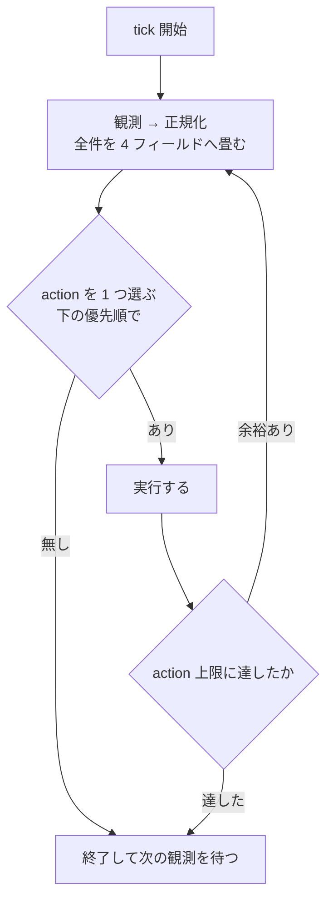

# 自動消化ループ

**目的は課題を滞りなく流すこと**。速く実装することではなく、**詰まりを作らないこと**が指標。
判断に迷ったら「どちらが待ち行列を短くするか」で決める。

**有限状態機械の reconciler**。外部化された状態を観測し、そこから一意に決まる遷移だけを実行する。
技術方針・製品優先順位・課題の中身には立ち入らない（`resolve` の領分）。

常駐して tick を繰り返す。**tick は冪等で、前回の続きを仮定しない。**
自分の記憶を状態にしない — 落ちても次の tick が観測から組み立て直せることが唯一の要件。

**project 差分が無くても動く**。ここの既定値から外れたときだけ project 側に書く。
唯一の例外は **Status の対応**で、これだけは project 必須（無ければ fail-closed で止まる）。
推測が外れても待ちが伸びるだけの項目には既定値を置き、**間違ったものを掴む項目には置かない。**

## 受け取らない

**自分の context が増える依頼を、自分では実行しない**。問い合わせ・調査・文書仕事・skill の修正を
渡されたら、**着手せずに pane を割って振る**（手順は下記「振る」）。**断って終わりにしない** ——
断りだけを返すと、人が引き取り先を探す仕事だけが残る。

**断る理由は忙しさではなく、劣化の仕方**。tick は 1 周のコストが事前に決まるが、対話・調査・文書は
**着手前に決まらない**。同じ実行器に載せると後者が前者を一方的に削り、しかも落ちるのは
「動かなくなる」ではなく「**観測の行が 1 つ落ちる**」「**在庫の評価が甘くなる**」なので、
外からは正常に見えたまま tick の質だけが下がる。**気づけない失敗なので、断ることでしか防げない。**

**判定は「自分の context が増えるか」の 1 本**。増えるなら受け取らない。
**「観測に混ぜれば済むか」を条件にしない** —— 済まないが context も増えないものが実際にあり
（人が渡した回答の転記、指示された Issue の作成、宣言行の記入）、**どちらも他の節が明示的に
許可している**。2 つの述語を並べると、許可されている経路を「自分の領分ではない」と事実に反して断る。

**人から渡されたものの処理は action ではない**（転記・指示された Issue の作成・宣言行の記入・振る）。
`1 tick 1 action` にも上限にも数えない（`退避先` の `count` 精算・状況ボードの更新と同じ扱い）。
転記のやり方は `references/harness.md`。

**自分の観測から出たものの起票は、action として数える**（条件は「Issue の作成と本文」）。Issue 一覧を
変えて次の tick の選出に効くので、免除に載せると**上限に数えないまま自分で仕事を増やす経路が開く**。
免除が守っているのは「人が渡した仕事のせいで tick が止まらないこと」であって、conductor 自身が
増やすぶんではない。

### 振る

**pane を割り、材料を渡して起こす。完了を待たない**。入れ物と命名は `references/harness.md`。
振ったことは**状況ボードの「表に載らない滞留」と応答に出す** —— どこへ行ったか分からないと、
人が同じことをもう一度頼む。

**製品判断は振らない。人へ返す**。機能を足す・削る・仕様を変える・優先度を決めるは人の権限で、
別のエージェントに渡すと**誰も承認していない決定が、承認されたかのように戻ってくる**。
振ってよいのは**答えが事実で決まるもの**（調査・実装・文書・skill の修正）だけ。

**材料は「自分の tick で既に観測したもの」だけを渡す**。渡すために調べ直さない —— それをやると
振る意味が消える（context が増えるのを避けるための経路なので）。手元に無いものは
**事実ではなく在り処を渡す**（Issue 番号・file path・コマンド）。

**確認済みの事実は必ず渡す**。渡さないと受け手が同じ観測をやり直す。**「調べた結果 0 件だった」も
事実**で、これを落とすと受け手は「まだ調べていない」と読んで調べ直す。

**判断が済んでいるなら、済んでいると書く**。書かないと受け手が是非から問い直し、人が同じ判断を
2 回する。逆に**判断が残っているならどれが残っているかを書く** —— 全部決まっている前提で渡すと、
受け手が黙って自分で決める。

**渡した先の出力を自分で読み込まない**。読むと結局 context が増える。人が読む場所に出ているので、
必要なら人が戻してくる（`references/harness.md` の転記）。

**振り先を稼働中の課題にしない**。同じテーマの worktree が動いていても、そこへ注入すると
**その課題が知らないところで計画の `invalidationScope` / `resourceKeys` / 本文の digest が濁る**
（`resolve` のスコープ規約は**自分で気づいたもの**を吸収するためのもので、外から積むためではない）。
そもそも**どの課題に載せられるかは中身の判断**で、conductor の領分ではない。
**人が「この worktree で」と指示したときは、人が渡す** —— 転記の経路が既にある。

### Issue の作成と本文

**書いてよいのは関係の行だけ** —— 宣言（`Depends on #N` / `Same branch as #N`）と `Refs #N`。
**それ以外の本文（目的・受入条件・非目標・リスク・設計判断）には触らない**。そこは製品判断と
計画の領分で、conductor が書くと**誰も承認していない仕様が Issue 契約として通る。**

**Issue の作成は、人が指示したときだけ**。自分の観測から「これも要りそう」で起票しない
（何を課題にするかは製品判断）。

**例外は自分の規約の穴だけ**（自分が読んでいる skill の記述の誤り・欠落・矛盾）。**製品判断ではない**
ので禁止の射程に入らず、**ここでしか外部化できない** —— 状況ボードは tick ごとに書き直されるので、
そこにしか書かないものは次の tick で消える（実測で、実際に踏んだ穴が消える直前だった）。歯止めは 4 つ。

- **この tick で、その穴のせいで action が誤発火したか、規約を曲げる判断をしたもの**に限る。
  「読んでいて気になった」では起こさない
- **書くのは観測した事実だけ** —— 何を観測し、どの記述とどう食い違ったか。
  **直し方・受入条件・非目標・優先度は書かない**（計画の領分）
- **同じ事実の open Issue が既にあれば起票しない**
- **1 tick 1 件**

**永続化と優先順位は別の責務**。起票した Issue が回ってくるかは選出順が決めるので、**起票しても
消化はされない**のが正常で、それでよい。

**書く前に digest を持つ記録の有無を確かめる**。本文を書き換えると digest が変わるので、
**計画済み（`ready` の記録あり）や claim 済み（`plan` の記録あり）の Issue を触ると、
その場で陳腐化・失効させる**。触ってよいのは記録がまだ無いもの（`未計画` で refine 前）か、
**陳腐化させると分かったうえで人が指示したとき**に限る。判断は `references/same-branch.md`
「他人の本文を触ってよいか」。

**宣言（`Depends on` / `Same branch as`）は本文の先頭区画へ、行頭に置く**。散文に埋めると関係として
読まれない（形と置き場所・読み取り側の定義はどちらも `references/same-branch.md`）。

**起票したら、並べ替えが要ることを人へ出す**。Project へ足す操作は**末尾に入れる**ことしかできず、
**起票した Issue は人が動かすまで事実上選ばれない**（実測で 205 件中 205 位）。出し先は
状況ボードの「表に載らない滞留」と「人がやること」。

**人が押し切ったら実行する**。人の権限が上なので、断りを繰り返さない。

## 観測

**観測の最初に default を fetch する**。古い default を基準にすると、着地済みのものを稼働中と
数えて枠が埋まったままになる。tick が「前回の続きを仮定しない」のは、ここを毎回やり直すため。

読む先はここからのみ。

| 観測材料                 | SSOT                                                                                                                                                |
| ------------------------ | --------------------------------------------------------------------------------------------------------------------------------------------------- |
| 自動実行の承認・課題仕様 | Issue 本文 + Status                                                                                                                                 |
| 課題どうしの関係         | **Issue 本文の先頭区画・行頭の宣言行**（`Depends on` / `Same branch as`。定義は `references/same-branch.md`。**本文全体の文字列一致では辿らない**） |
| 二重着手防止             | remote branch                                                                                                                                       |
| 計画                     | 固定 marker 付きの Issue コメント（`resolve` が書く。本文との突き合わせ方は `references/body-digest.md`）                                           |
| 在庫の鮮度               | 固定 marker 付きの Issue コメント（`references/ready-record.md`）                                                                                   |
| claim                    | 固定 marker 付きの Issue コメント（`references/same-branch.md`）                                                                                    |
| 人待ち                   | 固定 marker 付きの Issue コメント（`references/wait-record.md`）                                                                                    |
| 休止                     | 固定 marker 付きの Issue コメント（`references/protocols.md`）                                                                                      |
| 渡した merge の枠        | 固定 marker 付きの Issue コメント（`references/integration-record.md`）                                                                             |
| 失敗                     | 固定 marker 付きの Issue コメント（`references/protocols.md`）                                                                                      |
| 着地                     | PR の `merged` と default branch の SHA                                                                                                             |
| 実行器                   | セッション（状態値の意味は `references/harness.md`）                                                                                                |
| 容量                     | worktree                                                                                                                                            |
| 台帳                     | Project Status（**排他には使わない**。承認・選出・台帳・退避の制御には使う）                                                                        |

### 正規化

**正規化は Issue 単位で行う**。group を 1 レコードに畳まない — 一部だけ計画済みの group は
`ledger` が 1 つに決まらず、未計画側の refine が起きないか計画済み側を早期 claim するかになる。
**group が単位になるのは選出と資源の集約だけ**（claim・在庫・write の数え方）。

**共有の成果物をどう帰属させるかは `references/same-branch.md`**。そのまま引くと非代表が
永久に `未着手` になる。

**1 件につき 4 つのフィールドへ畳む**。`progress` と `runtime` は
**排他ラダー（上から読んで先に当たった行が勝つ**）で、生の条件は重なってよい — 重なりは順序が
解決する。`capacity` と `ledger` は値そのものが互いに素。

**`Conflict` はラダーで解決できないものだけ**。次の 5 つ。「2 つの行に当たった」は含まない。

- **観測できない**（API が落ちて PR の状態が読めない等）
- **証跡が矛盾している**（印はあるのに記録が無い等）
- **`ledger` が下のラダーで 5 に落ちた**（`準備中` なのに `完了` 等）
- **group の中で終端と非終端が混在している**（共有実体をどちらに倒しても壊れる）
- **Issue 契約が欠けているのに、捨てられない成果物がある**（commit または dirty）。
  差し戻すと実装が消え、放置すると着手できない
- **計画コメントが無いのに実装の証跡がある**（commit または dirty）。資源キーが観測できないまま
  書いている状態で、**保守的に全交差のまま保持し続ける**（下記）

**`ledger` はこの順で判定する**。上から見て最初に当たったところで決まる。

1. **`退避先`** — 人が見るまで拾わせない安定状態。`ledger` のずれからは `Conflict` にも差し戻しにもしない
   （観測不能・group の終端混在は別軸なので当たる）。**置き手を数え上げない** —— 人も解決工程も
   conductor 自身も置くので、増えるたびに古くなる。判別が要るなら
   **失敗の記録を持つのは retry budget 切れで落としたものだけ**、という述語で引く
2. **差し戻しの 4 事象のどれか** — 戻す
3. **期待どおり** — 何もしない
4. **期待より手前** — 前進で直す
5. **それ以外（先・解釈不能）** — `Conflict`

**差し戻しを `Conflict` より先に見るのが要点**。`進行中 × 未着手`（claim だけ残った）は
字面では「期待より先」に見えるので、順序を決めないと `Conflict` に吸い込まれて差し戻しに
到達しない。claim 直後に Status 更新が失敗した `準備中 × 計画済み` も同様で、4 で直る。

**`progress` — 成果物がどこまで進んだか**。セッションを見ない。**上から読み、最初に当たった
行が値**（各行は上の行に当たらないことを前提にする）。順序は恣意ではなく**包含関係** — 終端の
証跡があるなら中間状態は過ぎている。

| 値         | 条件（上の行に当たらないこと）                                                        |
| ---------- | ------------------------------------------------------------------------------------- |
| `着地済み` | PR が `merged`、または branch の**空でない** commit がすべて default に含まれる       |
| `取り下げ` | Issue が closed、または **open PR が無く** head に紐づく最新 PR が unmerged で closed |
| `着地待ち` | open PR あり・checks 緑                                                               |
| `提出中`   | open PR あり                                                                          |
| `実装中`   | branch あり・**commit があるか worktree が dirty**                                    |
| `準備済み` | branch あり・計画コメントあり                                                         |
| `準備中`   | branch あり                                                                           |
| `未着手`   | 上のどれでもない                                                                      |

**終端（`着地済み` / `取り下げ`）を最上段に置く**。`ship` は remote branch を消さないので、
merge 直後は「branch あり + commit あり」も同時に真になる。**終端を先に確定しないと、正常な
着地のたびに `Conflict` で止まり、片付けに到達しない。**

**worktree の「有無」は見ない。中身（dirty）だけ見る**。有無を入れると、着地待ちの worktree が
消えた瞬間に `未着手` へ退行し、**着地済みの課題を未着手として選び直す**。
一方 dirty は「まだ commit していない実装がある」ことの証跡で、worktree ごと消えたならその実装は
失われているので、`準備済み` へ戻るのが正しい。

**着地は PR の `merged` で見る**。`default..HEAD == 0` を主条件にすると、squash merge で着地済みが
未着地に見え、逆に **default から切っただけの空 branch が着地済みに見える**。PR を経由しない
着地だけ、**空でない** commit の包含で補う。

**`計画中` を `progress` に置かない**。計画セッションの有無は実行器の話で、成果物は進んでいない。
セッションが消えただけで成果物の進捗が退行する形にしない。

**`runtime` — 実行器がどうなっているか**。同じく上から読む。

| 値       | 条件（上の行に当たらないこと）                                                              |
| -------- | ------------------------------------------------------------------------------------------- |
| `人待ち` | 人待ちの記録が `waiting` **で、それが人待ちを表している**（**セッションの有無を問わない**） |
| `稼働中` | セッションが動いている                                                                      |
| `休止`   | **休止の記録があり、かつセッションが動いていない**                                          |
| `待機`   | セッションはあるが動いていない（記録が無い / `cleared` のどちらも）                         |
| `無し`   | セッションが無い                                                                            |

**`人待ち` を最上段に置き、セッションの有無を条件に入れない**。入れると「答えを解釈して
`cleared` にした直後の idle」がどの値にも当たらず、**人待ちからの復帰が `Conflict` で止まる**。

**`waiting` を無条件に `人待ち` へ写さない**。実行資源待ちを人待ちとして書いた記録があり、
最上段に写すと**その課題はどの遷移にも当たらないまま滞留する**。有効かどうかの判定は
`references/wait-record.md`「記録が有効かどうか」が SSOT で、**判定できないものは `Conflict`**
（証跡が矛盾している）。**中身の解釈ではない** —— 見るのは質問の本文の有無と、実行資源待ちの
証跡の有無だけ。

**セッションの生の状態が「分類できない」を返したら `Conflict`（観測できない）へ写す。**
`稼働中` にも `待機` にも丸めない —— 実行器の側が「agent は居るが分類できない。完了の証明では
ない」と定めている値なので、どちらへ倒しても実体と食い違い、**片付ける action か枠を渡す action の
どちらかが誤って当たる**。値の一覧と意味は `references/harness.md`。

**`休止` は「記録あり」だけでは成立しない**。記録を書いた直後はまだ書き続けているので、
ラダー上は `稼働中`（= write を保持したまま）。**この「休止要求中」を `休止` に丸めない** ——
丸めると、まだ書いている後発が非保持になり、交差する別の課題へ枠が渡って**2 つが実際に同時に書く**。

**人待ちの SSOT は Issue の記録**であって、multiplexer の印ではない。印は即時観測用のキャッシュで、
セッションが死ぬと印も最後の応答も失われる。**印と記録が食い違ったら記録が正**（印だけがあるときは、
書き手が記録を残す前に落ちた可能性があるので `Conflict`）。

**`capacity` — 実体を持っているか。**

| 値         | 条件                                                       |
| ---------- | ---------------------------------------------------------- |
| `あり`     | worktree の checkout がある                                |
| `prunable` | checkout は無いが、**所有している workspace が残っている** |
| `無し`     | どちらも無い                                               |

容量を数えるのは `あり` だけ。`prunable` は片付けの対象ではあるが枠は食っていない
（`無し` に畳むと掃除が漏れ、`あり` に畳むと存在しないものを消しにいく）。

**branch を `capacity` に入れない**。未マージ branch は意図的に残すので、入れると `取り下げ` の
片付けが毎 tick 再発火して固定点に収束しない。

**`ledger` — Project Status**。`未計画` / `計画済み` / `進行中` / `完了` / `退避先`。
対応表は **project 必須**。

| `progress`           | 期待する `ledger`                                                                     |
| -------------------- | ------------------------------------------------------------------------------------- |
| `未着手`             | `未計画` **または** `計画済み`（計画が済んで claim 前なら後者。どちらもずれではない） |
| `準備中`〜`着地待ち` | `進行中`                                                                              |
| `着地済み`           | `完了`                                                                                |
| `取り下げ`           | 触らない（人が置いた状態を尊重する）                                                  |

## 1 tick

**1 つ実行したら観測からやり直す**。git・GitHub・multiplexer は同時に撮れるスナップショットでは
ないので、**同じ観測に複数の変更を続けて適用すると別の競合を作る**。

**この節と下の優先順・正規化を書き換えるときは `references/scenarios.md` を先に確認する。**
代表シナリオの期待 action が変わるなら意味論を変えている。

空キューは**終了条件ではなく idle**。次の観測まで待つ。

**conductor は 1 つだけ動かす**。起動したら自分のセッションに固定名を付け（`references/harness.md`）、
tick の観測で**同名のセッションが自分以外にいたら自分を止めて報告する**。名前が付いていないと
検知できないので、名乗るのを飛ばさない。

**理由は lease が「保持」ではなく「観測からの導出」だから**。誰が持つかは条件式で決まり、
**排他は remote branch の一意作成（claim）1 つにしか無い**。同時に撮れないスナップショットを
2 つの実行器が別々に評価すると、**同じ枠を別の課題へ同時に渡す**・**同じ実体を二重に起こす / 消す**・
**integration の 1 件が 2 件に割れる**。「1 tick に 1 action、実行したら観測からやり直す」が
導出の一貫性を保証しているので、**並列にするなら lease を実際に取る仕組み（CAS）から要る**。

**人と並走するのは正常**。人が Status を動かす・Issue を足す・直接 `resolve` を走らせるのは
既に前提で、conductor は観測して辻褄を合わせる。**禁じているのは conductor の action を
2 つの実行器が出すこと**であって、外から状態が動くこと自体ではない。

**retry の `count` を 0 に戻すのは 2 つ**（形式は `references/protocols.md`）— **action が成功したとき**と、
**`ledger` が `退避先` のものを観測したとき**（`count` が 0 でなければ 0 に揃える。`lastAction` は残す —— 原因は状況ボードが読む）。

**「落とす側が一体で精算する」形にしない**。`退避先` へ落とす主体は 1 つではなく、
**計画工程も自分で退避先へ移して終える**うえ、Status 更新と記録更新の片方だけが成功しうる。
落とし手ごとに精算を書くと、書き漏らした経路が `退避先` × `count` 上限という**どの action も
当たらない状態**を作る（`差し戻す` は `退避先` に当たらず、`計画セッションを片付ける` は自分の
`count` 条件で降りるので、**入れ物を片付ける主体が居なくなって計画枠が永久に焼ける**）。

**戻す主体を人にしない**。Status を動かすのは人だが、**人は失敗の記録を書き換えない**。
「人が戻したときに 0 にする」と書くと実行する主体がどこにも居らず、救出した次の tick で
差し戻しの述語（`count` が上限）が**新しい失敗を 1 回も要さずに真のまま**当たって直帰する。
**不変条件にすれば、どの経路で落ちても次の観測で揃う。**

**1 つ目には例外がある。次の `lastAction` を持つ記録は、action の成功では 0 に戻さない。**

| `lastAction`                    | 例外の解除条件（現在の観測だけで決める）                                                                                                                                                                                                                                                                                                                                                                                                                                                 |
| ------------------------------- | ---------------------------------------------------------------------------------------------------------------------------------------------------------------------------------------------------------------------------------------------------------------------------------------------------------------------------------------------------------------------------------------------------------------------------------------------------------------------------------------- |
| 計画セッションを片付ける        | `ledger` が `計画済み` 以降で、`refine-<番号>` のセッションが無い。**この行だけ発火条件の否定にしない** —— 否定形にすると入れ物を閉じた瞬間に解除され、**budget が一度も積まれない**                                                                                                                                                                                                                                                                                                     |
| 本文の変更を伝える              | **その action の発火条件が偽になった**（条件は「action の優先順」の表）                                                                                                                                                                                                                                                                                                                                                                                                                  |
| 計画の失効を伝える              | 同上。**project が足した発火条件も含む**                                                                                                                                                                                                                                                                                                                                                                                                                                                 |
| 交差を解消する / 休止を促し直す | **その課題の `runtime` が `休止` になった**（記録があり、かつ止まった）**か、休止の記録が無くなった**。**発火条件の否定にしない** —— 発火条件は「記録を持つ保持者が 0」なので、記録を書いた瞬間に偽になって **budget が一度も積まれない**。**記録が消える経路も入れる** —— 「失効した記録を片付ける」で消えると**一度も `休止` にならない**ので、前半だけでは `count` が残り、次の 1 回の失敗で誤って `退避先` へ落ちる。**2 つは同じ記録を伸ばす**（`lastAction` は「交差を解消する」） |
| checks を引き直させる           | **`progress` が `着地待ち` になった**。**発火条件の否定にしない** —— 伝えた瞬間 `稼働中` になって偽になり、次の tick でまた `待機` に落ちて再発火するので、`count` が 0 と 1 を往復して上限に永久に届かない                                                                                                                                                                                                                                                                              |

**どれも「成功することが計上の理由」なので、除かないと書いた同じ tick で消える**。伝える 2 つを
例外に入れ忘れると、送信は必ず成功するので `count` が 0 と 1 を往復し、**上限に到達せず永久に
`退避先` へ落ちない**（数えている意味が無くなる）。

**伝える 2 つの解除条件を述語の実体で書かない**。発火条件の否定でなくなった瞬間に 3 つ壊れる ——
**project が足した発火条件（未知キー等）では解除条件が常に真になって永久に budget へ届かず**、
group では「どれかが不一致」で発火するのに「一致した」で解除して往復し、
同じ述語を `references/protocols.md` にも書くと片方だけ直ってずれる。

**解除条件を `refine` セッションの不在で共用しない**。伝える 2 つの相手は `resolve` セッションなので、
その述語には一生当たらない。**逆に、正常に再 plan した課題の `count` が上限のまま居座り、
次の 1 回の失敗で誤って `退避先` へ落ちる。**

**2 時点の比較にしない** —— tick は前回の続きを仮定しないので、「前は `未計画` だった」を判定に
使うと構造的に発火しない。前進すれば次の tick で解除条件が成立して自己修復し、直っていなければ
成立しないので戻らない。

**2 つ目（`退避先` の観測）に例外は掛からない。**

**`退避先` の `count` を 0 に揃えるのと、状況ボードの更新判定は、tick のうち action の選択とは
独立に行う**（どちらも遷移ではないので **action 上限に数えない**）。

**action として書かない**。`退避先` にはどの action も当たらないことがあるので、action に
すると `PICK → 無し → END` に落ちて**一度も揃わない** —— 人が救出した瞬間に差し戻しの述語が
真のまま当たり、直帰する。

### action の優先順

**同じ課題に 1 tick で 2 つの action を出さない**。上から最初に当たったものを 1 つだけ実行する
（片付けるなら起こさない、が自動的に守られる）。**「1 tick で」を落とさない** —— これが無いと、
解消しない `Conflict` の報告が同じ tick の中で当たり続け、**tick が終わらない**。

**適用の単位は group**（正規化は Issue 単位、実体を触る action は代表の番号で 1 回）。
帰属・代表の固定・片付けの条件は `references/same-branch.md`。
**終端が混在する group は `Conflict`** にして人へ返す。

**順序の理由**: 止める（1）→ 終わったものを消す（2-3）→ 台帳のずれを直す（4-7）→
実行器を動かす（8-11）→ 新しく始める（12-13）。**終わったものの片付けが台帳の前進より先**なのは、
`着地済み` で台帳が手前でも、実体を残したまま台帳だけ進めると次の tick で同じ判定を繰り返すため。
**始める action を最後に置く**のは、詰まりを解消してから新規を入れるため。

| 順  | action                       | 条件                                                                                                                                                                                                                                                                                                                                                                                                                                                                                                                                                       | すること                                                                                                                                                                                                                                                        |
| --- | ---------------------------- | ---------------------------------------------------------------------------------------------------------------------------------------------------------------------------------------------------------------------------------------------------------------------------------------------------------------------------------------------------------------------------------------------------------------------------------------------------------------------------------------------------------------------------------------------------------- | --------------------------------------------------------------------------------------------------------------------------------------------------------------------------------------------------------------------------------------------------------------- |
| 1   | **報告して止める**           | `Conflict`                                                                                                                                                                                                                                                                                                                                                                                                                                                                                                                                                 | 触らずに状況ボードの「制約・異常」へ出す（fail-closed）                                                                                                                                                                                                         |
| 2   | **片付ける**                 | `progress` が `着地済み` / `取り下げ`、**かつ**（`capacity` が `あり` / `prunable` **または** セッションが残っている **または** 人待ちの記録が `waiting` **または** 渡しの記録が残っている）                                                                                                                                                                                                                                                                                                                                                               | 成果を確認してから実体を消し、記録を閉じる（手順は `references/protocols.md`。**成果の確認を飛ばさない**）                                                                                                                                                      |
| 3   | **計画セッションを片付ける** | `refine-<番号>` のセッションがあり、`runtime` が `人待ち` でなく、`ledger` が `未計画` でないか**そのセッションが動いていない**。**かつ `ledger` が `未計画` なら失敗の記録の `count` が上限に達していない**                                                                                                                                                                                                                                                                                                                                               | **`done` なら入れ物を閉じ、`idle` なら `retired-refine-<番号>` へ rename する**（どちらも計画枠を空ける。下記）。**`ledger` が `未計画` のまま片付けるなら失敗の記録を進める**（下記）                                                                          |
| 4   | **差し戻す**                 | 下の「差し戻し」の 4 事象のどれかに当たる                                                                                                                                                                                                                                                                                                                                                                                                                                                                                                                  | **先にセッションを止め**（在庫の陳腐化には止める実行器が無い）、表の戻し先へ移し、経緯を Issue にコメントする。**止めたことを確かめてから、渡しの記録があれば消す**                                                                                             |
| 5   | **本文の変更を伝える**       | 対象集合のどれかの本文が計画の記録と違う。**かつ届け先のセッションが生きていて、`runtime` が `人待ち` でも `休止` でもない**                                                                                                                                                                                                                                                                                                                                                                                                                               | 再承認と再 plan が要ることを伝える（`references/protocols.md`）。**計画側が更新されるまで着地を止める**（止めるのは受け手の側の停止条件。**渡しの記録は消さない**。理由は「資源」）                                                                             |
| 6   | **計画の失効を伝える**       | `baseSha..default` が計画の `invalidationScope` か `resourceKeys` に交差し、**届け先のセッションが生きていて、`runtime` が `人待ち` でも `休止` でもない**                                                                                                                                                                                                                                                                                                                                                                                                 | 再 plan が要ることを伝える（`references/protocols.md`）                                                                                                                                                                                                         |
| 7   | **台帳を進める**             | `ledger` が期待より**手前**、または**対象集合の誰かの Status か assignee が欠けている**                                                                                                                                                                                                                                                                                                                                                                                                                                                                    | Status と assignee を期待値へ寄せる（**前進のみ**。後退は「差し戻す」だけが行う）。claim の部分失敗はここで埋まる                                                                                                                                               |
| 8   | **計画を起こし直す**         | `ledger` が `未計画` かつ `runtime` が `人待ち`（記録が `waiting`）で、計画セッションが無い。かつ **計画枠に空きがある**                                                                                                                                                                                                                                                                                                                                                                                                                                   | 入れ物だけ作って起こす（worktree は使わない）                                                                                                                                                                                                                   |
| 9   | **解決を起こし直す**         | `progress` が `準備中`〜`着地待ち` かつ、`runtime` が `無し` / `人待ち` / `休止` でセッションが無い（**`休止` でも起こす** —— 起こされた側は記録を読んで書き始めないので、実体が観測できるようになるだけ）。**かつ対象集合の台帳が揃っている**（揃っていなければ「台帳を進める」が先）。**checkout が無く、作ると容量が目安を超えるなら選ばない** —— ただし**その課題が論理 lease を保持しているなら、目安を超えても起こす**（新規の claim ではなく保持者の回収。控えると、保持者が容量の解放を待ち、容量を持つ課題が保持者の write 解放を待つ循環になる） | checkout があるなら入れ物だけ。無いなら worktree を作ってから起こす                                                                                                                                                                                             |
| 10a | **失効した記録を片付ける**   | 次のどれか。**①** 休止の記録があるのに、その課題が**成果物の側の条件で write を保持していない**（**`runtime` / `ledger` の側の理由では当たらない**。下記）。**②** 人待ちの記録が `waiting` なのに人待ちを表していない（判定は `references/wait-record.md`「記録が有効かどうか」）。**③** 渡しの記録があるのに、「資源」の回収の表の行に当たり、**その行が定める観測が済んでいる**。**3 つは箱が同じだけで、述語は共有しない**                                                                                                                              | ① と ③ は記録を消し、② は `cleared` にする。**再開は伝えない** —— 渡すかどうかは 11 が別に決める。**③ は旧保持者が止まった後にしか消さない**（状態だけで消すと 2 件が merge しうる）                                                                            |
| 10  | **交差を解消する**           | 資源キーが交差する write 保持者が 2 つ以上居て、**そのうち休止の記録を持つものが 1 つも無い**                                                                                                                                                                                                                                                                                                                                                                                                                                                              | **後発**（順序の定義は「予定範囲を超えたとき」。ここには写さない）に休止の記録を書いて伝える。**先発には何もしない**。worktree と変更は保持させる                                                                                                               |
| 10b | **休止を促し直す**           | 休止の記録があるのに、そのセッションが**動き続けている**                                                                                                                                                                                                                                                                                                                                                                                                                                                                                                   | 同じ休止を再送し、**「交差を解消する」の失敗の記録を伸ばす**（新しい記録を作らない。下記）。**止めにいかない** —— 後発は安全なチェックポイントまで書き続けてよい。budget を超えれば「差し戻す」が `退避先` へ落とし、`退避先` は論理 lease を返すので先発が進む |
| 10c | **checks を引き直させる**    | `progress` が `提出中` かつ `runtime` が `待機` かつ、**実行中の checks が 1 つも無い**                                                                                                                                                                                                                                                                                                                                                                                                                                                                    | 「誰も動いていない」という事実だけを伝える（**引き直し方は PR を持つ側に任せる**）                                                                                                                                                                              |
| 11  | **枠を渡す**                 | `runtime` が `待機` / `休止` かつ、**入場を止める宣言を持つ課題が居るなら渡す先はその課題自身**（「資源」）。待っているのが write なら**資源キーが write 保持者（対象集合自身は除く）のどれとも交差しない**（自身を除かないと、`実装中` で write を保持したまま `待機` に落ちた課題が**自分と交差して永久に枠を受け取れない** —— 人待ちから復帰する経路がこれ）、integration なら**渡しの記録を持っているか、記録がどこにも無くて次の受け手に選ばれている**（選び方は「資源」）                                                                            | **休止の記録があるなら先に消してから**渡して再開させる。**integration は、渡す前に渡しの記録を書く**（記録が権限の実体。逆にすると、伝達が成功して記録が落ちたときに次の tick が別の課題へ渡す）                                                                |
| 12  | **計画を起こす**             | `ledger` が `未計画` かつ `progress` が `未着手` かつ**その番号の計画セッションが無く**（`retired-refine-<番号>` も「有る」に数える）、人待ちの記録が `waiting` **でない**                                                                                                                                                                                                                                                                                                                                                                                 | `refine` を起こす（在庫の上限と計画枠を見る）                                                                                                                                                                                                                   |
| 13  | **claim する**               | 選出の条件をすべて満たす。**かつ作っても容量が目安を超えない**、**かつ入場を止める宣言を持つ課題が居ない**（どちらも「資源」）                                                                                                                                                                                                                                                                                                                                                                                                                             | branch を作って起こす（下記）                                                                                                                                                                                                                                   |

**`ledger` が `退避先` の課題に当てるのは、上 3 つ**（報告して止める・片付ける・計画セッションを片付ける）**と、「失効した記録を片付ける」の merge の枠の回収だけ**。人が見るまで
拾わせないための状態なので、差し戻し・起こし直し・台帳の前進のどれで動かしても退避が復活する
（一度 `未計画` へ落ちれば、次の tick ではもう `退避先` ではない）。**判定は Status の値だけで
行う** — 経緯コメントは監査用で、分岐の条件にしない。

**`idle` では閉じない**。実行器の `idle` は「入力待ち **かつ** そのタブが focused UI で seen」で、
`done`（未 seen のまま background 作業が終わった）とは別物。**`idle` には人が入力を書いている最中が
含まれる** —— 実測 2 件で、書きかけのプロンプトと、割り込み直後の書きかけの返信が載っていた。
**送信は取り返しがつくが、pane を閉じたら戻せない**。代わりに `retired-refine-<番号>` へ rename する。
計画枠は完全一致で数えるので、**rename した瞬間に枠が返り、人の入力はそのまま残る**。

**rename しても、その Issue の「計画を起こす」「計画を起こし直す」は塞ぐ**。物理枠の述語からは
外し、**「計画セッションが無い」の判定には含める** —— 塞がないと、次の tick で新しい
`refine-<番号>` が起き、人が送信すると**両方が本文・`ready`・Status を書いて digest が食い違う。
守ろうとした未送信入力が、守った結果として二重計画を生む。**

**rename は失敗として数えない**（人と会話している最中であって、失敗ではない）。人待ちと同じクラス。
**閉じる直前に生値を取り直す** —— 一覧を撮ってから閉じるまでに人がタブを開くと `done` が `idle` に変わる。

**`resolve` には rename を適用しない**。worktree を持つので残すと容量が漏れる
（着地まで進める工程なので、そもそも「入力待ちで放置」が正常状態ではない）。
**計画工程だけの非対称**であることを明示しておかないと、対称にすべきだと読まれて後から広げられる。

**`ledger` が `未計画` のまま「計画セッションを片付ける」なら、失敗の記録を進める**。`refine` が
Status も人待ちの記録も残さずに終わると `ledger` は `未計画` のままなので、**「計画を起こす」が
また当たる** —— 閉じる → 起こす → 閉じる、を止めるものが無い。**往復はどちらの action も成功する**
ので、失敗として数える場所がここ以外に無い（`count` を戻さない例外がある理由もこれ）。
budget を超えれば「差し戻す」が `退避先` へ落とし、人が見るまで拾われなくなる。

**「伝える」2 つ（5・6）も同じ形の往復を作るので、同じく失敗として数える**。受け手が計画コメントを
更新しない限り述語は毎 tick 真のままで、**伝えるのは成功するので `count` が増えない**。
5・6 は 7 以降より上位なので、その課題は**台帳前進も枠渡しも claim も永久に受け取れず**、
`稼働中` として表示され続けるだけで停止が観測できない。**同じ内容を送っても計画コメントが
変わらなければ `count` を進める**（`lastAction` はその action の名前）。

**計画の人待ちが落ちたときは「計画を起こし直す」が拾う**。`refine` は成果物を進めないので `progress` は `未着手`
のままで、「計画を起こす」の上限に阻まれると**記録を `cleared` にする主体が二度と立ち上がらない**。
再起動は新規の計画ではないので、在庫の上限を見ない。

**失効した記録を片付けるのが独立した行なのは、記録に失効条件が無いから**。後発が**自力で前へ進んで**
交差を解いた場合（`提出中` → `着地待ち` で write が空く）、休止の記録だけが残る。そこでセッションが
動いていると 10b が当たり、**緑になって着地できる課題にもう一度「止まれ」と送る**（10b は失敗の
記録を伸ばすので、繰り返せば `退避先` へ落ちる）。11 は交差が残っていれば当たらず、10 は記録が
あるので当たらないので、**この行が無いと誰にも当たらないまま滞留する**。実測で、着地目前の課題に
対してこれが起き、規約を曲げて 10b を見送ることでしか避けられなかった。

**解除条件に `runtime` を入れない**。`休止` は write の非保持を意味するので、「write を保持して
いないなら消す」と書くと**記録を消した瞬間に保持者へ戻り、10 が再発火する** ——
`references/protocols.md` が禁じている「交差する保持者が 1 以下で解除」と同型の往復になる。
**見るのは成果物の側の条件だけ**で、`runtime` / `ledger` の側の理由（`人待ち` / `休止` / `退避先`）では
消さない。

**解除条件を足してよいかの判定はこれ 1 本** —— **消したことの直接の帰結として発火条件が再び真に
なるなら足さない**。成果物の側で保持から外れた課題は、記録を消しても保持者に戻らないので足してよい。
**`着地待ち` から checks が赤くなって `提出中` へ戻るのは往復ではない**（外部要因で実状態が動いて
いるので、そこで交差が再検出されて新しい記録が書かれるのが正しい）。

**起こす・渡す・閉じる action は、結果を観測してから tick を終える**（起こす・渡すなら稼働中に
なったこと、閉じるならセッションが消えたこと）。確認しないと、まだ `待機` に見える課題へ同じ枠を
もう一度渡せる。**観測できなければ失敗として扱う**（失敗の記録を進め
（`references/protocols.md`）、次の tick でやり直す。無言で次へ行かない）。

**上限に達したら順位を譲る**。「計画セッションを片付ける」は「差し戻す」より上位なので、
上限に達しても選ばれ続けると**差し戻しに永久に到達しない** —— 入れ物を閉じられない harness では
`count` だけが伸び、`退避先` にも状況ボードにも出ないまま**計画枠が 1 つ永久に埋まる**。
条件に `count` を入れてあるのはこのため。譲れば「差し戻す」が `退避先` へ移し、
そこは上 3 つしか当たらないので押し戻されない（止められないなら `Conflict` が拾う）。

**`stale` は独立した概念ではない。**「`progress` から期待される `runtime` / `capacity` / `ledger`
とのずれ」がそれで、片付ける・計画セッションを片付ける・差し戻す・台帳を進める がその修復にあたる
（計画の通知 2 つは修復ではない）。別の表を持たない。

**前進と後退を混ぜない。**「台帳を進める」は期待表に向かって進めるだけ、「差し戻す」だけが戻す。
両方を「期待値へ寄せる」で書くと、同じ観測が「計画済みへ戻す」とも「未計画へ直す」とも読めて
一意にならない。

### いつ打つか

**ポーリングしない。待ちっぱなしにもしない**。状態のスナップショットを取り、前回と違ったときだけ打つ。
何も変わっていない tick は観測の空振りにしかならず、API の枠だけを焼く。

**入れるのは正規化と action が読むものすべての digest**。項目を列挙して足し忘れると、その観測
だけで進む遷移が永久に起きない（checks が緑になっても PR 番号は変わらないので、`提出中` から
`着地待ち` へ進まず **integration が一生発行されない**）。**個別に数え上げず、読むもの全部から
1 つの指紋を作る。**

読むものは「観測」の表がそのまま該当する — Issue（本文・Status・assignee・open / closed）、
remote branch、PR（state・checks）、「観測」の表に挙げた固定 marker の記録すべて、セッション、
worktree と workspace、default の SHA。

丸めてよいのは 4 つ。**「観測項目を落とす」のとは違う** — 項目を落とすと遷移が止まる。

- **worktree が prepare を抜けたかは 0 か 1 に丸める**（実装中にファイルが増えるたび起こさないため）
- **正規化で同じ値になるものは、指紋でも同じ文字列に畳む**。逆に**意味が違うものは畳まない** ——
  `稼働中` と人待ちの手掛かりは別だし、**セッション状態の `done` と `idle` も畳まない**
  （片付け方が違う。畳むと、**人が入力を書いている最中の pane を閉じる action が、指紋の上では
  `done` と区別できないまま起きる**）
- **同じ項目を、遷移を駆動しうる部分集合へ絞る**。追跡していない PR（branch 名に Issue 番号を
  持たないもの）の checks は、紐づく課題が無いので**定義上どの `progress` も動かせない** ——
  人が自分のブランチで CI を回すたびに起こされるだけになる（実測で 5 tick 連続の空振り）。
  **項目を落とすのではなく値を丸めている**ので、PR の open / close は今までどおり指紋に出る。
  判定を branch 名の形だけで行うこと・**判定できないものは残す側（fail-open）へ倒す**ことは
  `scripts/watch.sh` が持つ
- **先発判定の 2 段目（作業量）は入れない**。commit が積まれるたびに起きるうえ、**量が逆転するたびに
  先発が入れ替わり、両方が別々の時点で休止を受け取る**。順序は交差を検出した tick で 1 度だけ評価すれば
  足りるので、**値そのものは action が読み、指紋には出さない**
- **自分だけは状態を落とし、存在は残す**。conductor の状態は応答のたびに変わり、
  **どの遷移も駆動しない**ので入れると全部ノイズになる —— 落としてよい唯一の例外がこれ。
  一方で存在まで消すと**多重起動が指紋に出ず**、「同名のセッションが自分以外にいたら止まる」を
  snapshot から判定できない

**観測対象を絞る軸は「その課題の遷移に効くか」**。別 repo のセッションや、名前の無い実行器は
`runtime` にも容量にも関与しないので入れない（入れると無関係な変化で起きる）。

スナップショットの取り方は harness 依存（`references/harness.md`）。

**rate limit のときも観測項目を間引かない**。部分観測は禁じ手で、落とした項目だけで進む遷移が
永久に起きない。**正しい縮退は backoff**（間隔を空けて、全項目を取り直す）。
ただし、**「観測できていない」ことを状況ボードに出す** — 黙って盲目になると、詰まりが
「変化が無い」と区別できなくなる。

## 資源

並列は「事前に予測した path」ではなく**実行資源の貸し出し**で制御する。

**守るものが違うものを 1 つの語にまとめない**。まとめると「人待ちは返す」と「実体が枠を握る」が
矛盾する。**論理 lease（write / integration）の保持者は課題**、**物理枠（容量 / 計画枠）の保持者は
実体**、と分けると両立する。

| 資源            | 何を守るか                         | 保持者     | 保持している条件                                                                                                                                 | 同時数                                             |
| --------------- | ---------------------------------- | ---------- | ------------------------------------------------------------------------------------------------------------------------------------------------ | -------------------------------------------------- |
| **容量**        | ディスクと build 資源              | worktree   | `capacity` が `あり`                                                                                                                             | **目安 4**（超過可。**作ると超えるなら選ばない**） |
| **計画枠**      | 計画セッションの同時数             | セッション | **生存している `refine-<番号>` のセッション**（完全一致。人待ちでも返さない。`retired-refine-<番号>` は数えない）                                | 3                                                  |
| **write**       | 同時書き込み。資源キーが交差しない | **課題**   | `progress` が `準備済み` / `実装中` / `提出中` かつ、`runtime` が `人待ち` / `休止` でなく `ledger` が `退避先` でない                           | **数の上限を置かない**（資源キーの交差が決める）   |
| **integration** | **merge**。本当の直列化点          | **課題**   | **渡しの記録を持つ 1 件**（記録の存在だけで決まる。**`着地待ち` に居なくてよい** —— 追随中の `提出中` を含む）。記録が無いあいだは誰も保持しない | **常に 1**（変更不可）                             |

**「保持している条件」が唯一の復元式**。取得と解放を別に書かない — 条件が満たされた瞬間に持ち、
外れた瞬間に空く、が観測から一意に決まる形。**`提出中` → `着地待ち` で write は空く**
（merge だけが直列化点なので、そこから先は integration が守る）。

**容量だけは目安で、超えても止めない**。自分からは目安を超えて増やさないが、**超過は外から起きる**
（人が直接 `resolve` を走らせた、急ぎで頼まれた）。**そのとき fail-closed にしない** — 超過を
Conflict や異常として扱わず、新しい checkout を伴う action だけ控えて、既存の課題を進める action は
選び続ける。**超過は状況ボードに出す**。暴走を止めるのは 1 tick の action 数と在庫であって、容量ではない。

**`退避先` が返すのは論理 lease だけ**。write は返り、merge の枠は回収の表に従って返るが、**容量は占有したまま**
（worktree に未コミットの変更が残っているかもしれないので消さない）。人が見て判断するまで
枠が 1 つ埋まるのは意図した挙動。

起こし直しの対象外なので、握らせたままにすると人が Status を動かすまで論理 lease が死ぬ。
**差し戻しがセッションを止めてから移す**ので、書き続ける実行器と枠の受け渡しが競合しない
（止められないなら `Conflict`）。

**`待機` を非保持の条件に使わない**。「渡された直後でまだ書いていない」と「渡されるのを待っている」は
**同じ観測**になるので切り分けられない —— `resolve` は枠を受け取ってから必ず読み取りの期間があり、
そこでターンが終われば `待機` に落ちる。しかも**成果物が別 repo や Issue 本文にある変更では、
`progress` は `準備済み` のまま何ターンも進む**。ここで手放すと、資源キーが交差する別の課題へ
同じ枠が渡る。**譲る経路は `休止` の 1 本に集約する。**

**保護しているのは「計画コメントを持たないこと」であって `準備中` という値ではない**。
`progress` のラダーは `実装中` を「commit があるか **worktree が dirty**」で引くので、
**prepare の途中で 1 ファイル書かれるだけで `準備中` を飛び越え、計画の無いまま write 保持者になる**
（実測で、claim から 2 分でそうなった）。しかも `実装中` は `準備済み` より進んでいるので、
**きちんと計画を持つ課題より先発になり、そちらを休止させる**。

**それでも非保持へ倒さない**。計画コメントの投稿に失敗した・人が消した・帰属先を間違えた、
といった経路で**実装中の課題が無防備になる**。**証跡の矛盾として報告し、保守的な保持は続ける** ——
人が直すまで全交差のままなのは意図した挙動。**根を直すのは prepare の側**（worktree を汚さない・
計画の投稿を確かめてから進む）で、こちらはその契約が破れたことの検出器。

**`準備中` は保持側に入れない**。`resourceKeys` は計画コメントにしか無い（在庫の記録は
「どう作るか」を書かない）ので、**計画コメントを持たない `準備中` は必ず `unknown` = 全交差**。
入れると claim した瞬間に全 write 保持者と交差し、10 が休止させ、`休止` だから prepare が走らず
**`resourceKeys` が永久に生えない** —— 容量ぶん claim しても実効並列が 1 に潰れる。
**`準備中` を外していることが、prepare を lease 無しで走らせている実体**でもある。

**本文の不一致で write を手放させない**。手放すと、**書きかけで dirty なセッションが動いている最中に**
資源キーが交差する別の課題へ枠が渡る（`実装中` の `待機` を非保持にしないのと同じ危険）。
本文が変わったら「伝える」で再承認と再 plan を促し、**着地だけを止める** —— 一致は merge の枠を
**渡す条件**として残してあるので、前提が崩れたまま新しく渡されることはない。

**`人待ち` と `休止` は `progress` を問わず非保持**。dirty を抱えたまま返すことになるが、それは
「予定範囲を超えたとき」の後発規則が引き受ける（worktree と変更は保持し、先行が着地したら
rebase して再開する）。**「記録があるから非保持」ではない** —— そう書くと次の読み手が
`ready` / `plan` へ一般化する。成立の理由は**後発が再開できると規約で決まっているから**。
返さない側に倒すと、**人が答えるまで / 先発が着地するまで交差する全課題が止まる**。

**`休止` を merge の枠の条件に足さない**。**write と integration は別の資源**で、write の交差は
merge の直列化に関係しない —— 枠を持ったまま追随して `提出中` に戻れば write を取り直すので、
**保持者が休止を伝えられること自体は正常**。**足さない理由を書いておかないと、「対称にすべき」で
後から足されて merge が止まる。**

**`提出中` の write 保持を「書く予定があるか」で条件付けない**。`提出中` は PR を持つので
**push のたびに `着地待ち` との境界を跨ぎ**、交差する相手はそのたびに休止・再開させられる
（実測で 6 分のうちに往復した）。それでも条件を足さない理由は 2 つ。

- **clean かつ checks 実行中は切り分けられない** —— 「もう書かない。緑を待つだけ」と「直して
  push した直後で、赤が返ればまた書く」が**同じ観測**になる（`待機` を非保持にしないのと同じ形）
- **非保持にしてよいのは、書き始めない対の規約が受け手にあるときだけ**。`人待ち` と `休止` には
  「渡し直されるまで書かない」があるが、**`提出中` の CI 待ちには無い** —— 解決工程は赤を見た
  その場で直し始める。lease を返させると、**dirty になる前から交差する 2 つが同時に書く**

**往復の費用は、保持条件ではなく再開手順の側で下げる**。休止から戻った課題に再 plan が要るとは
限らない（**先発の push は default を動かさない**）ので、判定は解決工程の再 plan の表に任せる。
**保持を `着地待ち` まで伸ばして往復を消すのも採らない** —— 緑を待っている間に交差相手を
前へ進めるために、そこは意図的に空けてある。

**`runtime` を条件に使うのは、記録に裏付けられた値（`人待ち` / `休止`）だけ**。記録という明示的な
証跡があるので判定が一意に決まる。`待機` と `無し` は「渡されるのを待っている」と「gate を待って
中断している」の両方に付き、`runtime` だけでは切り分けられないので、そちらは成果物（`progress`）
で決める。

**人待ちは write も merge の枠も返す**。着地の直前で製品判断を待つことはあるので、枠を握ったままに
すると**他の課題が永久に merge できない**。write は条件から外れて自動で返り、**merge の枠は回収の表の
`人待ち` の行が返す**。

**論理 lease の保持者を課題にするのは、実体が交換可能だから**。セッションは交換可能な実行器、
worktree は交換可能な checkout で、**課題だけが復旧後も同一性を持つ**。だからセッションが死んでも
write を保持したまま起こし直せるし、worktree が消えても integration は二重発行されない。

**物理枠は実体そのものを数える**。`capacity` が `あり` の数が容量、**生存している `refine-<番号>` の
セッション数**が計画枠（**完全一致で引く。前方一致にしない** —— `retired-refine-<番号>` が
枠を返さなくなり、rename の目的そのものが達成されない）。計画枠は人待ちでも返らない（実行器は残っているので）。**空くのは
セッションが消えたか rename されたときだけ** — 計画セッションを片付ける行が要るのはこのため。

**`resolve` セッションを数える枠を別に持たない**。`resolve` は必ず worktree を作るので容量が
そのまま上限になる。二重に縛ると、**資源を何も使っていない `待機` のセッションが次の claim と
計画を止める**（停止中のセッションは background の完了で自分から再開するので、そもそも同時実行数
の入場制御にはならない）。`refine` だけ専用の枠が要るのは、worktree を持たず容量で縛れないため。

**write に数の上限を置かない**。保持は条件から導出されるので、数では「誰が持つか」を制御できない
（条件が真になった瞬間に持つ）。数が実際に読まれるのは「枠を渡す」の前提だけで、そこで判断すべき
なのは**資源キーが交差しないか**であって何本目かではない — 交差しないなら何本走っていても安全、
交差するなら 1 本でも待たせる。数を足すと、安全なものを理由なく待たせる側にしか働かない。

**write の本数は容量が縛る**。write を持てるのは branch のある課題、つまり worktree を持つ課題だけで、
worktree は容量が縛る。外部の数値で止める役目はそちらが果たしている。

integration だけが固定なのは、**merge が本当の直列化点**だから。他は増減させてよい。
**PR 作成と CI は integration の外**で、write を持ったまま進む（理由は `resolve` の工程表）。

**integration だけ、渡したことを記録に残す**。他の資源は現在の観測から導出するだけで足りるが、
**integration は渡した瞬間に受け手が候補集合を出る** —— 渡す内容が「latest default へ追随してから
着地してよい」で、追随は push を伴い、push は checks を回し直すので `着地待ち` → `提出中` へ落ちる。
しかも **1 件着地するたびに default が動く**ので、次の受け手はほぼ必ず追随を要する。**例外ではなく常態**。

そのうえ `提出中` から `着地待ち` へ**入り直した課題は順序が復活する**ので、渡した後に保持者が別の
課題へ移る。実測で、**渡してから 2 分で保持者が渡した相手でなくなり、2 件が同時に merge しうる状態**に
なった（`merge の直列化` そのものが破れる形）。

**順序キーをどう選んでも直らない**。候補集合の瞬間写真は、**複数 tick にまたがる排他の権限**を
表せない（受け手が自分の副作用で集合を出る以上、集合からの導出には載らない）。

**次の受け手の選び方**（記録がどこにも無いときだけ評価する）: **claim 済み**（対象集合と代表が
定まっている）で `着地待ち` かつ `runtime` が `人待ち` でなく `ledger` が `退避先` でなく、
**本文が計画の記録と一致している**もののうち **PR 作成が最も早い 1 件**（**`休止` は足さない**。下記）。
**claim を条件に入れるのは、記録の置き先が代表の Issue だから** —— 代表が無いと書く場所が決まらず、
しかも枠を待っていない課題に渡すことになる。

**記録が権限の実体なので、先に書いてから渡す**。渡してから書くと、伝達が成功して記録が落ちたときに、
次の tick が別の課題へ渡す。

**記録を消す（= 返す）のは、旧保持者が merge しえなくなったことを観測してから**。**状態だけで
無効にしない** —— 通知を送っただけでは相手が止まった証明にならず、**消して次へ渡すと、この穴が
そのまま戻る**。

| 事象                             | 扱い                                                                                                                                                                                                       |
| -------------------------------- | ---------------------------------------------------------------------------------------------------------------------------------------------------------------------------------------------------------- |
| 追随の push で `提出中` へ落ちた | **保持継続**。これが sticky にしている当のもの                                                                                                                                                             |
| セッションが消えた               | **保持継続**。起こし直す（保持者は課題であって実行器ではない）                                                                                                                                             |
| 伝達に失敗した                   | **保持継続**。同じ相手へ再送する                                                                                                                                                                           |
| 本文が不一致 / 計画が失効        | **保持継続**。伝えて**着地だけ止める**（止めるのは受け手の側の停止条件）                                                                                                                                   |
| `runtime` が `人待ち`            | **回収する**。答えても渡し直されるまで着地しない契約があるので、観測はこれで足りる                                                                                                                         |
| `ledger` が `退避先`             | **セッションを止めてから回収する**（「差し戻す」で移すときはその action が止めている。人が手で動かしたぶんは「失効した記録を片付ける」が止める）。**Status だけでは足りない**。止められないなら `Conflict` |
| `着地済み` / `取り下げ`          | **片付けるが回収する**（実体を消す手順に含める）                                                                                                                                                           |
| 記録が 2 件以上ある・壊れている  | **`Conflict`**（勝手に 1 つ選ばない）                                                                                                                                                                      |

**どの回収も、「枠を渡す」より上位の action が旧保持者を止めてから起きる**ので、掃除を待つあいだに
枠が焼けることはない。

**本文一致を「保持の条件」ではなく「渡す条件」に置いたのはこのため**。着地の直前で本文が動いたときに
記録を消して次へ渡すと、**再承認を待っている旧保持者と、新しい受け手の 2 つが merge しうる**。
不一致は伝えるだけにして、止めるのは受け手側の停止条件に任せる。

**lock ではなく lease と呼ぶのは、明示的な解放を要さないから**。台帳は持たず、正規化した
レコードの集合が貸出状態そのもの。**integration の記録もこれを破らない** —— 休止の記録と同じく
**観測材料が 1 つ増えるだけ**で、返すのはワーカーの明示解放ではなく上の表。
**write は `progress` が進めば自動で移り、終端で消える**（**merge の枠だけは記録を消したときに返る**。
上の表）。物理枠は実体が消えた時点で空く。

**答えが返っても、そのまま書かせない**。返した枠は別の課題が使っている可能性があるので、
**記録が `cleared` になった課題・休止の記録を消した課題には write を渡し直す**。交差していれば「予定範囲を超えたとき」の
後発として休止させる。渡し直さないと、資源キーが交差する 2 つが同時に書く。

判定は 3 値。**`unknown` は直列化する**（交差しないと言い切れないものを並列にしない）。

| 判定           | 意味                                        |
| -------------- | ------------------------------------------- |
| `compatible`   | 資源キーが交差しない。並列でよい            |
| `incompatible` | 交差する。後発は待つ                        |
| `unknown`      | 判定できない。**`incompatible` として扱う** |

資源キーは「同時に触ると壊れるもの」の名前であって path ではない。path は advisory に留める
（別ファイルでも caller と callee・generator と生成物・schema と consumer は意味的に衝突する）。

**キーの一覧を project が持っていなくてよい**。無ければ全部 `unknown` = 全直列になり、
遅いだけで壊れない。**並列が欲しくなった時点で、実際に衝突した組み合わせから書き足す。**
先に網羅しようとすると、使われないキーが並ぶ。

### 入場を止める宣言

**claim の条件に交差を入れない**。候補の `resourceKeys` は計画コメントにしか無く、**計画は claim して
prepare を走らせた後にできる**ので、claim の時点では候補側の値が観測できない。

**例外は、候補側の値に依らず結論が決まると project が宣言したときだけ**。「既存側だけで、これから
来るどの候補とも非互換だと証明できる」宣言を project が持つなら、それを**入場を止める宣言**として
扱う。宣言の形は project の領分で、ここでは扱いだけを決める。

| 宣言を持つ課題が居るあいだ | 扱い                                       |
| -------------------------- | ------------------------------------------ |
| claim                      | **しない**                                 |
| write を渡す               | **宣言した課題自身にだけ渡す**             |
| 既に走っている課題         | **中断しない**（自然に終端へ着くのを待つ） |

**渡す側を止めるのを落とさない** —— 宣言した課題が `着地待ち` に居るあいだは write を保持して
いないので、**claim だけ止めても既に claim 済みの課題へ枠が渡り、同じことが起きる**。

**自分自身への再貸出だけは開ける**。開けないと、宣言した課題が休止から戻れず、**入場を止めた当人が
永久に進めない**。

**効くのは終端に達するまで**。外すのは `人待ち`（人の答えを待って止まっている）と、
**セッションを止めたことを確かめた `退避先`** だけ。**`休止` は外さない** —— 外すと、先発を待って
いるあいだに新しい課題が次々 claim されて write を保持し、**宣言した課題が二度と再開できない**。

**キーの一覧が無いために全部 `unknown` になっている環境はこれに当たらない**。当たると**1 件も
claim できない**。効くのは**明示的な宣言があるときだけ**で、判定できないことは宣言ではない。

**人が直接走らせた課題は止められない**。lease を待たない variant なので、事後の交差検出と休止に
なる（既存の穴として意図的に開けてある）。ここで保証できるのは「自分が新しい課題を投入しない」まで。

**時間切れで解除しない**。経過時間で安全性が変わる形にすると fail-closed が壊れる。
**代わりに状況ボードへ出し続ける**（誰が止めているか・いつから・何を待っているか・
人がどう解除できるか）。

**「止めても失うものが無い」とは言わない**。宣言した課題が `着地待ち` に居るあいだに別の課題が
実装を進められた可能性はあるし、再開時に再 plan が要るとも限らない（判定は解決工程の再 plan の表）。
**それでも止めるのは、claim → 休止の往復と、休止したまま容量を埋める worktree のほうが高くつくから**
—— 実測で、**claim から 6 分で休止し、worktree 1 つと prepare がそのまま捨てられた**。

### 予定範囲を超えたとき

実装中に資源キーが増えるのは**異常ではない**（周辺改善を同じブランチで直しきる方針の帰結）。
規則を固定しておき、その場で判断しない。

1. **先に write を取った側が継続する**。順序の定義はここだけで、**他の節は参照する**
   （先発の側と後発の側を別々に書くと、表裏の 2 箇所になって片方だけ直る）

   | 段  | 軸                                                                     |
   | --- | ---------------------------------------------------------------------- |
   | 1   | `progress` が進んでいる方                                              |
   | 2   | 同値なら、**外部化済みの作業量が多い方**（default から先の commit 数） |
   | 3   | claim が古い方                                                         |
   | 4   | 番号                                                                   |

2. **休止の記録は conductor が書き、conductor が消す**。後発が休止した後に何をするかは解決工程が持つ
   （成果の保持・再開時の再 plan は向こうの手順。ここに写すと片方だけ古くなる）

**最小化しているのは「捨てる作業量」ではなく「やり直す量」**。休止しても worktree と変更は残るので、
失われるのは rebase と再 plan のぶんだけ。**待ち行列を短くすることとは目的関数が違う**と書いて
おかないと、次の実測で逆向きの規則が戻ってくる。

**1 段だけでは同値で並ぶ**。`progress` は enum なので粒度が足りず、そこで claim の新しさへ落とすと
**進んでいる方を止める**。実測 2 件 —— `実装中` どうしで **commit 15 の課題を止めて commit 4 の課題を
通し**、その前には **PR 目前まで進んだ課題を止めて、まだ 1 行も書いていない課題を continue させた**。
2 段目はこの隙間を埋める。

**2 段目は安全性ではなく中断コストの heuristic**。commit 数は作業量の弱い proxy（刻み方で桁が変わる）
だが、**同じ観測から常に同じ順序が決まる**ことが要件で、精度はその次。指紋での扱いは「いつ打つか」。

**記録は「止まったことを観測してから」効く**（`runtime` の `休止` は記録 **かつ** 非稼働）。
伝えた時点で非保持にすると、後発は安全なチェックポイントまで書き続けているので、
**write が守っているものそのものが破れる。**

これは実行資源待ちであって製品判断待ちではない。**人への差し戻しと混ぜない。**

## 硬い上限

暴走は「賢さ」で防がない。外部の数値で止める。**止めるのはここと「計画済みの在庫」**
（容量は目安であって停止条件ではない。理由は「資源」）。

- 1 tick あたりの最大 action 数（既定 5）。**内容が変わらない報告は数えない** —— `Conflict` の報告と
  「成果が確認できないので片付けない」報告は解消するまで毎 tick 最上位で当たるが、同内容は
  追記しないので**実行しても何も起きない**。数えると、この状態が 5 件溜まった時点で
  **キュー全体が停止し、しかもボードは変化しないので停止が人に見えない**。
  **観測もやり直さない**（何も変わっていないので次の課題の判定にそのまま使える）。やり直すと、
  解消しない報告 1 件ごとに全項目を 1 周取り直し、**共有の GraphQL 枠を焼く**
- **対象集合ごとの** retry budget（既定 3。記録の置き場は `references/same-branch.md` の帰属表）。
  連続失敗は**選出対象外**へ退避する（記録の形は `references/protocols.md`）。**Issue ごとに数えない**
  —— 実体を触る action は代表で 1 回しか出ないので、Issue ごとに積むと 1 回の失敗が成員の数だけ増える
- systemic failure の circuit breaker。rate limit・ネットワーク断は backoff
- **解釈不能な状態では fail-closed**（進めずに報告する）
- 所有していない worktree / セッションは削除しない（**人が手で作ったものを消す事故を止めている唯一の行**。
  conductor は claim の記録から自分が作ったものを引けるので、引けないものは他人のもの）
- **tick の中で Issue を作らない・Status を計画済みへ進めない**（自己増殖の禁止。キューを
  回すのが責務で、中身を判断しない）。台帳を期待値へ寄せることと、下の差し戻しは行う。
  **ユーザーが直接指示したときと、自分の規約の穴を起票するときは作ってよい**（条件は
  「Issue の作成と本文」）—— 禁止しているのは「無人のループが自分で**製品の**仕事を増やし続けること」。
  **気づいたことを状況ボードにしか書けないと、発見がそこで死ぬ**（ボードは現在地を映すもので、
  待ち行列には載らない）
- **1 件を止めるのは下の「差し戻し」、全体を止めるのは conductor セッション自体の停止。**
  認証不明・conductor の多重起動・計画 schema 不明・整合失敗の連続は**全体 pause**に倒す
  （1 件ずつ退避すると、壊れた前提のまま別の課題を進めてしまう）

**人待ちの数に上限を置かない**。質問を積んでも待ち行列は伸びない — 人待ちは write と
integration を返し、`refine` は容量を使わない。**計画枠だけは `refine` が生きている間ずっと
保持する**ので、そこは計画枠自身が縛る。
数を縛るのは物理枠（容量と計画枠）と在庫で足りており、人待ち専用の上限は同じものを
二重に縛るだけで、**人が答えている最中に新しい計画が止まる**副作用の方が大きい。

### 差し戻し

**Status は claim から着地まで単調に進む**。戻すのは次の 4 つだけで、**人待ちは含まない**
（人待ちは記録で表し、Status は進行中のまま）。**判定キーは観測できる条件で固定する** —
そうしないと「台帳を進める」の前進と区別がつかない。

| 何が起きた           | 判定（観測できる述語だけ）                                                                                                                                           | 戻し先       | あわせてすること                                                      |
| -------------------- | -------------------------------------------------------------------------------------------------------------------------------------------------------------------- | ------------ | --------------------------------------------------------------------- |
| claim だけ残っていた | `ledger` が `進行中` かつ `progress` が `未着手` かつ **Issue 契約は揃っている**                                                                                     | **計画済み** | **claim の記録を消す**（残すと claim 済みに見えて二度と選出されない） |
| retry budget 切れ    | 失敗の記録の `count` が上限に達した                                                                                                                                  | **退避先**   | **`count` の精算は「1 tick」の規則に従う**                            |
| 計画が無効           | **Issue 契約が欠けている**かつ **commit も dirty も無い**                                                                                                            | **未計画**   | **claim の記録を消し、branch と実体を片付ける**                       |
| **在庫が陳腐化した** | `ledger` が `計画済み` かつ `progress` が `未着手` かつ **`Depends on` がすべて解消している**かつ、在庫の記録が陳腐化している（判定は `references/ready-record.md`） | **未計画**   | —（`ready` は次の `refine` が上書きする）                             |

**依存が未解決のあいだは陳腐化を評価しない**。依存待ちは在庫に最も長く留まる集合なので、
そこで毎回評価すると **default が `invalidationScope` に交差するたびに未計画へ戻して計画し直す**のを
依存が着地するまで繰り返す —— 在庫上限が「積みすぎて古くなる」を防ぐ役目を、除外した集合に対して
失っている状態になる。**依存が解けた時点で 1 回だけ評価すれば、作り直しは 1 回で済む。**

**「前提が崩れた」を差し戻しの理由にしない**。述語になっておらず、そのままでは default の進行に
よる計画の失効と切り分けられない。**切り分けるのは届け先のセッションの有無。**

| 局面                                  | 扱い                                                                 |
| ------------------------------------- | -------------------------------------------------------------------- |
| claim 後（届け先のセッションがある）  | 「計画の失効を伝える」→ 受け取った側が再 plan する。**差し戻さない** |
| `計画済み` × `未着手`（届け先が無い） | **未計画へ戻す**（上の「在庫が陳腐化した」）                         |

**在庫側に届け先が無いから、action を分ける必要がある**。`計画済み` にはまだセッションが
無いので「伝える」が空振りする。判定と後始末は `references/ready-record.md`。

**差し戻した先が、そのまま期待値と整合する形にする**。`未計画` へ戻すのに branch を残すと
`progress` が `準備中` のままなので、次の tick で台帳が `進行中` へ押し戻されて堂々巡りになる。
**永続コメントで期待値を上書きしない** — 失効条件を持てないので、再 claim 後も古い戻し先が残る。

## 選出

**起こす候補は 2 種類**。どちらを起こすかは action の優先順が決める（**1 tick に 1 つだけ**。
ここは候補の条件を定義する節で、並行して起こす節ではない）。

| 起こすもの | 対象                                                                                                                                                |
| ---------- | --------------------------------------------------------------------------------------------------------------------------------------------------- |
| `refine`   | Status が**未計画**の open Issue で、**その番号の計画セッションが無い**もの（`refine-<番号>` / `retired-refine-<番号>` のどちらも「有る」に数える） |
| `resolve`  | Status が**計画済み**の open Issue（下記の条件をすべて満たすもの）                                                                                  |

**Status が唯一の選出軸**。`refine` が Status を未計画から計画済みへ進めることが、着手承認そのもの。

対応表に要るのは 5 つ — **未計画 / 計画済み / 進行中 / 完了 / 退避先**（最後は retry budget 切れを
人が見るまで置く先）。claim と着地の判定が進行中と完了に依存するので、3 つでは足りない。
**書き手側からも読める場所に置く**（`refine` が計画済みへ進めるので、対応表が conductor 側に
しか無いと名前が食い違い、その Issue は誰にも選出されずに沈黙する）。

**明示された Status 以外は触らない**（fail-closed）。対応が無ければ何も選出せずに報告して止まる。
**「不明なので全部見る」に倒さない** — 置き場や参照用に使われている Status を掴む。
Status が増えたときも、対応表に載るまでは対象外。

### 計画済みの在庫

計画済みを積みすぎると、default が進むたびに計画が古くなり、着手時の再 plan が常態化する。
**上限に達していたら refine を起こさない**（消化を優先する）。既定は**容量の目安 + 先読み 1**
（容量の目安は「資源」の表が SSOT）。

**在庫 = 計画済みの group 数 + 生存している `refine-<番号>` セッション数**（完全一致）。計画済みだけを数えると、
**計画枠のぶんだけ上限を超えられる**（回っている `refine` がそのまま在庫に積み上がるため）。
**`稼働中` だけに絞らない** —— `待機` の `refine` が漏れて同じ穴が開く。

**計画枠と同じ述語ではない**。計画枠は人待ちの `refine` も数える（実行器が居るので返らない）が、
在庫は数えない（下記）。揃っていると書くと、どちらの読みでも実装できてしまう。

- **人待ちの `refine` は数えない。**「人待ちの数に上限を置かない」と揃える。人待ちを止めるのは計画枠
- **同じ group を二重に数えない**。既に計画済みの group の残りを計画している `refine` は +1 しない
- **`Depends on` が未解決のものは数えない**（計画済みの group も、それを計画している `refine` も
  両方）。上限が縛るのは「**claim 待ち**の計画をどれだけ積むか」で、依存待ちは claim 待ちではない
  （選出の条件 5 が弾くので、依存が解けるまで絶対に消化されない）。数えると、**着手できないものが
  先読み枠を恒久的に食い、`refine` が止まる。**
  同時に走る `refine` の数は計画枠が別に縛るので、ここを緩めても暴走しない。
  計画が古くなる心配も在庫の鮮度の記録が見ているので、ここで二重に縛らない

  **依存待ちのために Status を分けない**。`Backlog` → `Ready` を普通に通し、`Ready` に居るあいだ
  数えないだけにする。こうすると計画は作られた状態で待つので、**依存が着地した瞬間に claim できる**
  （分けると、そこから計画を始めることになる）。理由の詳細は「状況ボード」の節

**数えるのは group であって Issue ではない**（単位の定義は「同一ブランチ group」）。**上限の数値を Issue の数と読まない** — 1 group は複数の Issue を
持ちうるうえ、実装中に気づいたものは同じブランチで吸収される。実際に流れている量は上限より多い。

**揃っていない group の残りを計画する refine は、在庫の上限を超えて起こす**。上限の目的は
「積みすぎて計画が古くなる」ことの防止で、これは新しい仕事を積むのではなく**既に計画済みのものを
着手可能にする**操作。例外にしないと、計画済みなのに永久に claim できない Issue が残る。

**上限は起こすかどうかの判定であって、`refine` / `resolve` 自身の停止条件ではない。
判定はここでだけ行う。**

### resolve に渡す条件

次を**すべて**満たすものだけ。

1. Issue が open
2. Status が計画済み
3. まだ claim されていない（下記）
4. Issue 契約が揃っている
5. `Depends on #N` の依存がすべて解消している

**claim 済みの判定は 4 通りある**。branch 名には番号が 1 つしか入らないので、1 つだけでは漏れる。

- **claim の記録の `members` に含まれている**（最も確実。加入は記録が実体なので、台帳や計画の
  更新が途中で落ちてもここには残る）
- その Issue 番号の remote branch がある（実体の有無は問わない。**実体が無いものは
  「起こし直す」が扱う**ので、選出で拾うと二重になる）
- **計画コメントの `alsoResolves` に番号が含まれている**（1 ブランチで複数の Issue を片付ける
  のは通常運用なので、これを見ないと二重着手になる）。**セッションの生死で判定しない** —
  外部化された計画は残るので、セッションが消えた隙に別 branch を claim できてしまう
- **同じ group の代表が claim されている**（下記）

### 同一ブランチ group

Issue 本文の **`Same branch as #N`** で結ばれた集合が group（宣言の定義は
`references/same-branch.md`）。**group は 1 単位として claim する** — branch は 1 本、`resolve` には**対象集合の全番号**を渡す。代表の決め方と固定（claim 後に引き直さない）は `references/same-branch.md`。

`alsoResolves` だけでは **claim から計画コメント書き込みまでの窓が空く**。その間、同じ group の
別 Issue が未 claim に見えて別セッションが起き、1 本で直すはずのものが複数ブランチに割れる。
本文の宣言はセッションより先に存在するので、この窓が消える。

**group の一部だけが計画済みなら claim しない**。残りが後から同じブランチへ入れられなくなる。

**group はどこでも 1 と数える**。1 group = 1 計画 = 1 branch = 1 write lease。
在庫も容量も同じ（古くなるときもまとめて古くなる）。

### 順序

**解消 = 依存先の `progress` が `着地済み`**。`取り下げ` は解消ではない（前提が消えたなら本文を
直すのが先で、存在しない前提の上に実装を始めない）。選出のフィルタ・在庫の除外・陳腐化の
非評価は、すべてこの述語を引く。

`Depends on #N` から依存グラフを組み、**他をブロックしている数が多いものを先に取る**。
詰まりの原因を先に流すため。同数ならボード上の並び順。

**数えるのは、解ければ実際に動き出すものだけ**。`ledger` が `退避先` の課題は**人が動かすまで
どの工程も起きない**ので、依存を解いても動かない —— 数えると**詰まりでないものを詰まりとして
扱い、ボード順を飛び越えて選ぶ**（実測で、退避先 1 件をブロックしているだけの課題が
ボード 105 位から 1 位を飛ばして選ばれた）。**人が並べた順を壊すので、目的と逆に働く。**

依存は選出のフィルタでもある（解けていないものは選ばない）が、**それだけに使うと詰まりが残る**。
待たせている課題があるなら、それを解く課題が最優先。

**枠を渡す先が複数競合したときも、同じ順序で選ぶ**。選出だけの規則にすると、claim 済みの
課題どうしの順番を決める根拠がどこにも無くなり、その場の判断に落ちる。

**人が優先順を変えたいときは、ボードを並べ替えてもらう**。指示を conductor の記憶にも
永続コメントにも置かない — tick は前回の続きを仮定しないので記憶は次の tick で消え、
コメントは失効条件を持てないので古い優先順が残り続ける。**ボードは観測材料そのもの**なので、
並べ替えれば次の tick から自動で効き、気が変わればまた並べ替えるだけで戻る。

**未計画のままなら拾われない**のが正しい。進め忘れが自動着手にならない側へ倒す。

## Issue 契約

**Status が計画済み = 「計画が済んでいる」という宣言**。項目は `refine` の Issue 契約が SSOT。
**揃っているかを確認するだけ**で、欠けていたら着手せず不足項目を挙げて差し戻す（戻し先は
「差し戻し」の表）。

## claim

**claim = その課題を自分が引き受けたという宣言**。未 claim なら拾ってよい、claim 済みなら拾わない。
判定材料と理由は「選出」の節。

**remote branch の一意作成が二重着手の最後の防壁**（作成成功と conflict を区別できる）。
Status や assignee では排他できない — 同時に 2 つが「自分が取った」と書き込めてしまう。順序を守る。

1. Issue 契約を検証する（group なら全員分）
2. remote branch を代表の番号で一意に作成する。失敗したら候補を捨てて次へ
3. **claim の記録を代表の Issue へ書く**（代表と全員の番号。形式は `references/same-branch.md`）
4. **記録した全員**の Status を進行中にし、assignee を自分にする（group でも代表だけにしない）
5. worktree を作る
6. セッションを起こす（`references/harness.md`）

**4 が誰か 1 人でも失敗したらセッションを起こさない**。`resolve` は Status が進行中であることで
`managed` と判定するので、台帳がずれたまま起こすと **lease を一度も待たない `interactive` として
着地まで走る**
（`integration` が常に 1 という唯一の直列化点が破れる）。branch は残し、次の tick へ返す。

Project の更新失敗で claim をロールバックしない。**branch が真実**で、Status は台帳。
ずれは次の tick が直す。**base は常に default から切る** —— 他 branch から切ると、着地判定の
commit 包含と計画の `baseSha` からの失効判定が**両方壊れる**。

branch 名は `{prefix}/{Issue 番号}-{slug}`（prefix の既定は `feat` / `fix` / `chore`）。
**番号を含めるのは claim を機械的に引くため**で、この形は変えない。prefix の集合は project が変えてよい。

## 状況ボード

**1 つの Artifact を更新し続ける**。ユーザーがそれを見れば、今どの worktree で何が起きているかが
分かる状態にする。Artifact を作れない harness では、同じ内容を最終応答に出す。

更新するのは**下の表のどれかの行が変わったとき**。**盤面の行がどれも変わっていない tick では、
鮮度だけ差し替える** —— 時刻が毎 tick 前進することが**conductor が生きている信号**になり、
止まったボードと「変化が無いボード」を人が区別できる。
**条件を項目名で列挙しない** —— 行を足すたびに条件も足すことになり、落とした行は**変化しても更新されず、
人に届かないまま積み上がる**（実際に「依存待ち」「退避先の滞留」を足したときに落ちた）。

載せるもの:

| 項目                    | 中身                                                                                                                                                                                                                                                                                                                                                                                                                                                                                                                                                                                                                                        | 観測元                                                                                         |
| ----------------------- | ------------------------------------------------------------------------------------------------------------------------------------------------------------------------------------------------------------------------------------------------------------------------------------------------------------------------------------------------------------------------------------------------------------------------------------------------------------------------------------------------------------------------------------------------------------------------------------------------------------------------------------------- | ---------------------------------------------------------------------------------------------- |
| **鮮度**                | **観測した絶対時刻を先頭に置く。「何分前か」は書かない** —— 書いた瞬間は常に ≒0 で、以後は**古くなるほど新しく見える**（1 時間前のボードが「0 分前」と主張する）。読む側は自分の now と引き算できるので、絶対時刻だけで判定能力は落ちない。tick 番号も default の SHA も「いま」と比べられないので、**読む側がボードの中だけで信じてよいか判定できない**（古いボードを信じて、着地済みのものを人待ちとして報告した実例がある）                                                                                                                                                                                                              | tick の時刻                                                                                    |
| **人がやること**        | **先頭に束ねる**。詰まり・退避先・積み残し・`Conflict` に散っているものの件数と、**何を答えれば / 何を動かせば進むか**。人は上から読むので、散らすと拾われない                                                                                                                                                                                                                                                                                                                                                                                                                                                                              | 下の各行の導出                                                                                 |
| **この tick の action** | 何を選び、**なぜそれを選んだか**。数字の差分だけでは読み取れない（在庫が 6 → 1 に減った理由は、これが無いと Issue コメントを開くまで分からない）                                                                                                                                                                                                                                                                                                                                                                                                                                                                                            | 実行した action                                                                                |
| 稼働中                  | Issue 番号・`progress`・保持している資源・`runtime`。**branch を持つものは、あわせてその実体**（未コミット数 / 未 push の commit 数 / default から何 commit 遅れているか。計画セッションは branch を持たないので出さない）—— `progress` は**意図**であって実体ではなく、**失われうる作業量と追随コストがどこにも出ない**。実測で、未コミット 24・push 0・default −344 ファイルの課題が**ボード上は最も健全に見えていた**                                                                                                                                                                                                                    | 正規化レコードと worktree の git 状態                                                          |
| 待機中                  | 何を待っているか、何が空けば動くか。**`休止` もここに載せる**（何が着地すれば再開できるか。write 非保持だが未コミットは抱えている）                                                                                                                                                                                                                                                                                                                                                                                                                                                                                                         | 正規化レコードと容量                                                                           |
| 詰まり                  | 人待ちのもの。**何を答えれば進むか**を 1 行で。**記録がいつから `waiting` かも出す**（投げたばかりか、返事が遅れているのかで人の動きが変わる）                                                                                                                                                                                                                                                                                                                                                                                                                                                                                              | 人待ちの記録の `reason` と、そのコメントの更新時刻                                             |
| 依存待ち                | `Depends on` が未解決のもの。**何が着地すれば動くか**を 1 行で                                                                                                                                                                                                                                                                                                                                                                                                                                                                                                                                                                              | Issue 本文の `Depends on` と依存先の `progress`（解消の定義は「選出」）                        |
| 退避先の滞留            | 件数と番号。人がここを見て未計画へ移すまで、**どの工程も起きない**（`refine` / `resolve` を起こす action が当たらない）                                                                                                                                                                                                                                                                                                                                                                                                                                                                                                                     | `ledger` が `退避先` の Issue                                                                  |
| 制約・異常              | `Conflict` の内容、容量が目安を超えていること、そのために選ばなかった action、**GitHub 観測不能・backoff 中**であること、**`退避先` へ落ちた課題と原因の `lastAction`**（retry budget 切れで落ちたものだけ。人が置いたものには記録が無い）、**宣言に見えるのに読まれない出現**（下記）、**この tick で自分の規約を曲げたこと・規約の穴に気づいたこと**（下記）、**渡しの記録があるのに merge が進んでいないこと**（保持者が `待機` / `人待ち` / `退避先` に居ると、他のどの行にも出ない）、**入場を止める宣言があること**（誰が・いつから・何を待っているか・人がどう解除できるか。時間切れの自動解除を置いていないので、これが唯一の出口） | 正規化レコードと容量、起床スナップショットの観測結果、失敗の記録、Issue 本文、この tick の実行 |
| 直近の着地              | 前の tick 以降に default へ入ったものと、**そのセッションまとめの `積み残し・懸念`**（`対応不要` の推奨が付いていても落とさない）。人が読んで次のアクションを決める材料で、**worktree を消すと PR 本文にしか残らない**                                                                                                                                                                                                                                                                                                                                                                                                                      | default の SHA 差分と、PR に載ったセッションまとめ                                             |
| キュー                  | 計画済みの残数と次に取る予定の上位数件                                                                                                                                                                                                                                                                                                                                                                                                                                                                                                                                                                                                      | Issue 一覧                                                                                     |
| 表に載らない滞留        | **振った作業**（どこへ何を渡したか）、`retired-refine-<番号>` が残っている Issue、**この tick で起票した Issue**（下記）                                                                                                                                                                                                                                                                                                                                                                                                                                                                                                                    | この tick の実行、セッション一覧、Issue 一覧                                                   |

**表に載らない滞留を行にするのは、どれも「異常が起きた」形では現れないから**。振った作業は
action にも数えないので「この tick の action」も動かず、`retired-refine-<番号>` は人が pane を
閉じるまで再計画されず、起票した Issue は人がボードを並べ替えるまで選ばれない。
**行にしないと更新の契機にも掛からず、黙って止まる。**
**どこへ置くべきかは書かない** —— 優先順は製品判断で、conductor の領分ではない。
**自分でボードを並べ替えない**（人が並べた順を上書きすることになり、ボードが観測材料である
ことが壊れる）。

**宣言に見えるのに読まれない出現を出すのは、黙って消えるのがいちばん重いから**。先頭区画の外に
ある `Depends on #N` / `Same branch as #N` の一致は関係として読まれないので、**書いた側は宣言した
つもりで、読む側には存在しない** —— 依存が解けていないのに claim され、group が 2 本のブランチに
割れる。どちらも「異常が起きた」形では現れないので、検知しなければ誰も気づけない。
**行頭かどうかで絞らない**（理由は `references/same-branch.md`）。**自分で直しにいかない** ——
本文を書き換えると digest が動いて計画を陳腐化させるので、人へ出すだけにする。

**自分の逸脱を出すのは、pane を読まないと取れないから**。規約を曲げた判断は妥当なことも
あるが、**妥当かどうかを決めるのは人**で、応答に書くだけでは流れて消える。穴に気づいたのに
直せない（自分の領分でない）ものも同じ。

**その tick で起きたことだけ書く**。tick は前回の続きを仮定しないので、**過去の逸脱は
観測材料が無く再現できない**（「3 tick 前に曲げた」は記憶にしか無い）。持ち越したいなら
外部化する側の問題で、ボードで解く話ではない。

**退避先を出すのは、そこが人の受信箱だから**。解決工程は製品判断を含む懸念を退避先の Issue にする
（`resolve` の「着地の段階で残ったものの行き先」）。**放っておくと静かに積み上がり、
置き場が変わっただけで忘れられ方は変わらない**。滞留を出せば、人が見て未計画へ移した時点から
先は自動で流れる。

**依存待ちを Status のレーンにしない**。新しい Status は `ledger` の 5 値のどれかへ写す必要があり、
`退避先` に写せば人が戻すまで止まり、`未計画` に写せば既にある計画を捨てる —— **どちらも壊れる**。
そのうえ `Depends on` と二重管理になり、依存が解けてもレーンは動かないので**ボードが人に嘘をつく**。
依存待ちは観測から導出してここに出すだけにする。

**経過時間を出すのは、観測できるものだけ**。人待ちは記録コメントの更新時刻があるので出せるが、
**`待機` になってからの時間と `退避先` に落ちてからの時間は観測材料が無い**（セッション一覧も
Status も変更時刻を返さない）。**観測できない値を項目に書かない** —— 埋めようとした tick が
毎回コストの高い経路へ逸れる。

**URL は記憶しない。題名を固定し、一覧から引き当てる**（無ければ新規に作る。題名の条件は
`references/artifact.md`）。tick は前回の続きを仮定しないので、覚えた URL は次の tick には
**正しい保証が無い記憶**になる。それでも掴むと、**作り直された版を見失って古い方を更新し続ける**
—— 人が一覧から開くのは新しい方なので、**更新しているのに盤面が止まって見える**
（読むときも同じ理由で題名から引き当てる）。tick ごとに新しい Artifact を作らない。

**課題の枚の URL も添える**。Issue 番号を出す行に、その課題の本文の先頭区画にある URL を置く
（**本文は既に読んでいるので観測は増えない**）。計画工程は人の画面に出ないことがあり、
**そのときはボードが人の唯一の入口になる** —— 出さなければ、計画も判断の根拠も誰にも読まれない。
**課題の枚は読むだけで、書き換えない**（ボードを書くのは tick、課題の枚を書くのは工程）。

**書き換えるのは tick だけ**。振った pane も、人へ返す応答の側も、ボードには書き足さない。
次の tick が全面的に書き直すので、**書き足したものは黙って消えるか、消える前に読まれれば
由来の違う記述が 1 枚に混ざる** —— どちらにせよ、人は**自分が読んだ行がまだ生きているのか
判定できない**。ボードに載らないことを伝えたいなら、Issue コメントか応答に置く。

1 件終わるごとの詳細な報告は `resolve` のセッションまとめが担う。ここは全体の現在地だけを持つ。
