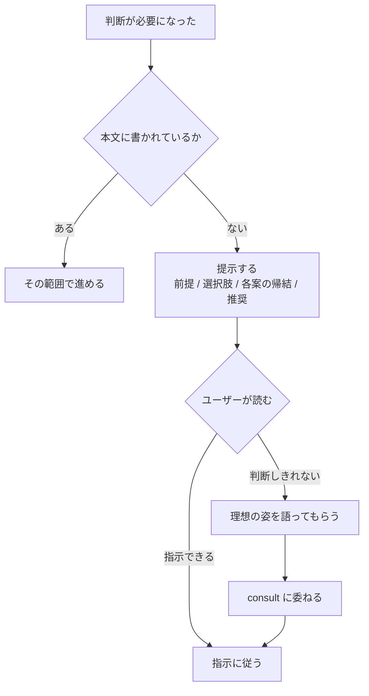

# 課題解決

課題 1 件の状態機械。各ステップの中身は各 skill が SSOT。

工程は名前で呼ぶ（番号は増減する）。**外部から工程を指すときも名前で指す。**

| 工程 | 中身 |
| --- | --- |
| **prepare** | 読み取りのみで方針を決め、**計画を外部化する**（下記） |
| **write 待ち** | managed のみ。待つ間は idle |
| **実装** | — |
| **仕上げ** | `finish`（規模別） |
| **検証** | プロジェクトの検証 skill（例: `verify-app`）。レポートとセッションまとめを提示する |
| **意図の確認** | 機械が正解を持たない成果物だけ、実物を見せて確認する（下記） |
| **提出** | latest default へ追随して `pr`。**CI が緑になるまでここ**。セッションまとめを PR へコメントする |
| **integration 待ち** | managed のみ。**merge だけが直列化点** |
| **着地** | `ship` |

**PR 作成と CI は integration lease の外側**。CI はブランチごとに独立して回るので直列化しても
速くならず、**先に lease を要求すると「PR があること」を条件に出す側と待ち合って止まる。**

## variant

**起動したらまず人待ちの記録を読む**（`references/wait-record.md`）。`waiting` のまま起こされた
なら、それは前のセッションが死んだということ。**質問を出し直して待つ**か、人が既に答えていれば
解釈して `cleared` にしてから続ける。記録を書いた当人が居なくても、ここで復帰できる。

渡された課題が **claim 済み**（Status が進行中 + assignee が自分 + **渡された番号のいずれかの**
remote branch）なら `managed`。それ以外は `interactive`。Status は claim から着地まで単調に進むので、
**人待ちで止まっている間も `managed` のまま**（巻き戻さないのはこの判定を壊さないため）。

**複数番号を渡されたら、そのどれか 1 つで branch が見つかれば claim 済み**（理由は
`references/same-branch.md`）。全番号に branch を求めると `interactive` に落ちる。

**見るのは「進行中」であって「計画済み」ではない。**claim はセッションを起こす前に Status を
進行中へ移すので、渡された時点で計画済みは残っていない。計画済みで判定すると全部 `interactive` に
落ち、lease を一度も待たないまま着地まで走る。

| variant | lease |
| --- | --- |
| `interactive` | 要らない |
| `managed` | write / integration lease が要る |

**variant で着地の可否は変わらない。**違うのは lease を待つかどうかだけ。
lease を**誰が出すかは知らない**。空くまで idle で待ち、渡されたら続きを進める。

**人を待って止まったときも write は返っている。**答えを受け取ったら**まず記録を `cleared` に**し、
`managed` は**渡し直されるまで書き始めない**（停止条件・意図の確認のどちらも同じ）。止まっている
間に枠は別の課題へ回っているので、勝手に書くと交差する 2 つが同時に書く。

**待つ = 応答を終えて idle になること。**ポーリングも sleep もしない。再開は外から渡される。

**待って応答を終えるときは常に、何を待っているかを最後の応答に 1 行書く。**lease 待ちも人待ちも
同じ（何が空けば・誰が何を答えれば進むのかが、外から見える唯一の手掛かりになる）。

## prepare

**書き込まない。**最新の default を読んで、実装計画を Issue コメントに残す。
実装を始めるのは write lease が来てから。

**原則 `consult` を回さない。**「何を作るか」は Status が計画済みへ進んだ時点で決着している。
ここで出すのは「どう作るか」— 触る範囲・資源キー・無効化条件だけ。
回すのは、読んだ結果 Issue の前提が崩れていたとき（骨格が変わる新事実）に限る。

計画を外部化するのは、**セッション文脈がキャッシュ、外部化した計画が復旧契約**だから。
セッションが失われても、別セッションがこのコメントから続きを組み立てられる状態にする。

固定 marker と機械可読 block で書く。scheduler は自然言語を再解釈せず block だけを読む。

````markdown
<!-- plan:v1 -->
```yaml
baseSha: <prepare 時点の default の SHA>
issueDigests: # 対象集合の全件。本文が変わったことの検知に使う
  <Issue 番号>: <本文のハッシュ>
size: 軽微 | 中規模 | 大規模
expectedWrites: # 書く予定。advisory であって契約ではない
  - <path / module>
invalidationScope: # ここが変わったら計画が無効になる。読んで前提にした範囲
  - <path / 契約>
resourceKeys: # 同時に触ると壊れるものの名前。並列判定に使われる
  - <key>
dependsOn: [<Issue 番号>]
alsoResolves: [<Issue 番号>] # このブランチで一緒に片付ける Issue。二重着手の防止に使われる
```
<!-- /plan:v1 -->

方針 / リスク / 検証方針を人が読む文で続ける。
````

**ハッシュの取り方を固定する** — API が返す本文の文字列をそのまま UTF-8 で SHA-256。
正規化しない。**キーが無いものは不一致として扱う**（読む側と書く側が別セッションなので、
取り方が揃っていないと一致判定が一意にならない）。

**`updatedAt` ではなく本文のハッシュを持つ。**`updatedAt` はコメントを付けただけでも動くので、
計画を書いた瞬間に不一致になって収束しない。**group は 1 計画なので、単一の値では非代表の変更を
検知できない** — 番号ごとに持つ。

**`expectedWrites` と `invalidationScope` は別物。**前者は書く範囲、後者は変わったら
やり直しになる範囲で、後者が無いと再 plan の判定ができない。

同じ marker のコメントを複数作らない。更新するときは既存コメントを書き換える。

**再 plan では最初に `baseSha` を今の default へ更新する。**外から失効を判定する側は交差が消えた
ことでしか収束を知れないので、後回しにすると同じ通知が届き続ける。

### 再 plan

時刻や「default が進んだ」では判定しない。**内容で判定する。**

| 起きたこと | 対応 |
| --- | --- |
| Issue 本文が変わった | **停止して再承認を待ち**、承認後に再 plan（停止条件を参照） |
| 依存先の merge SHA が変わった | 再 plan |
| `baseSha..default` が `invalidationScope` か同じ `resourceKeys` に触れた | 再 plan |
| 実装中に前提誤り・未宣言の資源が判明した | 再 plan |
| default が無関係な場所だけ進んだ | **rebase のみ**。計画は再利用する |

## 意図の確認

検証が pass しても、**正解を機械が持っていない成果物**は着地の前に実物を見せて確認する。
起動元では分けない。

| 変更の性質 | 確認 | 理由 |
| --- | --- | --- |
| 不具合修正で、再現が test / E2E に固定できた | 不要 | pass が正しさの定義そのもの |
| 挙動を変えないリファクタ | 不要 | 同上 |
| docs のみ | 不要 | 同上 |
| **新しい API / CLI / 公開 surface** | **要る** | 署名・命名・粒度に意図がある。動くことと意図どおりは別 |
| **UI の見た目・操作** | **要る** | 受入条件に書ききれない（「使いやすい」は真偽が言えない） |
| **設計の骨格を変えた** | **要る** | 同上 |

**実物を渡す。**API は署名そのもの、CLI は実際の出力、**UI は触れる状態のもの**。
「〜を追加しました」という要約では意図とのずれが見えない。ずれていたら直して再提示する。

**UI に静止画を使わない。**押した感触・遷移・pointer の down / up のような**操作の質**が写らず、
そこにこそ意図が宿る。静止画はエージェントが自分で見た目を観測する手段であって、人への提示物ではない。
起動しっぱなしにして、**どこを触れば見えるか**を添えて渡す（起動と後始末の条件は project の検証 skill）。

これは停止条件ではなく正常フローの一段。確認が不要な変更はそのまま着地する。
**ただし人を待つことに変わりはないので、停止条件と同じく人待ちの記録を `waiting` にする**
（`phase` に工程名を書く）。書かないと資源待ちと区別できず、確認前に実装へ戻される。

## 着地を先延ばししない

**スコープは広げる。期間は延ばさない。**受入条件を満たして検証が pass したら着地する。
「まだ直せるところがある」で伸ばさない。

| 状況 | 判断 |
| --- | --- |
| 受入条件を満たし、検証 pass | **着地する**（他に直したいものが残っていても） |
| 今回変更由来の回帰が残っている | 着地しない。直しきる |
| 触ったコードの周辺に改善余地 | 入れてから着地する（ボーイスカウト） |
| 別の場所に気づきがある | **着地してから**次のブランチで扱う |

着地が遅れると、他の作業が古い base の上で動き、rebase と衝突が増える。
**気づきを捨てるのではなく、着地を待たせない。**残した気づきはセッションまとめに出せば、
次のブランチですぐ着手できる。

## 停止条件（managed）

人を待つのは次の 4 つだけ。当たったら **人待ちの記録を `waiting` にする**
（形式と消し方は `references/wait-record.md`）。**Status は進行中のまま動かさない。**

| 事象 | 扱い |
| --- | --- |
| Issue 本文に無い判断が必要になった | 停止して確認する（下記） |
| 承認された製品境界を越える | 停止して確認する |
| CI が詰まって進まない | 停止して報告する |
| 実装中に Issue 本文が変わった | 停止して再承認を待つ |

製品境界とは、**機能の追加・削除** / 新しいユーザー可視挙動 / 非目標への侵入 /
新たな永続形式・migration / 認証・決済・外部送信・公開・破壊的操作の追加 / 設計骨格が変わる新事実。
テーマ違いや分量では判定しない。

**判定表があればそれで引く。**path と生成 artifact の変化で機械的に引ける形にしておくと、
散文の解釈より速く正確になる。

**表は先に用意するものではなく、育てるもの。**無いうちは上の性質で判定し、**迷った path が
出るたびに project 差分の表へ足す**。表が育つほど人を呼ぶ回数が減る。
最初から網羅しようとすると、当たらない行が並ぶだけで判定は速くならない。

判定の chokepoint は **`finish` の commit 直前に diff 全体で 1 回**。実装中に気づいた時点でも
判定するが、そこで漏れても commit 前で捕まる。

**使われていなさそうな機能を消すのも越境。**dead code の削除（到達不能なコード）とは別で、
ユーザーが使える機能を減らすのは製品判断。

**lease 待ちはここに含めない。**資源が空くのを待つのは実行待ちであって、人の判断待ちではない。

## 判断が要るとき

「製品判断が要るか」を推測しない。**Issue 本文に無い判断が必要になった = 製品判断待ち**が唯一の定義。



提示の作法（判断軸を添える・専門用語に説明を付ける・推奨まで書く）は `~/.agents/AGENTS.md`。

ユーザーが判断しきれず理想を語ったときは、それを判断材料として `consult` に渡してよい
（プロダクト方針はユーザー・技術的収束はアドバイザー、という分業の内側）。

## 作業単位の運用

原則（1 ブランチで直しきる）は `~/.agents/AGENTS.md`。ここはその運用。

**分かれ目は受入条件を満たしたかどうか。**満たす前に気づいたものは常にそのブランチで直す
（今回変更由来の回帰は必ずこちら）。

### 着地の段階で残ったものの行き先

**気づいた時点では逃がさない。**振り分けるのは受入条件を満たしたあと、
着手すると着地が遅れると分かったものだけ。

| 性質 | 行き先 |
| --- | --- |
| **製品境界を含まない技術的改善**（型の厳密化・dead code・重複の共通化・命名統一など） | `issue` で Issue にする。分かっている範囲を本文に書く。**Status は未計画のまま**（計画済みへ進めるのは計画工程の責務） |
| **製品境界を含む**（定義は「停止条件（managed）」の節。定義自体は variant に依らない） | Issue にせず、セッションまとめの懸念として残す（形式は「セッションまとめ」の表） |

技術的改善を Issue にしてよいのは、**正解を機械が持っている**から（型が通る・test が通る・
dead が消える）。製品判断を含むものは人が決めるまで動かさない。

**作る前に、既存へ寄せられないか見る。**寄せ先は未 claim のものだけ。

| 既存の Issue との関係 | どうするか |
| --- | --- |
| 同じ内容 | そこへコメントする |
| 同じブランチで直せて、**その Issue の目的にも収まる** | **本文へ足す** |
| 同じブランチで直せるが、目的が別 | Issue にして `Same branch as #N` を相互に書く |
| テーマが近いだけ | Issue にして `Refs #N` |

**件数の上限は設けない。**

「同じブランチで直せる」の判定と `Same branch as #N` の書き方は `references/same-branch.md`。
**足した結果タイトルが実態を説明できなくなるなら、足す先が違う** ── 目的が別なので Issue を分ける。

**全件の本文を読まない。**触ったパス・識別子で `--search` するか、タイトル一覧を 1 回引いて
候補を絞り、**当たったものだけ本文を読む。**Backlog は数十件まで育つので、総当たりは
1 件の気づきに対して釣り合わない。

managed で範囲が `expectedWrites` を超えたときは、**止めずに計画を更新する**。予定外の拡張は
この方針の当然の帰結であって違反ではない。ただし新しい `resourceKeys` が増えたら計画に反映し、
後続の判定に載るようにする。

**別の Issue の内容まで片付けたら、その Issue を加入させる**（手順は `references/same-branch.md`）。
宣言しないとその Issue が「未 claim」に見えて別セッションが起こされる。
本文に `Same branch as #N` があるものは prepare の時点で**閉包で辿って**写す
（実装中に気づいたものは都度足す）。
あわせてその Issue にも一言コメントして、人がボードを見て分かる状態にする。
着地時は `pr` の closing keyword で**対象集合の全番号**を閉じる（引き先は
`references/same-branch.md` の「どちらの集合を見るか」。台帳や `alsoResolves` は加入の途中で
落ちると欠ける）。

## セッションまとめ

検証レポートと合わせて提示し、**着地の前に PR へも同じものをコメントする。**応答は流れて消えるが、
PR は変更と一緒に残る（閉じる Issue と違い、後から `git blame` → PR で辿れる）。
日常的に読まれる場所ではなく、**必要になったときに引ける場所**として置く。

- 変更の要点
- 変動した Issue すべて（作成・クローズ・更新。番号 + 一言）
- 積み残し・懸念点（下記の形式）
- **skill / docs へ反映したもの**と、**しなかったものとその理由**

**懸念は 1 件につき次を埋める。**「懸念がある」だけでは放置してよいか判断できない。
埋まらない項目があるなら、その項目自体を「不明」と書く。

| 項目 | 中身 |
| --- | --- |
| 何が | 観測した事実（推測と分ける） |
| 影響範囲 | 誰の・どの操作が・どれくらいの頻度で当たるか |
| 放置すると | 次に何が起きるか。起きないなら「起きない」 |
| 判断材料 | 選ぶために必要な事実（コスト・代替案・前例） |
| 推奨 | このブランチで続けて着手 / 対応不要 / 別 worktree へ切り出し + 理由 |

推奨を決める情報が足りなければユーザーに質問する。
