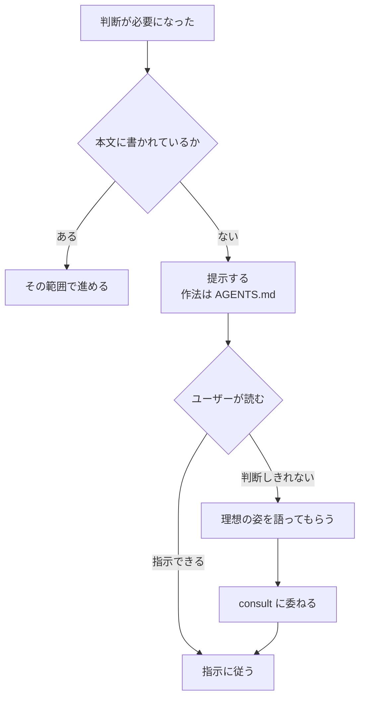

# 判断が要るとき

「製品判断が要るか」を推測しない。**Issue 本文に無い判断が必要になった = 製品判断待ち**が唯一の定義。

提示の作法は `~/.agents/AGENTS.md`。**提示は Artifact にする** —— **この課題の枚を書き直す**
（引き当て・節の作り方は `artifact.md`）。

ユーザーが判断しきれず理想を語ったときは、それを判断材料として `consult` に渡してよい
（プロダクト方針はユーザー・技術的収束はアドバイザー、という分業の内側）。
